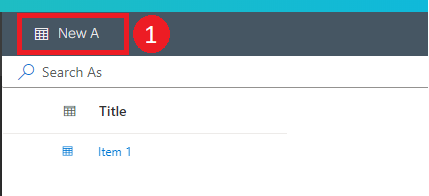

# Item Creation

Items are created and stored on lists. Users are are then able to view and manage items to their liking.

## Creating a new item

To create a new item in a data table:

1. In the list page of an entity, in the top left of the command bar, click **New *Table Name***. This will then open a flyout pane that includes all relevant fields that need to be filled in.

