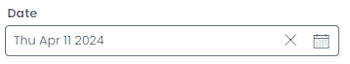
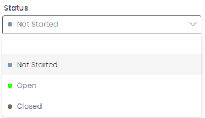
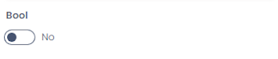
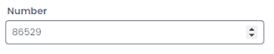
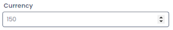
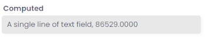
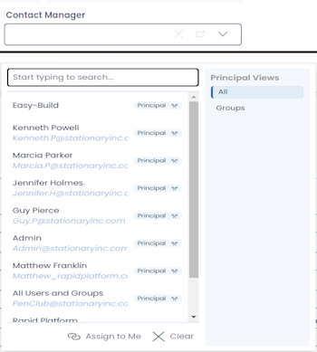
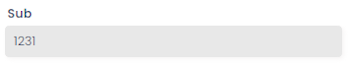

# Items

Items in Rapid represent a single row on a [Rapid Table](../data-tables/data-tables.md) they are made up of an arbitrary number of columns. 

A simple example of a rapid item is a Task, which exist on a default [system table](../system-tables/system-tables.md), and thus exist on all rapid sites. You can access tasks by clicking on the 'Tasks' menu button in the Rapid sidebar

## Columns

|Column                 |   Description                                                                                                                     |   Example image      
|---                    |---                                                                                                                                |---             
|Single line text       |A single line of text up to 128 characters                                                                                         |
|Email                  |A field that only accepts text in the shape of a valid email                                                                       |
|Multiple lines of text |A box that accepts large bodies of text, also supports images                                                                      |
|Date and time          |A column that stores a date and time of day, presenting the user with a calendar and a clock for setting the time                  |
|Date                   |A date only field with no time connected to it                                                                                     |
|Choice                 |A dropdown box that presents a list of pre-defined options                                                                         |
|Lookup                 |A dropbox that looks to a predefined table and allows the user to select a single item to be linked to the current item            |
|Boolean                |A binary togle switch, by default this is set to 'null' but can be toggled to ON or OFF                                            |
|Number                 |A field that only accepts numbers                                                                                                  |
|Percentage             |A number field that presents and calculates as a percentage                                                                        |
|Currency               |A number field that presents as a predefined type of currency                                                                      |
|Computed               |An SQL field that is calulated off of data found only inside the current table, in the image to the right the *title* column is being merged with the  *number*  column      |
|User                   |A lookup field specifically designed to point towards users on the current site (points towards the principal table)               |
|Subquery               |An SQL query that calculates off of data anywhere on the current sites database and presents in a predefined format (In the image to the right, the Subquery is counting all *tasks* on this site)                                                                                                                          |
|Whole number           |A number field that will not accept decimal places                                                                                 |
|Multiple Lookups       |A lookup field that allows you to select multiple items in a dropdown box, creating links between the current item and multiple others|
|PowerBi                |A fieldtype that stores a PowerBI report to be presented at an item level context                                                  |