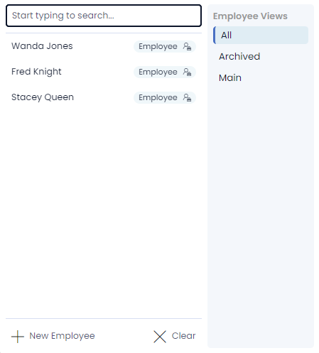

# Items Overview

*Items* are containers where data is stored. An item can be anything, but what it represents is always determined by the Table it is stored on. For example:
- Each item stored on an *Employees* table, will represent an employee.
- Each item stored on a *Cars* table, will represent a car, etc.

## Items as Rows

Items are represented as a single row on a [Rapid Table](</docs/Rapid/3-User Manual/2-Explorer/1-Tables/1-viewing-data-using-tables/1-viewing-data-using-tables.md>).

In the screenshot below, the Table named "tasks" stores a list of tasks for employees to complete. Note the single item that has been highlighted.

We can open items, read their data, add new data, edit existing data, or delete the entire item.

## Data Types as Columns

You system administrator will determine which columns should exist on a table. This also determines which types of data will be stored in that table's items.

In the screenshot above, the system administrator has created the following columns: *Title*, *Assigned To*, *Start Date*, *Due Date*, and *Status*. Note, however, that there are additional columns not shown here. Each item contains [default fields](</docs/Rapid/3-User Manual/2-Explorer/1-Tables/4-default-fields/4-default-fields.md>) that are usually not visible. 

Additionally, to ensure items have a clean and simple appearance, your system administrator might choose to only show some columns when viewing them on a table.

If we open an item, we will be able to see the other columns that are not visible here.

## Columns and Fields

Every Table in Rapid contains **Columns**. For example, we could create a **Table** titled "Employees". This table would then need columns that store data about each employee. For example, we might want to record the *Name*, *Date of Birth* and *Email Address* of each employee.

Each of these pieces of information would become a column in our table. In this example, we would need a column where we can store text (to record the employee's name), a column to store a date (for their DOB), and a column where we can store an email address.

Any item that we create inside the "Employees" table will now represent an employee, and it will contain the three columns mentioned above. It would look something like this:

Note that there are three items in our table, and they each contain data inside of our three customised columns: *Name*, *Date of Birth*, and *Email Address*.

## Column and Field Types

There are many types of columns that an item can contain, and these **Columns** will have different behaviour when they are interacted with as **Fields**.

|Column / Field               |   Description                                                                                                                     |   Example image      
|---                    |---                                                                                                                                |---             
|Single line text       |A single line of text up to 128 characters                                                                                         |
|Email                  |A field that only accepts text in the shape of a valid email                                                                       |
|Multiple lines of text |A box that accepts large bodies of text, also supports images                                                                      |
|Date and time          |A column that stores a date and time of day, presenting the user with a calendar and a clock for setting the time                  |
|Date                   |A date only field with no time connected to it                                                                                     |
|Choice                 |A dropdown box that presents a list of pre-defined options                                                                         |
|Lookup                 |A dropbox that looks to a predefined table and allows the user to select a single item to be linked to the current item            |
|Boolean                |A binary toggle switch, by default this is set to 'null' but can be toggled to ON or OFF                                            |
|Number                 |A field that only accepts numbers                                                                                                  |
|Percentage             |A number field that presents and calculates as a percentage                                                                        |
|Currency               |A number field that presents as a predefined type of currency                                                                      |
|Computed               |An SQL field that is calculated off of data found only inside the current table, in the image to the right the *title* column is being merged with the  *number*  column      |
|User                   |A lookup field specifically designed to point towards users on the current site (points towards the principal table)               |
|Subquery               |An SQL query that calculates off of data anywhere on the current sites database and presents in a predefined format (In the image to the right, the Subquery is counting all *tasks* on this site)                                                                                                                          |
|Whole number           |A number field that will not accept decimal places                                                                                 |
|Multiple Lookups       |A lookup field that allows you to select multiple items in a dropdown box, creating links between the current item and multiple others|
|PowerBi                |A field type that stores a PowerBI report to be presented at an item level context                                                  |

## Task Items

There is a unique category of item in Rapid called a **Task**. This is a special item used to track work within a company. All Rapid sites come packaged with a *Tasks Table*, and *Task Item* functionality.

Tasks can also be "Completed", unlike regular items. Completing an item means that it will cease to appear in most Tables and Views. There are two methods of completing a Task. You can learn more about **Task** items by visiting the link below.

- [Creating, Editing, and Deleting Tasks](</docs/Rapid/2-Rapid Standard/1-Tasks/creating-editing-and-deleting-tasks/creating-editing-and-deleting-tasks.md>)
