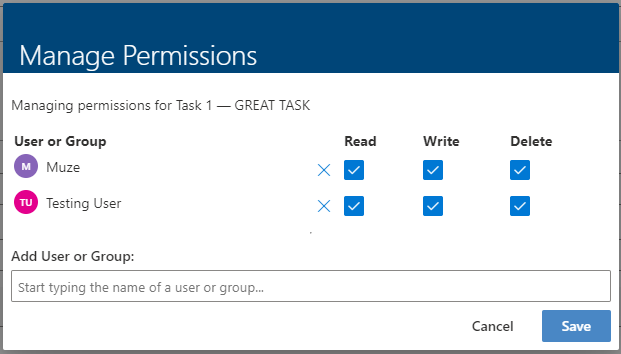

# Item-Level Permissions

Each item in Rapid Platform can have unique user permissions. This means on a per-item basis, you can select who is allowed to **Read**, **Write**, or **Delete** an item. Note that if you wish to [set default permissions for all items in a table](</docs/Rapid/3-User Manual/2-Explorer/1-Tables/6-permissions/6-permissions.md>), this is also possible.

## Permission Coins

- Can see the permission coins on items
- Permission coins max out at 4 items
- Clicking the coins opens the permissions panel

## Permissions Page

### Viewing Permissions

This is the Item's permissions configuration. It lists the users and groups which have access to the item. These are displayed as a user coin. To open more details as to what users exactly you are able to click on the 'Edit Permissions' button this will bring up the Permissions management config for that particular item.

*Item Permission Configuration*

- Can see the list of permissions for the item
- Can search for users/groups by typing

### Managing Item Permissions

- Can remove users/groups permissions
- Can set the Read/Write/Delete permissions
- Can add new users/groups permissions
- Can cancel permission changes and have them revert
- Can save changes to permissions
- Can save and Sync permissions to linked items

