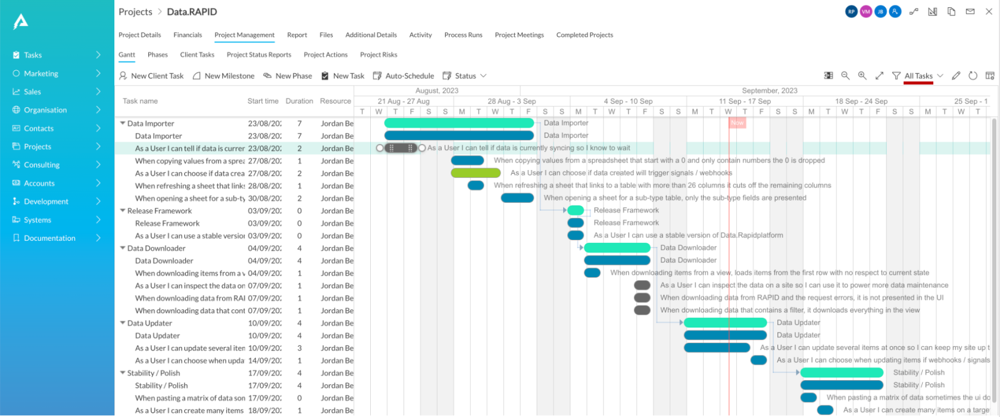
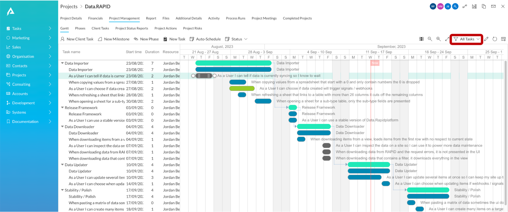
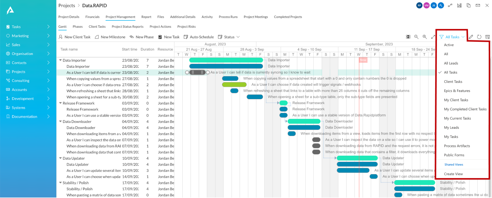
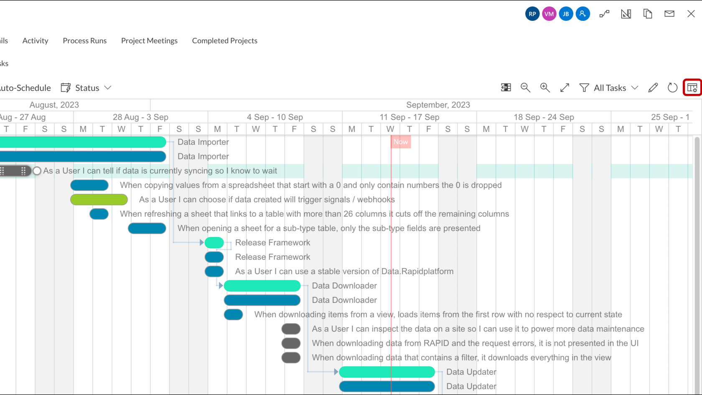
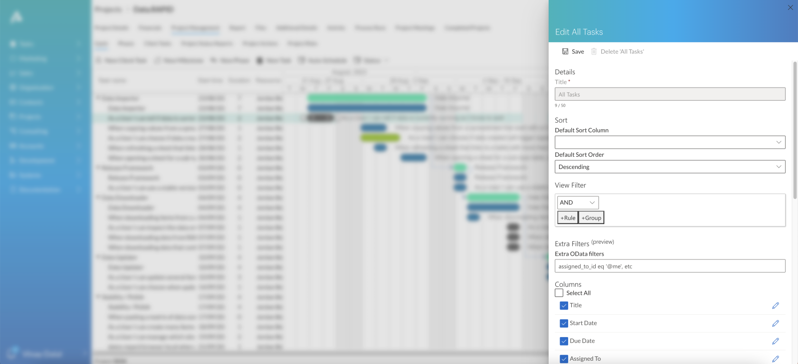

# How to view and order tasks based on Table Views in a Gantt Chart?

A Gantt Chart presents visual representation of tasks based on data tables.

Data tables can have ***Table Views*** based on which the data is filtered and organized. You can learn more about [Table Views here.](</docs/Rapid/3-User Manual/2-Explorer/2-Page Components/Data Table Component/data-table-component-views/data-table-component-views.md> "Data Table Component - Views")

The Gantt Chart respects the defined *Table Views* and the visual presentation is based on the selected *Table View* parameters.

The default Table View can be defined in Designer while [configuring the Gantt Page Settings.](</docs/Rapid/4-Keyper Manual/2-Designer/2-Pages/3-Components/gantt-chart/gantt-chart.md> "How to configure the Page - Gantt Chart Component?")

The above image depicts that the Gantt Chart prepared on Table View titled - All Tasks.

Please note: The Gantt Chart will always sort Tasks based on the Start Date. However, if two or more Tasks have the same Start Date, then the Table View parameters will be used for ordering the Tasks.

## Changing the Table Views from within the Gantt Chart

A Table View can be easily changed from within the Gantt Chart using the dropdown button shown below.

As you click on the dropdown, a list of all the created Table Views will appear.

You can select your desired Table View from the list and the Gantt Chart shall change according to the filters and parameters defined in the selected Table View.

Please refer to the GIF below for illustration

Please note: you can create new Table Views from the dropdown option as well. This will create Table Views which will be visible on Table data throughout Explorer, not just limited to Gantt Charts.

## Editing Table View from within Gantt Chart

Apart from selecting and creating Table Views, you can also modify the selected Table View from within the Gantt Chart interface.

You can edit the Table View using the Edit View button shown below:

As you click on the Edit View button, a panel with existing View parameters will open in the right. You can make necessary modifications and Save.

**Please note:**

- Only the selected Table View will be modified.
- The modification made to the Table View will only take effect once Save is pressed.
- The modifications to the Table View will be effective across Explorer and not just limited to Gantt Chart page.

## Related articles

[How to create a new task and sub-types of task from Gantt Chart?](</docs/Rapid/3-User Manual/2-Explorer/2-Page Components/Gantt Component/creating-tasks/creating-tasks.md> "How to create a new task and sub-types of task from Gantt Chart?")

[How to open Task Details page from Gantt Chart?](</docs/Rapid/3-User Manual/2-Explorer/2-Page Components/Gantt Component/how-to-open-task-item-profiles-from-gantt-chart/how-to-open-task-item-profiles-from-gantt-chart.md> "How to open task item profiles from Gantt Chart?")

[How to create and edit dependencies in a Gantt Chart?](</docs/Rapid/3-User Manual/2-Explorer/2-Page Components/Gantt Component/how-to-create-and-edit-dependencies-in-a-gantt-chart/how-to-create-and-edit-dependencies-in-a-gantt-chart.md> "How to create and edit dependencies in a Gantt Chart?")

[How to Auto-schedule tasks in Gantt Chart?](</docs/Rapid/3-User Manual/2-Explorer/2-Page Components/Gantt Component/how-to-auto-schedule-tasks-in-gantt-chart/how-to-auto-schedule-tasks-in-gantt-chart.md> "How to Auto-schedule tasks in Gantt Chart?")

[How to interact with Gantt Chart component in Explorer with data?](</docs/Rapid/3-User Manual/2-Explorer/2-Page Components/Gantt Component/1-how-to-interact-with-a-gantt-chart-in-explorer/1-how-to-interact-with-a-gantt-chart-in-explorer.md> "How to interact with a Gantt Chart?")