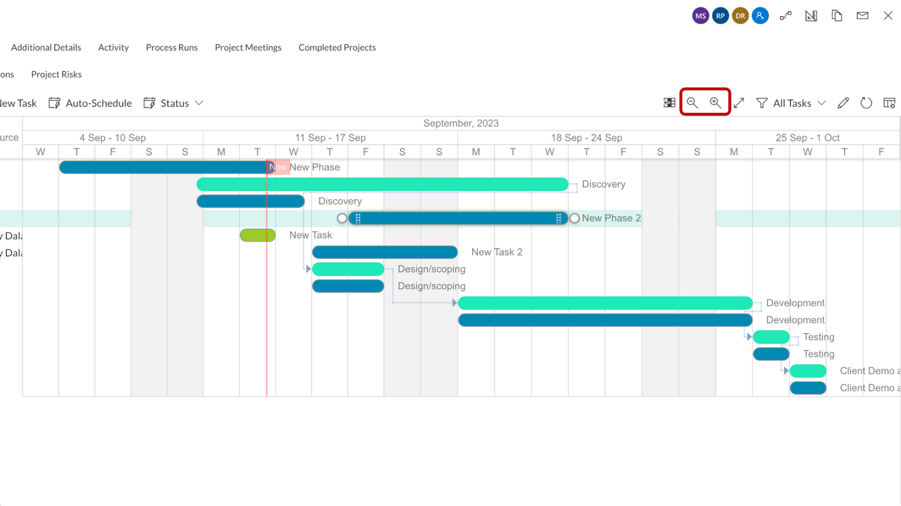
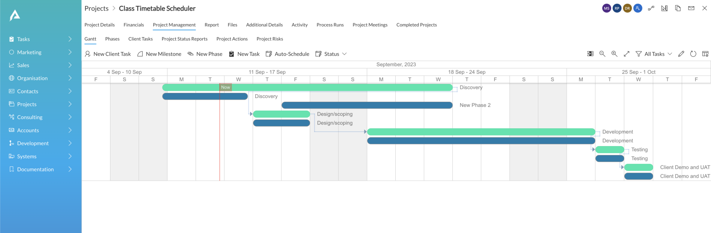
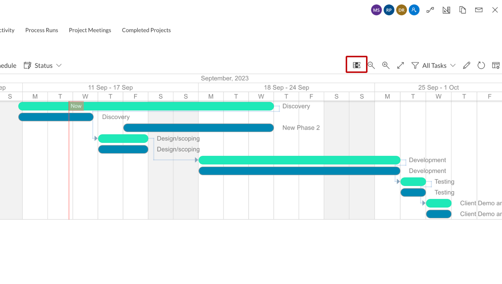
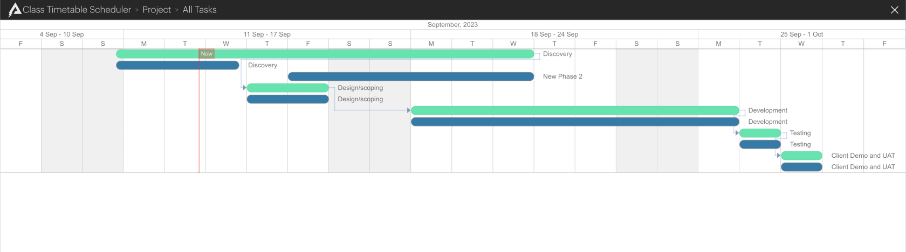
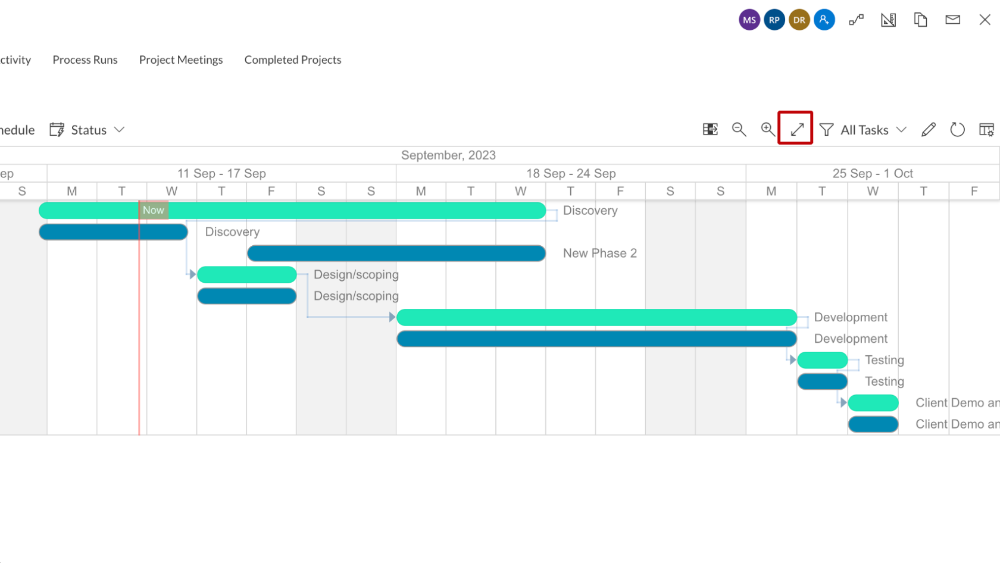
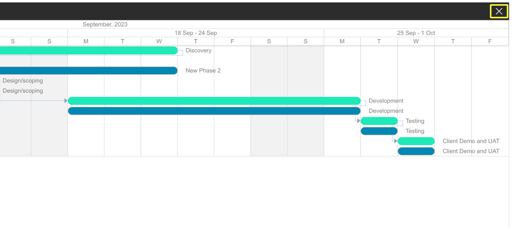

# How to Hide / Show the Left Panel / Go Full Screen in Gantt Chart?

Gantt Chart in RAPID Platform display Task and Parent information in the Left Panel, along with the visual representation with bars across time.

This information in Left panel can be useful in many ways like identifying the tasks, isolating tasks by parents, modifying resources etc.

However, sometimes there may be a need or personal preference to view the Gantt Chart in a wider area without Left Panel. It is possible to interpret all the information about the Gantt Chart without the Left Panel as well.

## Hide / Show Left Panel

You can toggle between hiding and showing the Left Panel using a single button.

The arrow of the button icon shows whether it will hide or show the left panel.

Please view the below GIF for illustration:

## Gantt Chart in Full Screen

The Gantt Chart can be viewed in Full Screen mode. The Full Screen mode allows you to view the Gantt Chart over the maximum width of screen possible. This enables a better span of bars, leading to better assimilation of information. Also, particularly useful for taking screenshots / screen sharing etc.

You can enter the Full Screen mode using the button shown in the below image

You can exit full screen mode by clicking on the X icon at the top right corner of the screen.

Please refer to the below GIF for illustration

## Related articles

[**How to Zoom in and out the Gantt Chart timeline?**](../how-to-zoom-in-out-the-gantt-chart-timeline/how-to-zoom-in-out-the-gantt-chart-timeline.md "How to Zoom in / out the Gantt Chart timeline?")

[**How to open Task Details page from Gantt Chart?**](../how-to-open-task-item-profiles-from-gantt-chart/how-to-open-task-item-profiles-from-gantt-chart.md "How to open task item profiles from Gantt Chart?")

[**How to view and order tasks based on *Table Views*?**](../filtering-and-sorting/filtering-and-sorting.md "How to view and order tasks based on Table views in a Gantt Chart?")

[**How to interact with Gantt Chart component in Explorer with data?**](../1-how-to-interact-with-a-gantt-chart-in-explorer/1-how-to-interact-with-a-gantt-chart-in-explorer.md "How to interact with a Gantt Chart?")