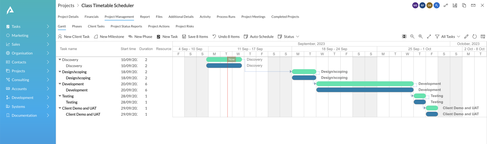
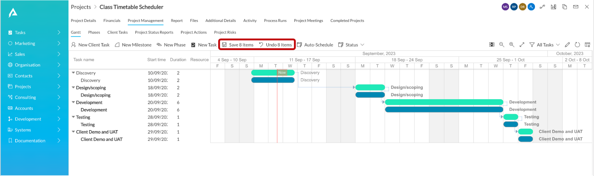

# How to Save / Undo changes to a Gantt Chart

You can make changes to the Gantt Chart.

Any change made to a task will affect other tasks as well, based on their dependency relationships.

For example, in the below image, the Task "Design/scoping" is changed. This led to a change in other tasks based on dependencies.

 

## Changes appear as bold

In the above image, observe that the tasks with changes appear bolder. Therefore, the "Discovery" task appear in normal (non-bold) font, whereas all the other tasks in the Chart appear as bold. A total of 8 items appear as bold in the Chart signifying that 8 items got modified.

### Save and Undo buttons appear

Observe that two new button appear in the command bar of the Gantt chart. These buttons provide you with Save and Undo options along with displaying the number of items being saved or reverted respectively.

**Save -** If you click the Save button then all the changes made to the chart will be committed sequentially.

**Undo -** If you click the Undo button then all the changes will be discarded and the chart will come back to its pre-modification state.

**Please note -** once you have pressed Save or Undo button, both the buttons will disappear. This becomes your new Chart State. Therefore, you cannot press "Control Z" to revert to previous state.

Please refer to the below GIF for illustration:

## Related articles

[How to change start date, duration and resource from left panel?](</docs/Rapid/3-User Manual/2-Explorer/2-Page Components/Gantt Component/altering-dates/altering-dates.md> "How to change start date, duration and resource from left panel?")

[How to move tasks in time, extend start / end dates from the Gantt bars?](</docs/Rapid/3-User Manual/2-Explorer/2-Page Components/Gantt Component/moving-tasks-in-time/moving-tasks-in-time.md> "How to move tasks in time, extend start / end dates from the Gantt bars?")

[How to create and edit dependencies in a Gantt Chart?](</docs/Rapid/3-User Manual/2-Explorer/2-Page Components/Gantt Component/how-to-create-and-edit-dependencies-in-a-gantt-chart/how-to-create-and-edit-dependencies-in-a-gantt-chart.md> "How to create and edit dependencies in a Gantt Chart?")

[How to Auto-schedule tasks in Gantt Chart?](</docs/Rapid/3-User Manual/2-Explorer/2-Page Components/Gantt Component/how-to-auto-schedule-tasks-in-gantt-chart/how-to-auto-schedule-tasks-in-gantt-chart.md> "How to Auto-schedule tasks in Gantt Chart?")

[How to interact with Gantt Chart component in Explorer with data?](</docs/Rapid/3-User Manual/2-Explorer/2-Page Components/Gantt Component/1-how-to-interact-with-a-gantt-chart-in-explorer/1-how-to-interact-with-a-gantt-chart-in-explorer.md> "How to interact with a Gantt Chart?")