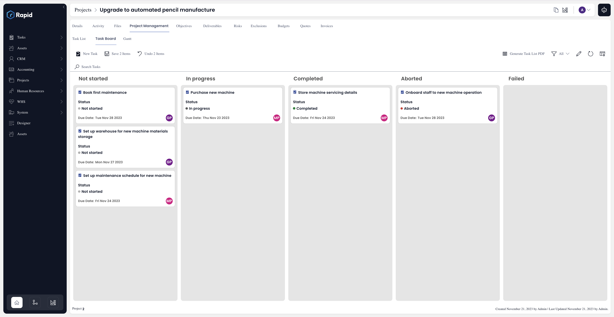

# The Board Component

A board (also known as Kanban Board) is a visual tool that gives an overview of the current status of entities being tracked. 

Imagine a Project Manager of a stationery manufacturing company wants to have a snapshot of current status of various projects tasks in the organisation. These tasks should display information on the names of the Task Principal (person responsible for completing the subject Task) and respective Due Dates. Moreover, as needed, the Project Manager should be able to drag and drop tasks across categories to update status. This can be achieved using the Board Component.

The board component can provide a convenient view of a project's tasks organized across a choice field. In the below image _Not started_, _In progress_, _Completed_, _Aborted_ and _Failed_ are the Task's 'Status' column on which Task cards are categorized. 

To put in simple words - a Board component allows you to view the list of items (as cards) categorized across a pre-configured choice field.

There can be many other use cases like - a sales manager viewing the status of various leads, a purchase manager looking at items' order status, an accounts manager monitoring invoices status etc.

## Interpreting information on each Board Item Card
As seen in the image above, the Board Component categorises the Table items across various sections based on the defined Choice Type of field. Each item is displayed like a Card.

Board component provides information about the following:

- A title field - like Project Task name  
- A choice type field - like Task status  
- A user type field - like Task Principal  
- A date type field - like Task due date  

:::note [Fine Points]   
In the above image please note the following:
- The icon of the item is visible next to the title.  
- The choice option is visible along with the set colour.  
- The Date value appears as Day Month Date Year format.  
- The initials of the User field appear in a coin of colour. Different users will be shown with different coloured coins
:::

## Search for an Item on Board

It is possible that the list of items on the Board Component is extensive. In such cases, it might be difficult to identify a particular item from all the cards on the Board. 

You can use the Search bar to type in the Keyword. This will show only those items which match the keyword.

Click on the "X" at the far right of the search bar to clear the Search filter.

## Viewing / Updating Item Details
Just like the Item List, you can view the details of an item by **double clicking** on the Item Card. This will open the Item Details Page. 

In case, any changes are made to the Item in the Details page, the same are visible in the Board Card upon saving.

  

## Updating item's category using Board Component
One of the key benefits of using a Board Component is the ability to update an item's selected choice field by a simple drag and drop.

For instance - imagine you are a Project Manager, going through the Task Items on the Board. You need to update a task from **Not Started** to **In progress**. You can simply do it by dragging and dropping the task in the category.

Refer to the below image. The task titled - "Onboard staff to new machine operation" has a status - **Not Started**. It is dragged and dropped in the In progress category and observe that the status in the item card changes to **In progress**

## Views in Board Component

Views can be considered as filters which prune the items list. It is important to note that **the items cards that appear in the Board across categories obey the filter rules of the selected View.**

## Changing / Creating / Editing View
Please refer to the image below:

a. You can click on the dropdown to open list of all existing views.  
b. Click to select your desired view. This will become the active view and will filter the list of items based on configured View Rules.
c. Click to create new views.
d. Click to open Edit View Panel. Please note, you can edit only the active view.

:::note [Important Note:]
In case you do not find the option to :
- Change View  
OR
- Edit View  

It means that they have been disabled from the Board Component preferences level.

:::

## Trigger Action Menus

You can trigger action buttons / menus from the Board. Just click on the button and it will perform the configured action.

:::note[Important Note:]
In case you have seen the action button on the Item Lists Page and is missing from the board, this means that this option has been disabled from the Board Component preferences level.

  
:::

## Creating new items

You can create new items from within the Board Component.   

Click on the new item button. This will open the Create Item Form.

### Creating new sub-type item

If your subject table is a Parent Table and there are other child tables which inherit properties from your subject (parent) table, then you can create new items for the child table from within the Board.

In the below illustration, **Tasks** is a Parent Table and **Projects** is a **[*Sub Type of*](</docs/Rapid/3-User Manual/glossary/glossary.md#inherit-tables>)**  **Tasks**.  

You can create new Project items from the Board. 

:::note[Important Note:]
In case your subject table is a Parent AND you do not find the option to create new items for the Child Table, this means that this option has been disabled from the Board Component preferences level.

:::

## The "unspecified" category

You may also find a category titled as "unspecified". 

**Illustration:**  

The Table - Project Tasks has a Status choice field. The Board component is set up on this Status choice field.   
However, for some records, the value of Status is left blank.   
This is possible when the Status field is not a mandatory field for item creation.  

Such items, where the category value is blank, are placed under an unspecified category.  

:::note[Important Note:]
In case you do not see "unspecified" as a category on your board, this means that this option has been disabled from the Board Component preferences level.

:::
