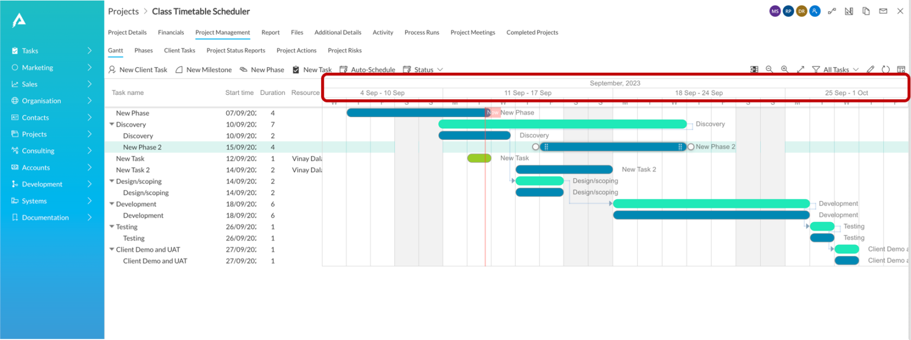
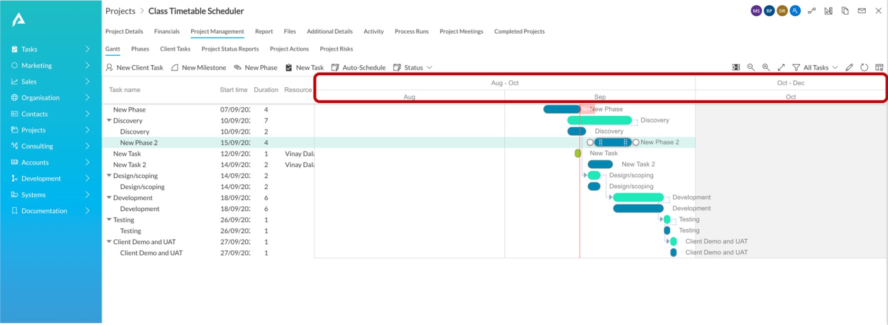
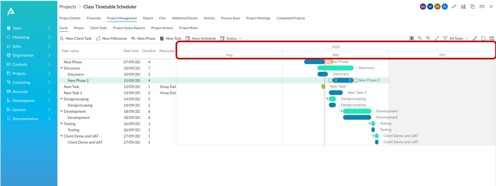
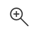
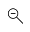

# Zooming In / Out

A Gantt Chart is a visual representation of various tasks across time. Therefore, the scale of time becomes an important parameter of how we view our Gantt Charts.

Gantt Chart in RAPID Platform provides for three levels:

1. Month
2. Quarter
3. Year

These are also termed as Zoom Levels.

The below image shows Month Level. Observe the top row in highlighted section shows the month and the lower row depicts weekly time interval.

The below image shows Quarter Level. Observe the top row in highlighted section shows the quarter and the lower row depicts monthly time interval.

The below image shows Year Level

## How to shift between Zoom levels?

Observe there are two buttons in the command bar - Lens (+) and Lens (-) icons.

These buttons are :

||Zoom In|
|:----|:----|
||Zoom Out|

These buttons will help you increase or decrease levels intuitively.

For example,

- To go from Year Level to Quarter Level - click Zoom In.
- To go from Month Level to Quarter Level - click Zoom Out.

Please note, a change in Chart viewing would only be visible if the tasks span across levels. For instance, if the tasks of a Gantt Chart span across multiple months, then you will notice a change in view when you change from Month Level to Quarter Level or vice versa.

However, if the Chart spans across, say a couple of months, then you wont notice any visible difference when Quarter Level is changed to Year Level.

Please view the below GIF for illustration

