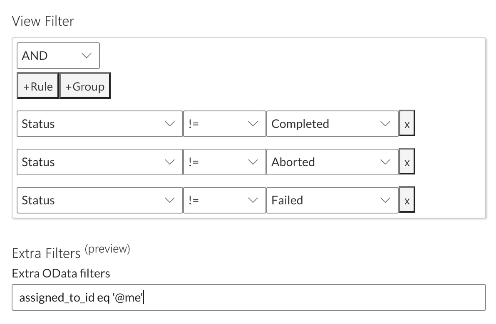

# Views

A **View** is a way of filtering [Items](</docs/Rapid/3-User Manual/2-Explorer/2-Items/1-items-overview/1-items-overview.md>) on a Table. A view can be created, edited, or deleted when viewing a [Table](</docs/Rapid/3-User Manual/2-Explorer/3-Pages/2-Page Components/Data Table Component/Data Table Component.md>), [Gantt Chart](</docs/Rapid/3-User Manual/2-Explorer/3-Pages/2-Page Components/Gantt Component/1-how-to-interact-with-a-gantt-chart-in-explorer/1-how-to-interact-with-a-gantt-chart-in-explorer.md>), or [Board](</docs/Rapid/3-User Manual/2-Explorer/3-Pages/2-Page Components/Board Component/Board Component.md>). A **View** is the essential method for **sorting** or **ordering** items, and well as determining which items should **visible** or **hidden**.

Views also affect which items are visible when selecting data using a [Lookup Field](</docs/Rapid/3-User Manual/2-Explorer/2-Items/1-items-overview/1-items-overview.md#column-and-field-types>), [Multi-Lookup Field](</docs/Rapid/3-User Manual/2-Explorer/2-Items/1-items-overview/1-items-overview.md#column-and-field-types>) or [User Field](</docs/Rapid/3-User Manual/2-Explorer/2-Items/1-items-overview/1-items-overview.md#column-and-field-types>). You can read about [how views are rendered within Lookup Fields, Multi-lookup Fields, and User Fields](</docs/Rapid/3-User Manual/2-Explorer/3-Pages/2-Page Components/Form Component/Form Component.md#user-fields-and-lookup-fields>) here.

In Rapid, the default view is called the *All* view. You can also create, edit, or delete views. Switching between views is useful, because they allow us to find the data quickly.

For example, if you are a project manager for a company, you do not want to view all projects that the company has ever undertaken. Instead, you will want to view all the *current* projects that *you* are managing. If we needed to see projects that have concluded, we could build a view for this as well. Therefore, by using views, we can essentially "zoom in" on the items we need, and hide the items that we don't need.

### Views in Tables

When using a **View** with [Data Table](</docs/Rapid/3-User Manual/2-Explorer/3-Pages/2-Page Components/Data Table Component/Data Table Component.md>), you can control:

- If an item appears in a the Table's list, or not
- The order that items are displayed in
- Which columns are displayed

Note that any new columns added to a table will be automatically added to the *All* View. [System Columns](</docs/Rapid/3-User Manual/2-Explorer/1-Tables/4-default-fields/4-default-fields.md>), however, will need to be added manually to a View if they are required.

> In the example above, we can see the View titled "Active" is being used. The table will now only show projects that **are not** *Completed* or *Aborted*. This is achieved by filtering the choices that appear in the *Status* column.

> In the same table, if the view is set to "Inactive", the table will now only display projects that **are** *Completed* or *Aborted*. This is achieved by filtering the choices that appear in the *Status* column.

### Views in Gantt Charts

At the time of writing, Views do not function as anticipated in the Gantt Component. For example, you can switch to a new Gantt Chart view that reveals **more** tasks. However, you cannot switch to a view that **hides** or reveals **less** tasks than the default *All* view.

### Views in Boards

When using a **View** with [Board](</docs/Rapid/3-User Manual/2-Explorer/3-Pages/2-Page Components/Board Component/Board Component.md>), you can control:

- If an item appears on the Board component, or not
- The order that items are sorted, and are displayed in the board's containers

> In the example above, the "All" view has been selected. As a result, all of the tasks are visible in the board component.

> On the same board, changing the view to "My Tasks" (which is a default view that is packaged with Rapid), the items are filtered to only show Tasks that are assigned to the current user.

## View Controls

There are three **View Control** buttons in the [Command Bar](</docs/Rapid/3-User Manual/glossary/glossary.md#command-bar>) of a [Table](</docs/Rapid/3-User Manual/2-Explorer/3-Pages/2-Page Components/Data Table Component/Data Table Component.md>), [Gantt Chart](</docs/Rapid/3-User Manual/2-Explorer/3-Pages/2-Page Components/Gantt Component/1-how-to-interact-with-a-gantt-chart-in-explorer/1-how-to-interact-with-a-gantt-chart-in-explorer.md>), or [Board](</docs/Rapid/3-User Manual/2-Explorer/3-Pages/2-Page Components/Board Component/Board Component.md>).

Below is an explanation of each of these buttons and their purpose:

| Label | Button Name | Description |
|---|---|---|
| 1 | *Views Dropdown* | This button opens a dropdown menu where you can switch between views. Additionally, there is an option to **Create Views** here as well. |
| 2 | *Edit View Mode* | This allows you to change the way a view is displayed on a table. You can also change which column the view will sort its items by. |
| 3 | *Edit View Panel* | This button opens a side panel, where you can change the rules governing what a view will and will not display, as well as how the view will sort its items. |

Each of these buttons and their functionality will be discussed further in the next sections.

## Changing Views

Alternative views can be selected using the **Views Dropdown** menu button. The default "All" view is available for selection. The "All" view displays all items present in the **Data Table**. It's important to note here that the "All" view option can be enabled or disabled (in **Designer**) by user according to their needs.

To change views:

1. Press the **Views Dropdown** menu button.
2. Select a View from the dropdown menu.
3. The dropdown menu button's label will change to display the name of the view that is currently in use.

> In the example above, the "All" view has been selected, because its name appears next to the filter icon. Additionally, the view that is currently selected will have a checkmark icon beside the view name in the dropdown list.

## Creating a View

Custom **Views** can be created via the **Drop-down Views** menu button when viewing a Table, Gantt Chart, or Board. Having custom views allows for you to switch between them, depending on your needs. Alternatively, other users may require different views, depending on their needs or role.

To create a custom view:

1. Press the **Dropdown Views** button.
2. In the dropdown menu that appears, select **Create View**.

3. Pressing *Create View* will bring up the configuration for the view. The initial configuration fields for the view will default to the values being used for the current view. Essentially, this means when you create a new view, you **clone** the current view, and then can make changes and adjustments to it.

4. Inputting any *sorting* or *filtering* within the **Edit View** flyout will commit those changes to the view after it is created. After giving the view a title, you will now be able to create it.

Once a view is created, it will be available from the **Views Dropdown** menu button, unless it is hidden by a System Administrator. Each of the sections of the view creation side panel are explained below.

### Details

Every **View** requires a title. The side panel will not allow you to save a **View** unless it has a title. This title will appear in the dropdown menu with the other created views.

### Sort

The default sort on a data table is 'Created Date', meaning that the newest items will be at the top. This however is not always desirable. Column sorting allows you to order the data table by the specified field. The sorts have two states. Largest to smallest and smallest to largest. To apply a sort press the edit view button. This will put you in the table edit mode.

Column sorting allows users to order the data table by the specified field. The default sort filter that is applied to a data table is 'Created Date', in which that the newest items will be at the top. Users will also be able to sort from smallest to largest or vice versa.

//TODO image

To enable a sort, click on a column header. Once a sort has been enabled, clicking again will cycle between sorting descending and ascending. The sort will not be saved until the save button is pressed, this will also leave the edit mode. After saving, the change will be committed to the database and any user who then accesses the site will see the change in the view reflected as such.

//TODO image

### View Filter

Column filtering allows you to hide columns from the view, it is a simple reversible action that can help reduce clutter. To hide one or more columns from the view open the view edit configuration and change the selection of fields that are visible in the view.

Rule based filtering allows you to narrow down the data set with more precision than exclusively using the quick filter. The following rules are supported by Rapid. Adding a rule requires you to define the exact column the rule should apply to.

- Exact string match: Only returns rows where the specified column is an exact match to the input string. This is denoted by the '=' symbol.
- Does not equal: Only returns rows where the specified column is not equal to the input string. This is denoted by the '!=' symbol.
- Greater than: Returns rows where the specified column is a greater number than input. his is denoted by the '&gt;=' symbol.
- Greater than or equal: As above but also includes equal to. This is denoted by the '&gt;=' symbol.
- Less than: Returns rows where the specified column is a smaller number than input. This is denoted by the '&lt;' symbol.
- Less than or equal: As above but also includes equal to. This is denoted by the '&lt;=' symbol.
- Partial string match: Performs a partial string match. This is denoted by the 'contains' choice.

💡 It is also important to note that all symbols can be used for strings as well as integers.

To open configuration for the rules press the edit view button, then to add a rule press '**+ Rule**'.

//TODO images

It is possible to add multiple rules, the behaviour for adding multiple rules depends on the operator chosen. There are OR rules as well as AND rules. Making a rule group with OR rules specifies that one or another rule should match. AND rules specify that all of the rules must match and will only return rows of data where the rules are true.

### Extra Filters

When using the view extra filters these tokens are available

- @me
- @startOfQuarter
- @endOfQuarter
- @startOfMonth
- @endOfMonth
- @startOfWeek
- @endOfWeek
- @today
- @tomorrow

For example

### Columns

