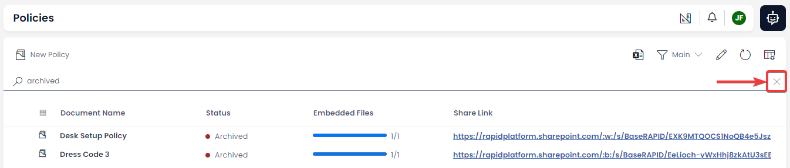

# Viewing Data Using Tables
## Tables Display Data
Data Tables are the main method of viewing data in Rapid. A data table presents a list of all items that have the same type. For example, the **Policies** table in *Rapid Standard* displays only policy items. The **Assets** tables displays assets.

 

## Tables Use Columns
The data of each item is split into columns. We can see that each item in this **Policies** contains information under the columns titled: *Document Name*, *Status*, *Embedded Files*, and *Share Link*.

### The Title Column
Note that the first column is written **in bold**. When your mouse hovers over this **bold** field, it is also underlined. This is called the *Title Column*.

You can <a href="https://rapiddocs.z8.web.core.windows.net/docs/Rapid/User Manual/glossary#data-table" target="_blank">visit the glossary</a> to learn more about data tables and their basic terminology.

## Searching for Items
Using the search bar, you can find a particular item in a table. To search for an item:
1. **Press the search bar.** The search bar also has an icon of a magnifying glass. Note that the search bar also automatically explains what type of data item you will be searching. For example, when searching the **Policies** table, the search bar reads: "Search Policies".

2. **Type your search.** You can search for the content of a column, and Rapid Platform will return any relevant items. For example, we can search for all or part of a *Document Name*.

3. Press **Enter** or **Return** on the keyboard.

> *Pictured:* by typing "desk" into the **Policies** table search bar, Rapid returned the item that is titled: "Desk Setup Policy".

### Many Columns are Searchable

As another example, we can search for the *Status* of an item. For example, we can search for any "Archived" items.

However, some fields cannot be searched. The *Embedded Files* and *Share Link* columns, for example, are not searchable. Additionally, your system administrator may decide to prevent the search fuction on any columns with sensitive information.

### Undoing a Search
If you would like to undo a search and view all of the items again, there are several ways to do this.

1. **Press the cancel button.** On the far right-hand side of the search bar, there is an **X** icon that will cancel your search.

2. **Delete search text and press enter**. You can delete the text in the search bar, and then press enter to remove all search filters from the table.

3. **Refresh the browser.** By using your browser's refresh button you can view all items in a table again. The keyboard shortcut for this is `F5` (on Windows), or `⌘ Cmd + ⇧ Shift + R` (on Mac)
.

## Can inline refresh the data table

## Items display their entity type icon

## Item icons are clickable and open the item page

### Title fields display as clickable links that open the item page

### Can double click a row to open the item
