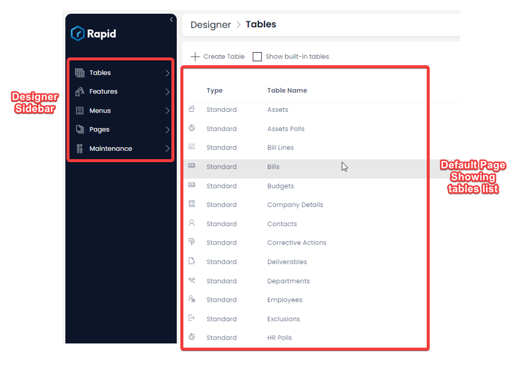
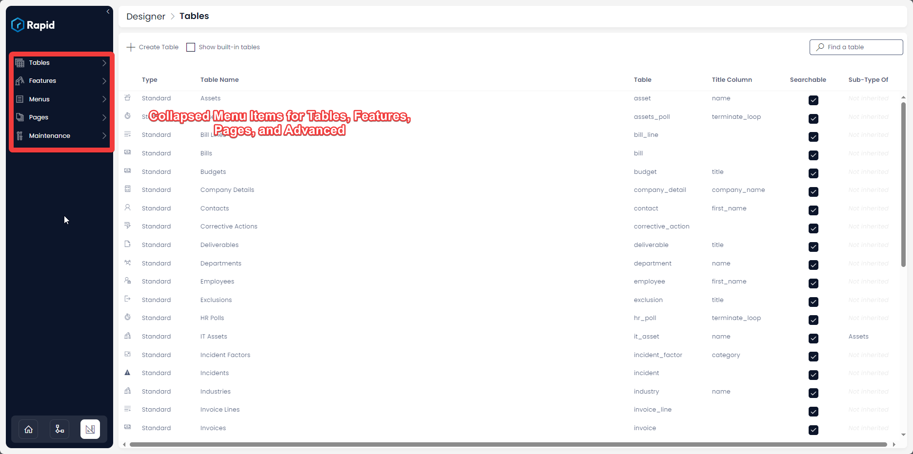

# How to access Designer?

**Welcome to Designer -** This is your space to create your business database [**tables**](/docs/Rapid/3-User%20Manual/Glossary/glossary.md#data-table "Data Table") and organise the Rapid Platform according to your business needs.

In this guide, we will take a quick look at some of the important functions that you can perform using Designer in Rapid Platform.

**To access *Designer*:**

- Click on the Designer icon in the bottom left of the screen
      
    <iframe allowfullscreen="allowfullscreen" frameborder="0" height="420" src="https://www.youtube.com/embed/Poycv1xhmIk?si=71gpRmg2XrnuycxA" title="YouTube video player" width="750"></iframe>**

As the Designer Window opens up, it will be by default on the tables page.

This is what the **Designer** screen looks like. The blue coloured left column is called the Designer [Sidebar](/docs/Rapid/3-User%20Manual/Glossary/glossary.md#sidebar "Sidebar"). The white portion lists the existing database tables.

For a newly created site, there would be no list of tables.

Please note the Designer Sidebar has collapsed design options titled - Tables, Features, Menus, Pages, Advanced.

These represent the key functions of Designer and houses all the design options in your site.

We shall organise our discussion in this chapter around these five items:

- [Tables](/docs/Rapid/4-Keyper%20Manual/2-Designer/1-Tables/all-about-tables-in-designer/all-about-tables-in-designer.md "All about Tables in Designer")
- [Features](/docs/Rapid/4-Keyper%20Manual/2-Designer/Permissions/feature-access-control/feature-access-control.md "All about Feature Control in Designer")
- [Menus](/docs/Rapid/4-Keyper%20Manual/2-Designer/3-Menus/1-all-about-menus-in-designer.md "All about Menus in Designer")
- [Pages](/docs/Rapid/4-Keyper%20Manual/2-Designer/2-Pages/1-all-about-pages-in-designer.md "All about Pages in Designer")

Click on each option to learn more about them.