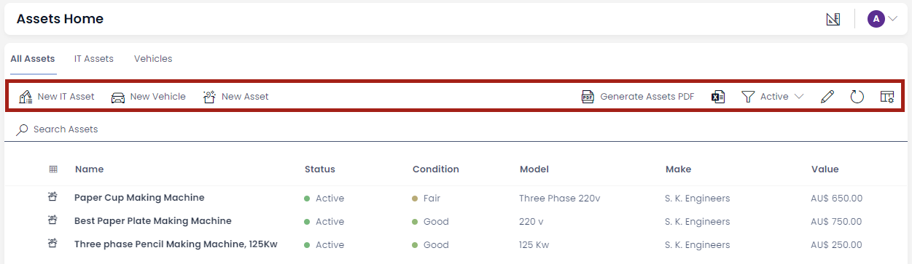

# Glossary

Here are definitions and references to terms used for discussing RAPID Platform functions and features.

## Designer

*Designer* is an application in Rapid Platform.

It helps in defining Table Data Structures, Menu Configurations, Pages and other aspects of your site.

You can access Designer from your main Rapid site using the navigation bar on the bottom of the menu.

**Releated Articles**

[What is Designer?](https://docs.rapidplatform.com/books/experiences/page/what-is-dezigna-designer-application "What is Dezigna (Designer application)?")

## Data Table

A data table is a collection of data organised across columns.

Here,

- Title
- Guide Author
- Owner
- Link
- Business

are columns that organise the data about various items in the table.

**Releated Articles**

[What is a data table structure?](https://docs.rapidplatform.com/books/glossary/page/data-table-structure "Data Table Structure")

## Table

A table defines the shape of data across various columns. The term table refers to the list of these columns along with their attributes. Tables also include additional configuration, such as where they store files, the default permissions when creating rows on the table and various default values.

When you are defining column attributes, such as:

- Column name
- Field Type

it is called defining the Table structure.

The Rapid Platform allows defining of data table structures that suits information needs, using the Designer application.

**Related articles**

[What is Designer?](https://docs.rapidplatform.com/books/experiences/page/what-is-dezigna-designer-application "What is Dezigna (Designer application)?")

## Command bar

A command bar is the horizontal area containing command buttons like Save, Delete, Add new item etc. Command bars are typically found at the top of a region containing data, such as a table, board, Gantt chart and item profile.

**Command bar in Table view**

**Command bar in Item view**

## Explorer

Explorer is an application in Rapid Platform. It can be understood as a front-end of the system, using which a user can interact with the data in different ways.

You can get to Explorer via the quick link buttons at the bottom of your main site menu.

## Sidebar

A sidebar is a collection of Menu items for easy navigation to various pages in RAPID Platform.

Each experience between Explorer, Designer and Workflow have their own sidebars. All contain the quick navigation buttons to jump between the three.

## Menu

A menu can be most fundamentally be perceived as a button.

There are two types of menu buttons:

- In the [Sidebars](https://docs.rapidplatform.com/books/glossary/page/sidebar "Sidebar")  
    

- In [command bars](https://docs.rapidplatform.com/books/glossary/page/command-bar "Command bar") 
    

The On-Click Action of the menu button can be configured.

Rapid Platform allows for several different types of On-Click Actions that can be used to customize the experience for your Users.

**Related articles**

[All about Menus](https://docs.rapidplatform.com/books/experiences/page/all-about-menus-in-dezigna "All about Menus in Dezigna")

## Menu item

A Menu item is an item added in the menus list. This item is configured to give a ***[menu button](https://docs.rapidplatform.com/books/glossary/page/menu "Menu")*** desired properties.

Each of the below shown in the tree is an example of menu item.

**Related articles**

[**All about Menus**](https://docs.rapidplatform.com/books/experiences/page/all-about-menus-in-dezigna "All about Menus in Dezigna")

## Workflow

Workflow is an application in the Rapid Platform. It is a BPMN designer that allows users to set up and configure processes within the system.

You can access Workflow from the quick navigation buttons at the bottom of your main site side bar.

**Related articles**

[Workflow User Manual](https://docs.rapidplatform.com/books/workflow-keyper "Workflow - Keyper")

## Table items and columns

An **item** in a table refers to the a single group of related data within a table. Relational databases contain **[tables](https://docs.rapidplatform.com/books/glossary/page/data-table "Data Table")** with items / rows and columns (also known as records and fields, respectively).

Columns are vertical, and hold a list of values all from the same field. Items are your horizontal elements in a table. The values in an item belong to different fields, but all refer to a single unit (like a row that contains information about one customer or one order).

## Inherit Table / Sub-Type Of

### Case Scenario

While conducting routine business operations, you need to collect and store contact information about various stakeholders - for instance - contact information of customers, employees, suppliers etc.

The nature of information stored for each category differs slightly, however, there are certain fields which are common. For example - you would want to store - Name, Contact Address, Email, Contact Number, Bank Account details etc. for employees as well as businesses. So we conclude that each type of stakeholder information will have a mix of - common fields (Name, contact number, Email etc.) and unique fields (Employee Id, ABN number etc. )

A brute-force approach would be to create separate tables (one each for businesses, employees etc.) from scratch. This would involve extra effort in creating columns that are common.

In Rapid Platform, you are not required to create the tables from scratch for each type of stakeholder.

#### Option 1 - Create a Lookup

The first option, which any relational database user will intuitively suggest, is use of lookups. This approach involves creating one table with common fields and then create another table with unique fields. Linking these tables using Lookup will allow you organise, store and fetch data.

However, imagine a large organisation, storing hundreds of transactions in a day. The volume of data in the table with common fields would bulky. This is because, the common table would be storing contact data for all the stakeholders (businesses, employees, suppliers etc.)

Further, and more importantly, any change made to the common fields will reflect into all the connected tables. For example - you wish to rename a field as Bank Account number as Employee Bank Details. You will have to compromise on such a change as it will make this field irrelevant for Businesses.

#### Option 2 - Inherit / Sub-Type Of

The other option possible in Rapid Platform, is to create a table with common fields. Let us call this Contacts.

Then create another table called Businesses, which inherits all the common fields from Contacts. Similarly, create another table called Employees, which also inherits all common fields from Contacts.

Inherit all fields means - the table structure of Businesses will copy all the fields as defined in Contacts. You can then easily modify the business column list and add / delete / modify business specific columns to it.

The creation effort for common fields is saved, but it still creates a separate, independent table.

In this relationship

- Contacts table - **Parent**
- Businesses, Employees etc. tables - **Sub-Type Of Contacts**

It is easy to identify which table is a Sub-Type of which other table in Designer. The last column displays the Sub-Type of values. If the table is not a sub-type of any other table, then it displays "Not inherited", otherwise it displays the name of the parent table.

For a particular table, we can easily identify which columns have been inherited from parent and which have been created afterwards. In the columns tab for a table in Designer, you can observe the last column ***Base Type.*** For the columns inherited from parent, this column provides the name of the column. For newly created columns, this field will display "*Not inherited*".

**Related articles**

[How to create a new table in Rapid Platform?](https://docs.rapidplatform.com/books/experiences/page/how-to-create-a-new-data-table-in-designer "How to create a new data table in Designer?")

[How to view / update table options of an existing table in Designer?](https://docs.rapidplatform.com/books/experiences/page/how-to-view-update-table-options-of-an-existing-table-in-designer "How to view / update table options of an existing table in Designer?")

## Page, layout and component

### Page

A Page is a fundamental element in Rapid Platform. Consider a broad analogy of a blank page of a notebook. You can write something on a page and then this page can be read by others. Similarly, in Rapid Platform parlance, a page can be considered as an area to host components.   
  
Rapid Platform features components like Gantt Charts, Kanban Boards, Data Tables, Activity feeds, Forms, PowerBI Reports etc.

All of these can be configured on a page for data presentation.

### Layout

A layout can be considered as a section on a page. Layouts define the arrangement of components across the page.

Layouts serve three main purposes:

1. Without a layout you cannot add multiple components to a page. You can only have one component on a page without layout.
2. It assists in defining the arrangement of components on a page.
3. If you want to hide / show all the components on Details or Creation, it can be done with a single click

Please note :

- Every component needs a page where it can be configured.
- A page can have multiple layouts.
- Each layout can have multiple components.
- There are a total of 19 component options that are possible in Rapid Platform.

## Task Experience

Task Experience is the name given to a separate environment where a user can manage tasks. This is different from Explorer. Task Experience provides the details about the task along with other essential fields like Due Date, Priority, Task Status etc. Further, the User Interface enables the user to add time-logs against tasks.

The environment is accessed at url - tasks.rapidplatform.com/

**&lt;&lt;More Details + screenshots needed&gt;&gt;**