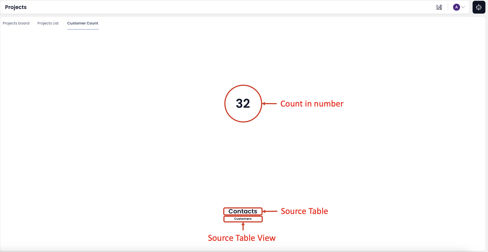
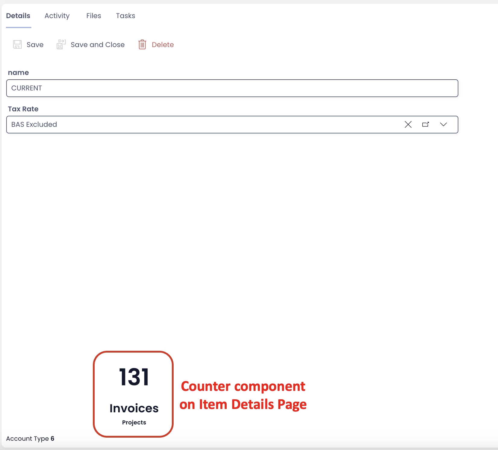

## What is a Counter Component?
Imagine you are a Company Executive and frequently visit the Projects Table. At any given point in time, you want to quickly reference the number of Customers of your organisation. 

The Counter Component can give you the **count of items** present in a defined Table View.

In the below image, you can identify the Table and View that provides the count.

:::info[**Please Note**]

The counter can appear in different size and position than depicted above. It depends on how the Counter Component is configured on the Page.

:::

:::tip[**Important Points**]

1. In case, the no Table View is mentioned, it means the default View - "All" is applied.

2. The counter does not have an upper threshold like a list on Page. A Page can show a list of 250 items, however, Counter component does not break at 250. It will count the full list number as defined by the Table and corresponding View.

:::