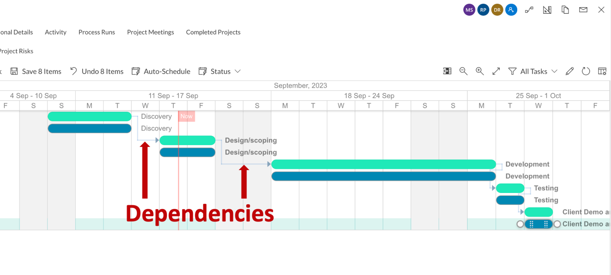
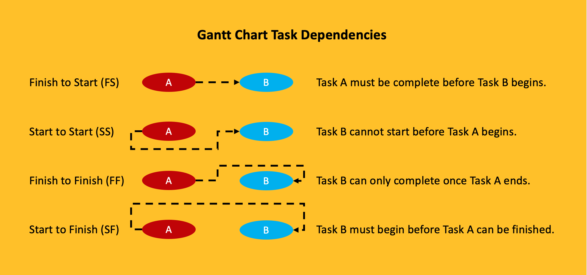

# How to create and edit dependencies in a Gantt Chart

A Gantt Chart provides a visual representation of tasks in a project. However, in real life scenarios, these tasks are often related to each other.

For example - Consider two tasks in a home construction project:

- Task A - erect walls
- Task B - paint erected walls

Task B can only start upon completion of Task A.

Such relationship between tasks in a project are known as Dependencies in Gantt Charts.

Gantt Chart Dependencies show how project tasks are connected and help you determine which tasks should be taken up first for smooth project execution.

In RAPID Platform, dependencies in Gantt Chart are depicted with arrows connecting the boundaries of related tasks.

## **Understanding Types of Dependencies in Gantt Chart**

Understanding task dependencies in Gantt Charts is a crucial element. This dependency affects the project schedule. Changing the predecessor of a task will affect the successor task, which will affect the next task, and so on.

 In general, there are four types of Gantt chart task dependencies:

- **Finish to Start (FS)** - FS dependency is the most common and logical one. It follows the natural flow of tasks from one to the next. The successor task will not be able to commence until the predecessor activity is complete.

For instance : to the Task B - painting walls can only start post completion of Task A - erecting walls, is an example of FS type. *(refer example at the start of this page)*

- **Start to Start (SS)** - In this type of dependency, Task B can only start after Task A has begun.

For example : let the project be installation of fence around the boundary of a plot.

- - Task A - erect fence
    - Task B - paint fence

You can start painting the fence as soon as erection of fence has started from one corner of the plot.

- **Finish to Finish (FF)** - According to FF, you cannot finish the Task B until Task A has finished.

For example : in a software development project, let

- - Task A - write software code
    - Task B - test software

You can’t finish testing (task B) until coding (task A) has finished.

- **Start to Finish (SF)** - In this type of dependency, you cannot finish Task B until Task A has begun. But Task B can complete anytime after Task A has started.

For example : in a system transition project, let

- - Task A - start using new software system
    - Task B - phase out old system

Assuming that Task A and Task B cannot be run in parallel, you can finish phasing out old system only after new system use has started.

In a Gantt Chart, the above four dependencies can be represented as shown below:

##   

## **Concept of Lag / Gap**

Sometimes there is a need to define a mandatory delay between two tasks. For example - after completing the cementing of wall, it would require two days of drying before painting can begin.

This could be represented as an FS dependency with a lag / gap of 2 days.

## **Creating dependencies in Gantt Chart in RAPID Platform**

To create dependencies among tasks, please consider the following points:

<svg class="svg-icon" data-icon="link" role="presentation" viewbox="0 0 24 24" xmlns="http://www.w3.org/2000/svg"></svg>
<input id="bkmrk--0" placeholder="url" readonly="readonly" type="text"></input> <button class="button outline icon" data-clipboard-target="#pointer-url" title="Copy Link" type="button"><svg class="svg-icon" data-icon="copy" role="presentation" viewbox="0 0 24 24" xmlns="http://www.w3.org/2000/svg"></svg></button>
<svg class="svg-icon" data-icon="edit" role="presentation" viewbox="0 0 24 24" xmlns="http://www.w3.org/2000/svg"></svg>

1. As you hover your mouse pointer over the task, two white circles will appear at the end of the bar.
2. Place your mouse pointer over the white circle.
3. Click and drag.
4. A dotted line will appear on the screen in the direction of the pointer movement.
5. Drag and drop the line to the desired circle of another task.

**Please note:**

- The task from where you start dragging the white circle becomes TASK A
- The task to which you drag and drop dependency line is considered as TASK B
- The system will calibrate the type of dependency based on the relationship established
- You can establish dependencies among any pair including tasks and task parents in the Gantt Chart
- The Gantt Chart is automatically saved as the dependency is established (does not require saving)
- RAPID Platform automatically optimises the Gantt Chart based on the nature of dependencies

Please refer to the below GIF for illustration

## **Editing dependencies in Gantt Chart**

There can be various occasions where editing the dependency is needed.

Editing can enable two operations:

1. Define lag in number
2. Delete a dependency

A lag can be created by dragging the subsequent task (Task B) rightwards in the timeline. However, sometimes, it may be convenient to define the delay in numbers.

Also, in case you have defined a dependency mistakenly, then you may want to delete the same.

To edit a dependency, please consider the following points:

1. Hover over the desired dependency line connecting the two tasks.
2. The arrow will display a slight shadow indicating it is being selected.
3. Double click on the dependency line.
4. A dependency pop-up will appear.
5. The pop-up will display the names of the two tasks (Task A -&gt; Task B).
6. It provides a number field to define the lag.
7. There is a button to delete the dependency.
8. There is a button to close the Edit pop-up.
9. Please note, you will have to save the changes to the Gantt Chart post editing the dependency.

Please refer to the below GIF for illustration

## **Related articles**

**[How to create a new task and sub-types of task from Gantt Chart?](https://docs.rapidplatform.com/books/experiences-oxn/page/how-to-create-a-new-task-and-sub-types-of-task-from-gantt-chart "How to create a new task and sub-types of task from Gantt Chart?")**

**[How to open Task Details page from Gantt Chart?](https://docs.rapidplatform.com/books/experiences-oxn/page/how-to-open-task-item-profiles-from-gantt-chart "How to open task item profiles from Gantt Chart?")**

**[How to change start date, duration and resource from left panel?](https://docs.rapidplatform.com/books/experiences-oxn/page/how-to-change-start-date-duration-and-resource-from-left-panel "How to change start date, duration and resource from left panel?")**

**[How to interact with Gantt Chart component in Explorer with data?](https://docs.rapidplatform.com/books/experiences-oxn/page/how-to-interact-with-a-gantt-chart "How to interact with a Gantt Chart?")**