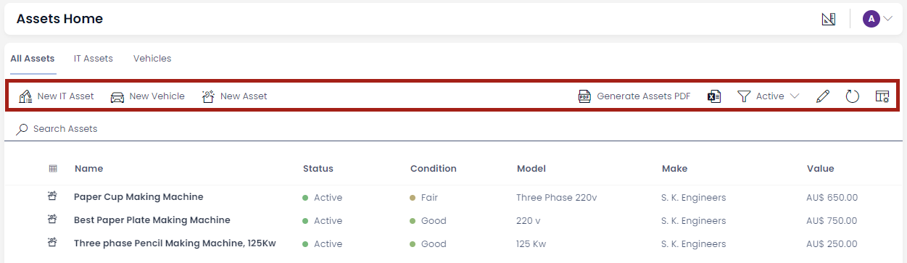
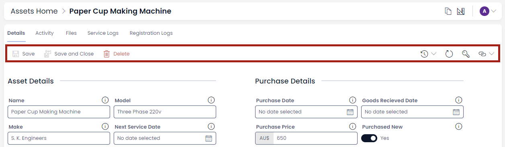

# Glossary

Here are definitions and references to terms used for discussing RAPID Platform functions and features.

## RAPID Experience
Experiences are self contained interfaces that interact with your site data for some purpose. These include:

### Explorer
A looking glass into your data. Explorer focuses on enabling users to see / edit / delete items in your site for any purpose. Suited best for direct data management.

You can get to Explorer via the quick link buttons at the bottom of your main site menu.

### Workflow
Based on the popular BPMN 2.0 workflow diagram specification, workflow focuses on letting users create and manage process diagrams that document their activities. With a built in processing engine, Workflow can also automate aspects of your business.

You can access Workflow from the quick navigation buttons at the bottom of your main site side bar.

**Related articles**
[Workflow User Manual](/docs/Rapid/4-Keyper%20Manual/3-Workflow/1-overview/1-overview.md "Workflow - Keyper")

### Designer
Designer provides a means to manipulate and control your site. It enables defining what Tables and Columns your site contains, managing pages and views and a slew of minor administration activities. 

You can access Designer from your main Rapid site using the navigation bar on the bottom of the menu.

**Related Articles**

[What is Designer?](/docs/Rapid/3-User%20Manual/3-Designer/1-what-is-designer/1-what-is-designer.md "What is Dezigna (Designer application)?")

### Tasks
Tasks focuses on helping Users to quickly find and manage their tasks.

Tasks is accessible [here](https://tasks.rapidplatform.com/).

## Data Table

A data table is a collection of data organized across columns.

Here,

- Title
- Guide Author
- Owner
- Link
- Business

are columns that organize the data about various items in the table.

## Table

A table defines the shape of data across various columns. The term table refers to the list of these columns along with their attributes. Tables also include additional configuration, such as where they store files, the default permissions when creating rows on the table and various default values.

When you are defining column attributes, such as:

- Column name
- Field Type

it is called defining the Table structure.

The Rapid Platform allows defining of data table structures that suits information needs, using the Designer application.

**Related articles**

[What is Designer?](/docs/Rapid/3-User%20Manual/3-Designer/1-what-is-designer/1-what-is-designer.md "What is Designer?")

## Command bar

A command bar is the horizontal area containing command buttons like Save, Delete, Add new item etc. Command bars are typically found at the top of a region containing data, such as a table, board, Gantt chart and item profile.

**Command bar in Table view**

**Command bar in Item view**

## Sidebar

A sidebar is a collection of Menu items for easy navigation to various pages in RAPID Platform.

Each experience between Explorer, Designer and Workflow have their own sidebars. All contain the quick navigation buttons to jump between the three.

## Menu

A menu can be most fundamentally be perceived as a button.

There are two types of menu buttons:

- In the [Sidebars](#sidebar "Sidebar")

    

- In [command bars](#command-bar "Command bar")

    

The On-Click Action of the menu button can be configured.

Rapid Platform allows for several different types of On-Click Actions that can be used to customize the experience for your Users.

**Related articles**

[All about Menus](/docs/Rapid/4-Keyper%20Manual/2-Designer/3-Menus/3-Menus.md "All about Menus in Designer")

## Menu item

A Menu item is an item added in the menus list. This item is configured to give a [**menu button**](#menu "Menu") desired properties.

Each of the below shown in the tree is an example of menu item.

**Related articles**

[**All about Menus**](/docs/Rapid/4-Keyper%20Manual/2-Designer/3-Menus/3-Menus.md "All about Menus in Designer")

## Table items and columns

An **item** in a table refers to the a single group of related data within a table. Relational databases contain [**tables**](#data-table "Data Table") with items / rows and columns (also known as records and fields, respectively).

Columns are vertical, and hold a list of values all from the same field. Items are your horizontal elements in a table. The values in an item belong to different fields, but all refer to a single unit (like a row that contains information about one customer or one order).

## Inherit Tables

### Case Scenario

While conducting routine business operations, you need to collect and store contact information about various stakeholders - for instance - contact information of customers, employees, suppliers etc.

The nature of information stored for each category differs slightly, however, there are certain fields which are common. For example - you would want to store - Name, Contact Address, Email, Contact Number, Bank Account details etc. for employees as well as businesses. So we conclude that each type of stakeholder information will have a mix of - common fields (Name, contact number, Email etc.) and unique fields (Employee Id, ABN number etc. )

A brute-force approach would be to create separate tables (one each for businesses, employees etc.) from scratch. This would involve extra effort in creating columns that are common.

In Rapid Platform, you are not required to create the tables from scratch for each type of stakeholder.

#### Option 1 - Create a Lookup

The first option, which any relational database user will intuitively suggest, is use of lookups. This approach involves creating one table with common fields and then create another table with unique fields. Linking these tables using Lookup will allow you organize, store and fetch data.

However, imagine a large organisation, storing hundreds of transactions in a day. The volume of data in the table with common fields would bulky. This is because, the common table would be storing contact data for all the stakeholders (businesses, employees, suppliers etc.)

Further, and more importantly, any change made to the common fields will reflect into all the connected tables. For example - you wish to rename a field as Bank Account number as Employee Bank Details. You will have to compromise on such a change as it will make this field irrelevant for Businesses.

#### Option 2 - Inherit / Sub-Type Of

The other option possible in Rapid Platform, is to create a table with common fields. Let us call this Contacts.

Then create another table called Businesses, which inherits all the common fields from Contacts. Similarly, create another table called Employees, which also inherits all common fields from Contacts.

Inherit all fields means - the table structure of Businesses will copy all the fields as defined in Contacts. You can then easily modify the business column list and add / delete / modify business specific columns to it.

The creation effort for common fields is saved, but it still creates a separate, independent table.

In this relationship

- Contacts table - **Parent**
- Businesses, Employees etc. tables - **Sub-Type Of Contacts**

It is easy to identify which table is a Sub-Type of which other table in Designer. The last column displays the Sub-Type of values. If the table is not a sub-type of any other table, then it displays "Not inherited", otherwise it displays the name of the parent table.

For a particular table, we can easily identify which columns have been inherited from parent and which have been created afterwards. In the columns tab for a table in Designer, you can observe the last column **Base Type.** For the columns inherited from parent, this column provides the name of the column. For newly created columns, this field will display "*Not inherited*".

**Related articles**

[How to create a new table in Rapid Platform?](</docs/Rapid/4-Keyper Manual/2-Designer/1-Tables/3-creating-tables/3-creating-tables.md> "How to create a new data table in Designer?")

[How to view / update table options of an existing table in Designer?](/docs/Rapid/4-Keyper%20Manual/2-Designer/1-Tables/5-Table%20Configuration%20Guides/how-to-view-update-table-options-of-a-table/how-to-view-update-table-options-of-a-table.md "How to view / update table options of an existing table in Designer?")

## Page, layout and component

### Page

A Page is a fundamental element in Rapid Platform. Consider a broad analogy of a blank page of a notebook. You can write something on a page and then this page can be read by others. Similarly, in Rapid Platform parlance, a page can be considered as an area to host components.   
  
Rapid Platform features components like Gantt Charts, Kanban Boards, Data Tables, Activity feeds, Forms, PowerBI Reports etc.

All of these can be configured on a page for data presentation.

### Layout

A layout can be considered as a section on a page. Layouts define the arrangement of components across the page.

Layouts serve three main purposes:

1. Without a layout you cannot add multiple components to a page. You can only have one component on a page without layout.
2. It assists in defining the arrangement of components on a page.
3. If you want to hide / show all the components on Details or Creation, it can be done with a single click

:::tip[Please Note:]
- Every component needs a page where it can be configured.
- A page can have multiple layouts.
- Each layout can have multiple components.
- There are a total of 19 component options that are possible in Rapid Platform.
:::

## Task Experience

Task Experience is the name given to a separate environment where a user can manage tasks. This is different from Explorer. Task Experience provides the details about the task along with other essential fields like Due Date, Priority, Task Status etc. Further, the User Interface enables the user to add time-logs against tasks.

The environment is accessed at url - [tasks.rapidplatform.com](https://tasks.rapidplatform.com)

Tenant - This is a Office 365 tenant reference for a company that is contained within BMS. They are segregated from the other tenants.

Site - Is a database within a Tenant combined with a set of page and entity definitions.  

User - This is the basic person that is operating the RAPID site.

Keyper - This is a special classification of user that is able to design and maintain their RAPID Site.

Admin - This is a user that controls permissions and security within the system.

IT Technical Support - This is a person in a client company that provisions IT resources.

Technical User - Same as Keyper but able to use Workflow Automation and external integration systems.

Developer - This is the people writing the software.

User Group - This is a collection of users that is given a name primarily for security purposes. You can use the group in lieu of a user in many cases.

Subgroup - A group within a user group.

Entity - A defined reference of what a particular Item will contain. It is the table definition within the database eg column (name, type).

Item - A specific row level instance of an entity (123 Fake St is an Item of the Address Entity).

Base Entity - An entity which serves on its own or as a parent to 1 or more inherited entities.

Inherited Entity - Extends a base entity data table with extra columns and data.

Rapid Page - A page definition built in Designer that is displayed in Explorer in context of an entity.  

List Page - The default page generated when an entity is created containing a data table and a list context.

Single Page - The default page generated when an entity is created containing a Tabstrip with the Details, Activity Feed, Tasks &amp; Files pages.

Details Page - The default page generated when an entity is created containing the default details definition and a single item context.

Activity Page - The default page generated when an entity is created containing the Activity Feed and a single item context.

Files Page - The default page generated when an entity is created containing the File Browser and a single item context.

Tasks Tab Page - The task list page linked from a tab strip. This tab and page link is generated by default when creating an entity.

Table View - A filtered or unfiltered list, can be saved and stored for re-use, multiple views per table possible.

Task - An item in the system default task entity.

Page Layout- Refers to either Desktop, Tablet or Mobile layout. A single page will display different for each layout.

Desktop Layout - One of three layouts able to be modified for an entity in RAPID Designer (&gt;1300px wide).

Tablet Layout - One of three layouts able to be modified for an entity in RAPID Designer (1300px wide).

Mobile Layout - One of three layouts able to be modified for an entity in RAPID Designer (600px wide).

Default Permissions - Refers to the default permissions on an item, by default every item made for that entity has these permissions.

Placeholder Permissions - Refers to the dynamically applied permissions on an item. These are based on the User or Group selected in a User Field.

Document Library - The default sharepoint folder for which files related to that entity are stored.

Process Diagram - A XML file almost matching the Carmunda [BPMN.io](http://bpmn.io/) standard, describing a business process using the BPMN 2.0 specification language.

Process Blueprint - The automation additions added to a process diagram to enable a process to be automated.

Process Run - One iteration of an executed Process.

Process Artifacts - An entity which stores items made during a Process Run.

Users Entity - An entity which stores the information of the users who have access to the Rapid Site.

System Entity - An entity which is on any RAPID Site upon creation and is required for its fundamental operation.

Dashboard - A designated page which serves as the dashboard in RAPID Explorer.

Component - This is an interactive element added to an items' grid layout that can come in the following flavours:

- Activity Feed
- Attachments
- Carousel
- Chart
- Counter
- Data Table
- External Page
- File Browser
- Form - This is the space defined for containing fields on a page.
- Grid Layout
- Image
- Linked Items
- Page
- Site List
- Tab Strip
- Gantt
- PowerBI Report

Board Component - A trello style way to view a collection of items and easily manage their status.

Gantt Component - A way of viewing a collection of tasks in a gantt chart.

Form - This is a special kind of component that can be added to an items' grid layout.

Embedded Form - A dynamic form component that will display fields based on the definition from a process definition.

Embedded File - As an extension of an embedded form, an embedded file is a single file ‘slot’ with a label (and some other meta-data).

Form Field : This is a type of data stored typically within a form, it can come in the following flavours:

- Boolean
- Choice
- Currency
- Date and Time
- Lookup
- Multiple lines of Text
- Number
- Percentage
- Single line of Text
- Subquery
- User
- Whole number

Remove Field - Removes the field from the form.

Field Deletion - Deletes field from form, removes column from data table &amp; schema.

Item Flyout - A modal window which contains the item opened.

Creation Flyout - A narrow modal window which contains a blank form to create an item.

Item Tabstrip - Refers to the navigation on the item flyout which contains the tab strip.

Linked Items flyout - Refers to the modal which opens on an item by pressing the 3 dots in the top right of the item flyout.

Linked Items - Refers to any linked items; universal links, scoped universal links, direct links.

Universal links - Refers to items which have been universally linked.

Scoped Universal Links - Refers to items which are connected through a multi lookup field.

Direct Link - Items which are linked through a lookup field.

Parent Link - Direct link but both sides of the link are for same entity, different item.

Inline Refresh - Refreshing a datatable, form or other page component using the inline controls.

Quick Filter - Filtering a datatable or search items through string matching.

Summary Task - Defines an item in the Gantt chart which groups 1 or more sub tasks within it.

Sub Task - Defines the task within a summary task.

BPMN - Business Process Management Notation. This is the notional standard developed by the OMG to describe how a business process is sequenced. This is the base definition followed by Compoza.

Tag - A unique reference given to each item within the system to allow for tracking within external systems. eg. Email.

Linked Items - Within the system we have replaced the concept of tags with linked items which is a structured tagging system that drives our dynamic linking functionality.

Notification - A message sent from the system to the user, hopefully a useful one.

Jumbotron - The large horizontal banner at the top of each page in Explorer &amp; Designer that contains the item name and buttons.

## Support request

A support request is a unit communication between the system user and the system's support staff. A user can create a support request when he/she is not able to proceed with a system functionality on his/her own or with the help of documentation. This indicates the need for assistance and a support request is a method to seek that assistance from support staff. 

Users can also use support requests for submit bugs or improvement requests. 

## Adaptive Documents

### Adaptive Document Canvas

The Adaptive Document Canvas is the interface which allows you to create, open, edit and configure elements of an Adaptive Document. 

### Document Structure Panel / Tree of Elements

You can scroll up and down to view all the components of the structure. You can click on any of the structural elements to select it on the  <a href="https://docs.rapidplatform.com/docs/Rapid/User%20Manual/glossary/#composition-area" target="_blank">**Composition area**</a>, or double click to edit the name of the element.

### Composition Area

This is the center portion of the Adaptive Document Canvas <a href="https://docs.rapidplatform.com/docs/Rapid/User%20Manual/glossary/#adaptive-document-canvas" target="_blank">**Adaptive Document Canvas**</a>. Here you can add, select and delete elements, and also perceive how various elements will appear visually. Please note this is different from Preview.

### Control

A control is the fundamental object which can be configured as an <a href="https://docs.rapidplatform.com/docs/Rapid/User%20Manual/glossary/#element" target="_blank">**elements**</a>. For example - imagine your Adaptive Document has two input fields - First name and Last name. Both of these are configured as different elements over the same control type (Single line). 

### Element

An element is a <a href="https://docs.rapidplatform.com/docs/Rapid/User%20Manual/glossary/#control" target="_blank">**control**</a> configured with attributes. For example - Imagine your Adaptive document has two input fields - First name and Last name. Both of these are single line input fields (control). These are two different elements which can be present on the composition area.

### Element Configuration Panel

Element configuration panel appears towards the right of the Composition Area. Depending on the nature of the element, this panel will display different  <a href="https://docs.rapidplatform.com/docs/Rapid/User%20Manual/glossary/#element-configuration-panel-categories" target="_blank">**configuration categories**</a>.

### Element Configuration Categories

The configuration categories appear in the  <a href="https://docs.rapidplatform.com/docs/Rapid/User%20Manual/glossary/#element-configuration-panel" target="_blank">**Element configuration panel**</a>. Categories include:

a. Attributes - to define the appearance parameters of the element on the form.

b. Conditions - to define logic which governs conditions when the element can be enabled, or appear etc.

c. Validation - to set element level validation criteria. When the criteria is met, the element will be considered valid, else invalid.

d. Connection - to define the connection of the element with data table's column.

e. Event - To define what actions can be triggered upon click of the element (please note this option is applicable for button elements only.)

f. Choice - To define the choices that will appear in a dropdown element. (please note this option is applicable for choice type elements.)

Based on the nature of the elements selected, configuration categories will appear in the  <a href="https://docs.rapidplatform.com/docs/Rapid/User%20Manual/glossary/#element-configuration-panel" target="_blank">**Element configuration panel**</a>

### Element Picker

The Element Picker enables you to add <a href="https://docs.rapidplatform.com/docs/Rapid/User%20Manual/glossary/#element" target="_blank">**elements**</a> to your document.

To learn about the various features of the element picker, <a href="https://docs.rapidplatform.com/docs/Rapid/Keyper%20Manual/Adaptive%20Designer/Element%20picker%20features/" target="_blank">**click here**</a>.

### Fetch on load

The Fetch on Load flag for a connection controls if data is updated from the site. This ensures that data presented is always up to date for the User.
Fetch on load can overwrite values from the documents default values, state values and prefill values. 

Fetch on load will only try to get data for an item if it has an ID. This still allows for the creation via default/state/prefill of blank items to be created.

Consider the following conditions:

1. **Fetch on Load = Yes AND Item has an ID field**  
  System will fetch the most up-to-date version of the source.

2. **Fetch on Load = Yes AND Item does not have an ID field**  
  System has nothing to fetch from the source, hence the form will load is as per the form creator's provided values (via default, state and/or prefill)

3. **Fetch on Load = No**  
  System will load the form as configured by the form creator. (via default, state and/or prefill)

