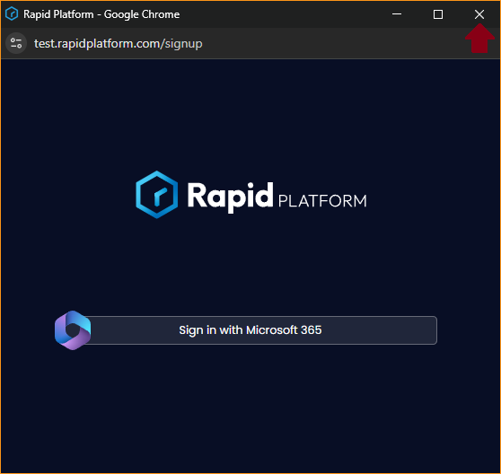

# Admin Consent
New Rapid sites by default have minimal consent. This limits Workflow to a one hour operating cycle, all automated file system behaviour and public forms disabled. To unlock the full power of the platform the application requires consent to access MS Graph resources without a User.

To unlock Admin Consent there are two main methods:
## Automatic
1)	In your site, navigate to the Designer experience using the bottom left buttons

 
2)	Using the side menu, open Maintenance > Admin

 
3)	Press the ‘Grant Admin Consent’ button in the command bar

 
4)	Out of the two options, choose Automatic

 
5)	Press the consent button to trigger the process

 
6)	You should see a Microsoft login window, go through their flow and login. You will then be presented with the list of permissions. After reviewing them press Accept to continue

 
7)	After accepting sometimes Microsoft will redirect the window to our blank signup screen instead of closing the popup. If it does, feel free to close the window.

 
8)	After signing in, you should see the consent markers like this

 
9)	Pres Recheck to get the system to check with Microsoft that consent is complete. Microsoft can take up to 10 minutes before it filters through their system. In this example it took about 30 seconds, but your milage may vary.

 
Once you have both ticks, you are good to go!

## Manual Method
To enable Admin consent manually, login to the [Azure Portal](https://portal.azure.com) as an administrator

1)	Navigate to Entra ID and then open up Enterprise applications under the Manage header

 
2)	Select Rapid Platform application. It will have an Application ID of cd5db0ec-1419-4ae6-9434-21cfb83fc42d

 
3)	Under the Security heading select Permissions where you will see the Grant Admin Consent button. You will also see a list of requested permissions from the application. After reviewing the list, press the consent button to confirm consent.

 
4)	You should see the permissions (typically after an inline refresh) marked as consented by Admin consent like this. We have observed it can take up to 15 minutes (even longer than the automatic method) before this consent filters through the rest of the Microsoft infrastructure.

 
With consent granted you should now be done! 
