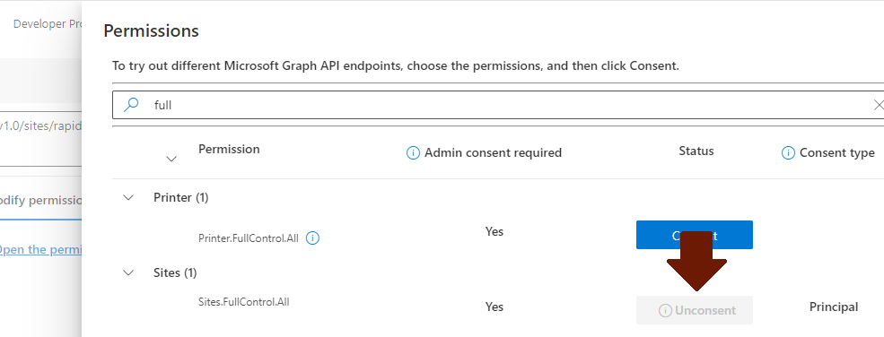
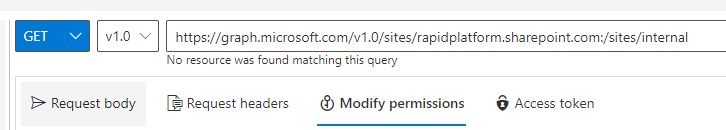
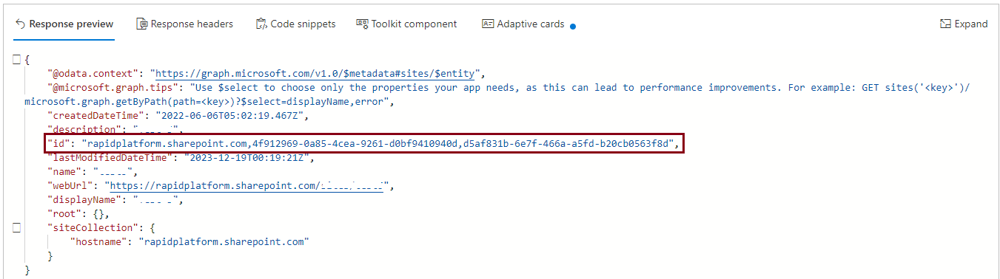

# Configuring Sites.Selected for SharePoint

SharePoint [offers](https://devblogs.microsoft.com/microsoft365dev/controlling-app-access-on-specific-sharepoint-site-collections/) a per site customizable permission set that allows you to control exactly how much reach an application that uses these permissions can have. Rapid Platform uses this permission to empower you to have complete control over your security.

Configuring this permission set is currently not supported by Microsoft UIs.

## How to set a Sites.Selected permission

### Before you begin

Ensure you have a SharePoint site associated with your group and sufficient admin privileges to consent to the `Sites.FullControl.All` permission.

### Get the Site ID for your site

1\) Navigate to the [Graph Explorer](https://developer.microsoft.com/en-us/graph/graph-explorer)

2\) Login and consent to the `Sites.FullControl.All` permission

3\) Fetch the site details by name

`GET https://graph.microsoft.com/v1.0/sites/{tenantname}.sharepoint.com:/sites/{sitename}`

For example to fetch the details of the internal site here at rapidplatform. Note that sites with a space in their name are removed; for example 'Product Testing' becomes 'ProductTesting'.



4\) Copy out id value



### Create the permission

1\) Assemble the URL in Graph Explorer

`POST https://graph.microsoft.com/v1.0/sites/{Full Id}/permissions`

2\) Assemble the post body

```JSON
{    "roles": [        "fullcontrol"    ],    "grantedToIdentities": [        {            "application": {                "id": "cd5db0ec-1419-4ae6-9434-21cfb83fc42d",                "displayName": "Rapid Platform"            }        }    ]}
```

3\) Make the request. You should see a pair of permissions being created for v1 and v2.