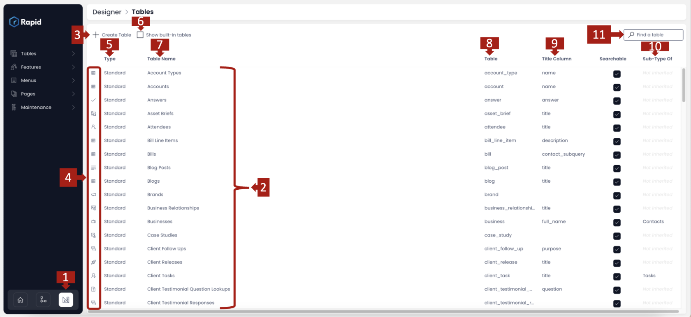
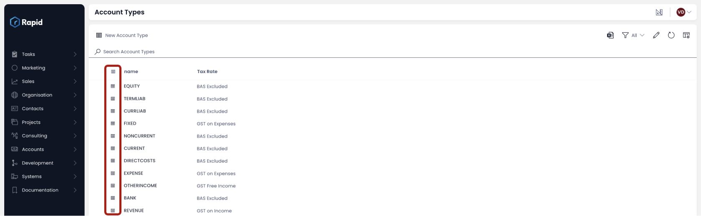
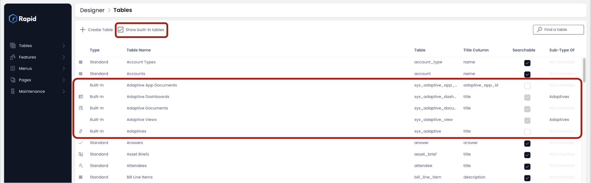

# All about Tables in Designer

## Overview

Rapid Platform allows you to easily create and edit database tables. The purpose of this page is to explain what a Database Table is and how to use the Table configuration UI.

## What is a Database Table?

Imagine you have a big file cabinet where you want to organize information about different things. Each drawer in the cabinet represents a category or a type of information. Now, let's say you want to keep track of information about your friends. Instead of having one messy pile of papers in the drawer, you decide to use a table.

ITables are comprised of rows and columns. Each row is like a separate sheet of paper, and each column is a specific piece of information you want to keep about your friends. For example, you might have columns for their names, ages, and phone numbers.

So, each row in the table represents one friend, and the columns represent different details about them. This way, when you want to find information about a particular friend, you can look at that friend's row and quickly see their name, age, and phone number neatly organized in the columns.

In the world of computers and databases, these tables work in a similar way. Each table is used to store specific types of information, and each row in the table holds a record with various details. The tables help keep things organized, making it easier to manage and retrieve information when needed.

## Table Configuration

The default Designer window will appear something similar to the image shown below:

This window provides the following information and features. Please follow the numbering shown in the image above for corresponding description below:

**1. The Designer Button** - Clicking on this button brings you to the Designer window.

**2. List of existing tables** - The default Designer window will show the list of all tables created by different users as per their business needs. These are called custom tables. The tables are arranged as per the alphabetical order of Table Names.

**3. Create Table button** - This button enables you to create a new custom table based on your business needs. To learn how to create a new custom table, [click here](/docs/Rapid/4-Keyper%20Manual/2-Designer/1-Tables/3-creating-tables/3-creating-tables.md "How to create a new table in Designer?").

**4. Table Icon** - This column provides the Icon identifier for a table. This identifier helps distinguish one table from another visually. It also becomes a relevant identity for the table items in Explorer ie. when you view items of this table in Explorer, they will have this icon against them.

**5. Table Type** - This column provides the information about the type of a specific table. There are two types of tables

- **Standard** - these are the custom tables
- **Built-in** - these are the system tables used by Rapid Platform for system functioning

**6. Show built-in tables** - This is a checkbox field. When this field is checked, the list of tables will show Built-in Tables like Adaptive App Documents, Adaptive Dashboards etc. These tables are hidden from the Designer window's default view.

**7. Table Name** - This column shows the title of the table as provided by the user at the time of table creation. Please note, the table titles are always plural.

**8. Table slug** - This column shows the table identifier as created by the system based on the Table Name. This identifier is used by the system to refer to the table throughout Rapid Platform.

**9. Title Column** - The title column displays the principle column of the table. It is a good practice to have a title column or a unique key identifier for each row of the table. However, it is optional to mark a column as title column, while creating / updating a table.

**10. [Sub-Type Of](</docs/Rapid/3-User Manual/glossary/glossary.md#inherit-tables> "Inherit Table / Sub-Type Of")** - When a table inherits its structure from another existing table, it is said to become a "Sub-Type Of" or child of that table. For example - Table A inherits structure from Table B, then Table A will be termed as the Sub-Type Of Table B. In this column, the Table Name of the parent table (Table B in our example) will be displayed.

**11. Find a table** - This is search field. It is typically useful when there are a lot of tables in the list of Designer window, and you wish to refer to your desired table. Just type in the letters of the table slug and the list will start to prune itself with the matching criteria.

The filter can be cleared by pressing the X icon at the right end of the field.  
  
<iframe allowfullscreen="allowfullscreen" frameborder="0" height="420" src="https://www.youtube.com/embed/sRT_0-fF1y0?si=dHxbFre5Pjxis34i" title="YouTube video player" width="750"></iframe>

**12. Open table details** - If you wish to view the details of a specific table like Table options, column structure etc., you can achieve this by double clicking on a table name.  
  
<iframe allowfullscreen="allowfullscreen" frameborder="0" height="420" src="https://www.youtube.com/embed/GUyFwOgXU6M?si=JyHftwataRuuJY0o" title="YouTube video player" width="750"></iframe>

### Features and functions for Tables in Designer:

[How to create a new table in Rapid Platform?](/docs/Rapid/4-Keyper%20Manual/2-Designer/1-Tables/3-creating-tables/3-creating-tables.md "How to create a new data table in Designer?")

[How to view / update table options of an existing table in Designer?](/docs/Rapid/4-Keyper%20Manual/2-Designer/1-Tables/5-Table%20Configuration%20Guides/how-to-view-update-table-options-of-a-table/how-to-view-update-table-options-of-a-table.md "How to view / update table options of an existing table in Designer?")

[How to add a new column to a table?](/docs/Rapid/4-Keyper%20Manual/2-Designer/1-Tables/5-Table%20Configuration%20Guides/how-to-add-columns-to-a-data-table/how-to-add-columns-to-a-data-table.md "How to add columns to a data table?")

[How to edit / delete a column from a table?](/docs/Rapid/4-Keyper%20Manual/2-Designer/1-Tables/5-Table%20Configuration%20Guides/how-to-edit-delete-a-column-from-a-table/how-to-edit-delete-a-column-from-a-table.md "How to edit / delete a column from a table?")

[How to edit / delete Table Views in Designer?](/docs/Rapid/4-Keyper%20Manual/2-Designer/1-Tables/5-Table%20Configuration%20Guides/how-to-edit-delete-table-views-in-designer/how-to-edit-delete-table-views-in-designer.md "How to edit / delete table views in Designer?")

[How to set up security &amp; permissions for a table? ](/docs/Rapid/4-Keyper%20Manual/2-Designer/1-Tables/5-Table%20Configuration%20Guides/how-to-set-up-security-permissions-for-a-table/how-to-set-up-security-permissions-for-a-table.md "How to set up security & permissions for a table?")

[How to delete a table in Rapid Platform?](/docs/Rapid/4-Keyper%20Manual/2-Designer/1-Tables/4-deleting-tables/4-deleting-tables.md "How to delete a table in Rapid Platform?")

[All about *Menus* in Designer](/docs/Rapid/4-Keyper%20Manual/2-Designer/3-Menus/3-Menus.md "All about Menus in Designer")

[All about *Pages* in Designer](/docs/Rapid/4-Keyper%20Manual/2-Designer/2-Pages/1-all-about-pages-in-designer.md "All about Menus in Designer")