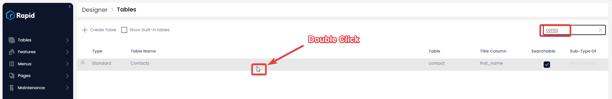
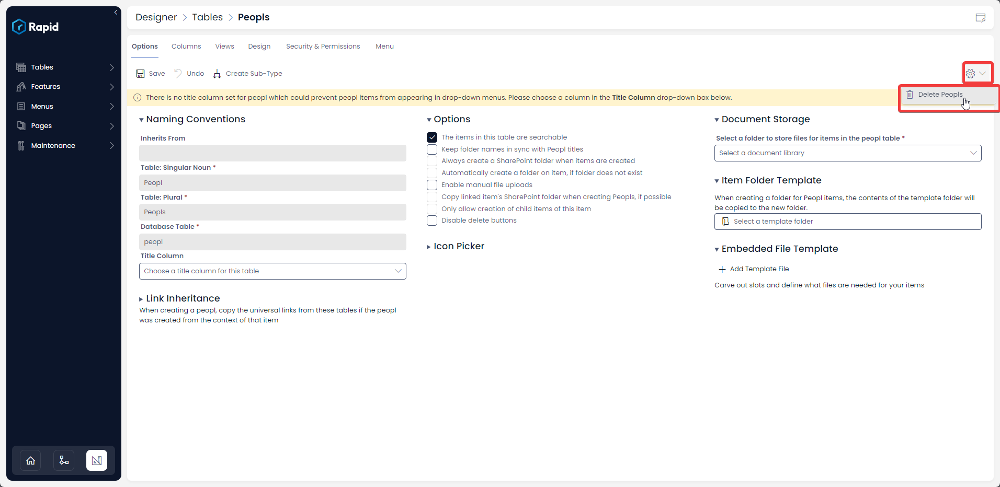
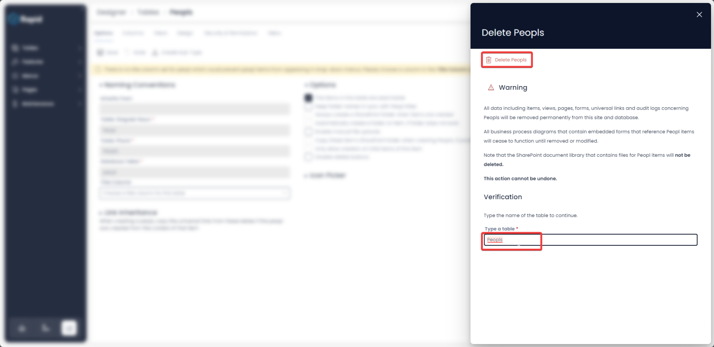

# Deleting Tables

## Overview

There may be scenarios where you would want to delete the entire data table from the system. Especially when in the design phase. The purpose of this page is to demonstrate how to do so.

## How to Delete a Table

To achieve this you may follow the below steps:

1. Navigate to Designer &gt; Tables &gt; All Tables  
   
2. Open your desired table. (Find your desired table by using the search bar or scrolling through the list)  
    
3. Select the options cog &gt; Delete &lt;Table Name&gt;
    
4. Type the name of the table in the verification window and press Delete &lt;table name&gt; button
  
    <iframe allowfullscreen="allowfullscreen" frameborder="0" height="420" src="https://www.youtube.com/embed/peq34Uhzmqs?si=Q_Ca01NP5P7fN9Yx" title="YouTube video player" width="750"></iframe>

Please note once the above steps are successfully completed all data, links and all system impressions of the subject table will be permanently deleted from the system. This action cannot be undone!

Always use this option with care and when fully certain of outcomes.

**Please note** - if your table has linkages to other table(s), then the system would not allow you to delete the subject table.

[How to set up security &amp; permissions for a table? ](https://docs.rapidplatform.com/books/experiences/page/how-to-set-up-security-permissions-for-a-table "How to set up security & permissions for a table?")

[How to create a new table in Rapid Platform?](https://docs.rapidplatform.com/books/experiences/page/how-to-create-a-new-data-table-in-designer "How to create a new data table in Designer?")

