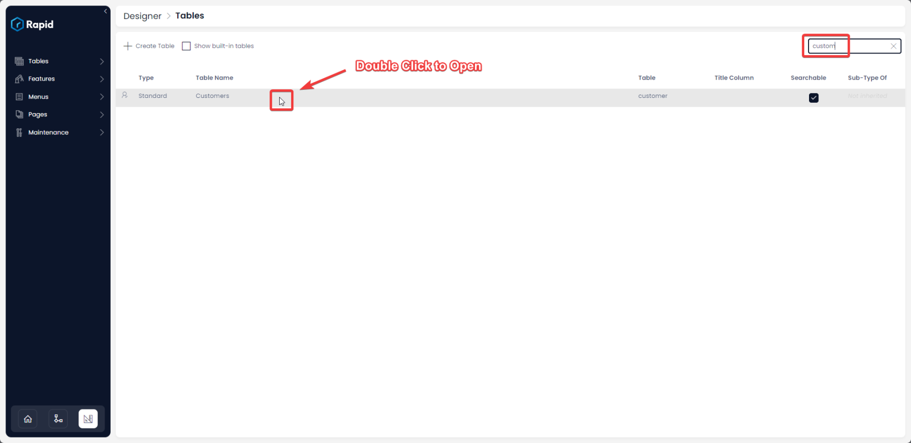
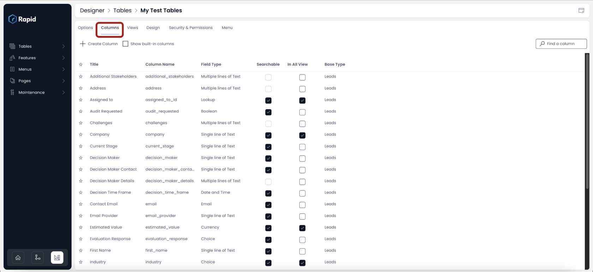
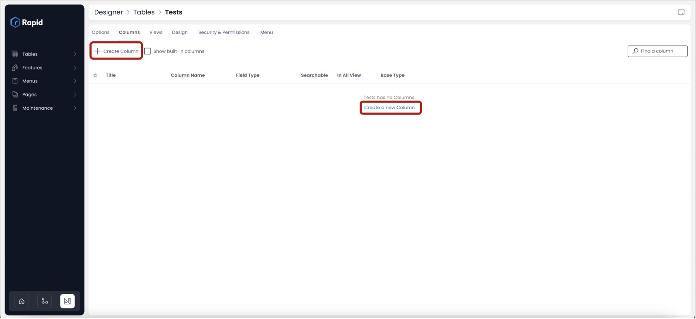
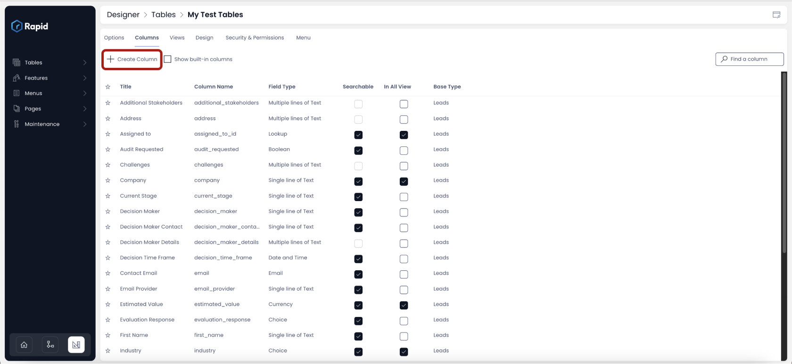
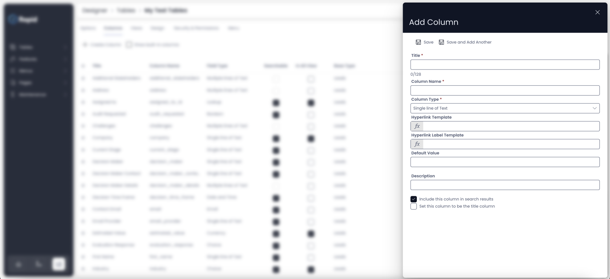
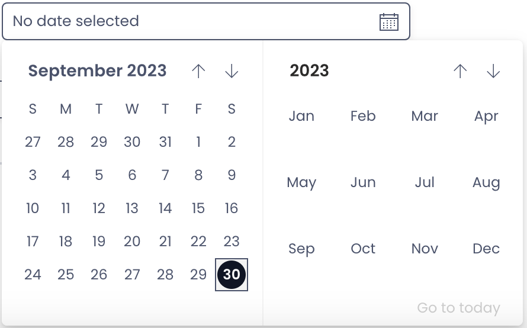
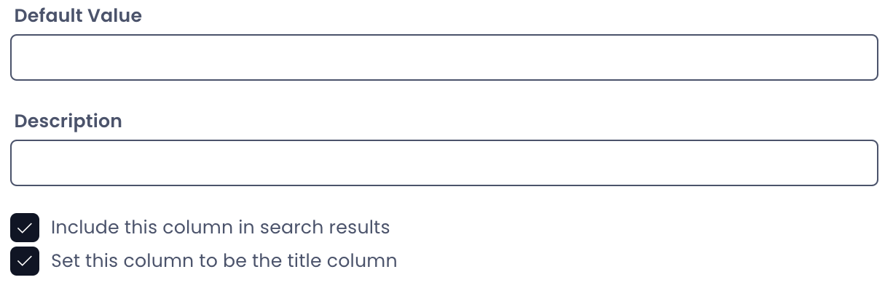

# How to add columns to a data table

## Overview

Columns of a data table are used to describe the various attributes of the data you are collecting. For example, on a table called **Customers** the columns could include: **First Name**, **Last Name**, **Email**, **Date of Birth** etc.

The purpose of this page is to demonstrate how to create a new column. Which is broken into the following categories:

1. Accessing the Columns Configuration
2. Adding New Columns to a Blank Table
3. Adding Columns to a Table that already has configured Columns

### Accessing the Columns Configuration

To create a new column, you need to access the "**Columns**" tab for a table in Designer. To do so follow the steps below:

1. Navigate to Designer &gt; Tables &gt; All Tables  
   

2. Select the table you want to add columns to using either the search bar or scrolling to find it  

  

3. Click on the columns tab  

    

### Adding columns to a new blank table

In the above image, a new table - "Tests" is created, and the tab "Columns" is shown.

In this illustration, the table has not inherited any columns from an existing table and hence the columns window is blank.

To add a column to a table, just click on the "**Create Column**" button or "**Create a new Column**" link.

As you click on it, a panel will open up in right, which would read "**Add Column**".

### Adding columns to a table already having columns

You can add more columns to an existing table or a new table having inherited columns from another table.

As you click on the insert column, a panel will open up in right, which would read "**Add Column**". This is shown in below image.

### Add Column panel details

**Follow the steps below to configure a column:**

1. **Add a Title** - This is the name of the column as you would like to see it. For example - Employee Id. This is a mandatory field 
    1. **Column Name** - This is system generated based on the Title. For example if you have titled your column as "Employee Id", then the column name will be auto-populated as "employee\_id". This field is used for referencing the column throughout the system.
2. **Choose the Column Type**
    - **Single line of Text -** This is the default column type. It allows you to input short sequence of characters which will be treated as text. For example - "Employee Id" can accept A001 as a value if defined as Single line of Text.
    - **Email -** As the name suggest, this type is used to store email value. If the value is not having an @ or similar email identifiers, then the system will throw an error and notify the user.
    - **Multiple lines of Text -** This type is suited where the user wants to enter large texts (compared to Single line of Text). This type is more suited for Descriptions, Remarks or Feedbacks.
    - **Date and Time -** This type is used to capture Date and Time. This field open a date and time picker for the user in Explorer. 
        - **Default Time -** The system also provides you the option to set a default value of date and time to the field. This means that while entering data into the table, if the user does not select a date, then this field will automatically have the default value.
        - **Default Relative Time -** You can set this default date value relative to the system calendar. For example - "Today" or "End of Month" etc. This is selected from a dropdown option - Default Relative Time. imagine if you need to set default date as the day when the user created the data entry, then you can set Default Relative Time as "Today".
        - **Default Value Offset -** Further, imagine that you want the default date as the next day from when the user created the data entry. So if the user created data entry in the table on 21 September, the default value should be 22 September. This is achieved through Offset field. It is possible to add or subtract a certain amount of days from the selected Default Relative Time. For the mentioned example, you can select "Default Relative Time" = "Today" and "Default Value Offset" = "1".   
           
           
           
            <iframe allowfullscreen="allowfullscreen" frameborder="0" height="420" src="https://www.youtube.com/embed/PPxUIMggj_o?si=aGrYUOW4Jcwu0FEN" title="YouTube video player" width="750"></iframe>

- **Choice -** There can be scenarios where you want users to choose from a given set of values. For example, consider the below question -

Select your skill level -

- Basic
- Intermediate
- Expert

In such a case, choice type of column would be ideal. The system allows you to configure the choices.

However, one can select only one choice at a time. In case there is a need to select more than one options, you can define the choices appropriately. For example:

- A
- B
- Both A and B
- Neither A nor B

The system also provides an option to configure colours as visual identifiers for each choice.

Please refer to below video for illustration.

<iframe allowfullscreen="allowfullscreen" frameborder="0" height="420" src="https://www.youtube.com/embed/L6iJKv9Erm0?si=Yel9_q-jmRcyI6mK" title="YouTube video player" width="750"></iframe>

- **Lookup -** Lookups are very useful when you wish to fill the value from another existing related table. For example - suppose you have a table - Employee Masters. This table stores the basic details of an employee. Now you are creating a table - Employee Payroll. This table will have the details of employee compensation items but will borrow the name from Employee Masters. Hence, Lookups allow for table connections.  
      
    <iframe allowfullscreen="allowfullscreen" frameborder="0" height="420" src="https://www.youtube.com/embed/CboOKEJ_NCI?si=Xr67GxILgg0RBPn_" title="YouTube video player" width="750"></iframe>
- **Boolean -** Boolean stores the value as a 1 or 0. This can be used when the user is asked a "Yes/No" question. For example - Do you want to continue?
- **Number -** This type stores the number. This can store decimals and negative numbers as well. The system can perform calculation on the same.
- **Percentage -** As the name suggest, this type is used to store percentage figures.
- **Currency -** Financial data can require storing amounts in a specific currency. You can use this type to define the currency of your choice.  
      
    <iframe allowfullscreen="allowfullscreen" frameborder="0" height="420" src="https://www.youtube.com/embed/OWWlllCzxzs?si=UZM8jifP-jFvJa0X" title="YouTube video player" width="750"></iframe>
- **Computed -** You can use a computed type of column when you require the system to calculate and store a value. For example - create file number appending F#10 to the row id.
    
    So, suppose if the row id is 20, then the system will compute the File number as F#1020.  
    The system shall check whether the query is syntax-wise ok or not  
      
    <iframe allowfullscreen="allowfullscreen" frameborder="0" height="420" src="https://www.youtube.com/embed/Tn_myC1Lo-o?si=9WZAvHLhXv1gdecL" title="YouTube video player" width="750"></iframe>
- **User -** Imagine if you wish to store the name of the project manager or the principal of a plan. In such cases, you can use the User column type which will allow you to store the identifier of the principals registered in your Rapid Environment.
- **Subquery -** Just like Computed type, the Subquery type can be used for the system to execute a SQL query. The system will execute the query and will store the result in the column.
- **Whole number -** As the name suggests, this type is used to store numerical values as whole numbers only. Unlike Number type, this column cannot store negative or decimal numbers.
- **Multiple Lookups -** While Lookup type points to a particular column in an existing table, however, a lookup column can store only one value. For example - you can select one employee name from a lookup to Employee Masters. However, if you wish to select multiple values from the table, you can use Multi Lookups. This, for example, will allow you to select multiple employees from the Employee Masters.
- **PowerBI Report -** This type helps you to connect and point to Microsoft PowerBI Reports.

3. OPTIONAL: **Enter a default value** (Based on the type of column selected, you will get an option to define the default value. For example - if you have a choice type of column with two choices as "Yes" and "No"; you can define the default value as "Yes". Similarly, if there is a Date type of column, then you can select "Today" as default value for the column.)

4. OPTIONAL: **Enter a Description** (You can use this field to express your description behind what this column will store.)

5. OPTIONAL: **Include this column in search results -** If this option is check, then you will be able to search items in Explorer based on this column. Minimising the number of searchable columns can give improved performance on very large tables.

6. OPTIONAL: **Set this column to be the title column -** Each table has a title column. If this option is checked then the subject column will be regarded as the title column for the table. The title column often serves as the main column for relational purposes.

7. Press Save

[How to edit / delete a column from a table?](../how-to-edit-delete-a-column-from-a-table/how-to-edit-delete-a-column-from-a-table.md "How to edit / delete a column from a table?")

[How to view / update the options of an existing table?](../how-to-view-update-table-options-of-an-existing-table-in-designer/how-to-view-update-table-options-of-an-existing-table-in-designer.md "How to view / update hte options of an existing table?")

