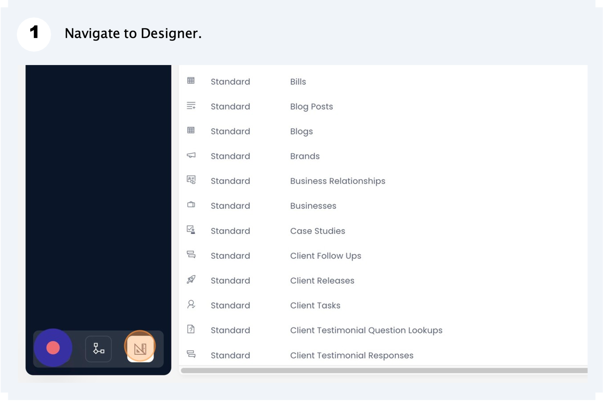
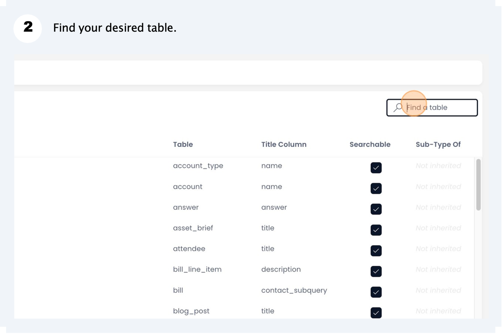
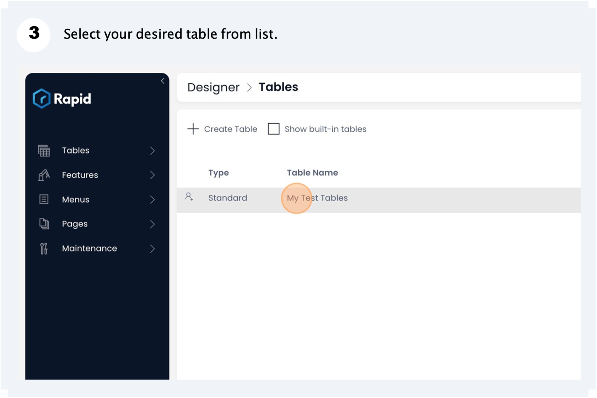
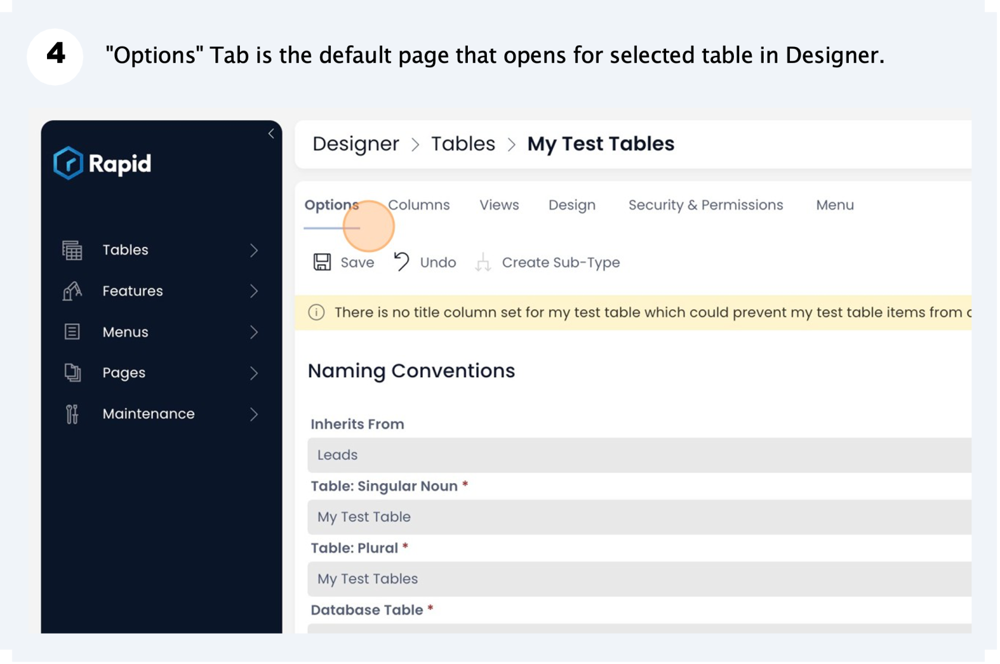
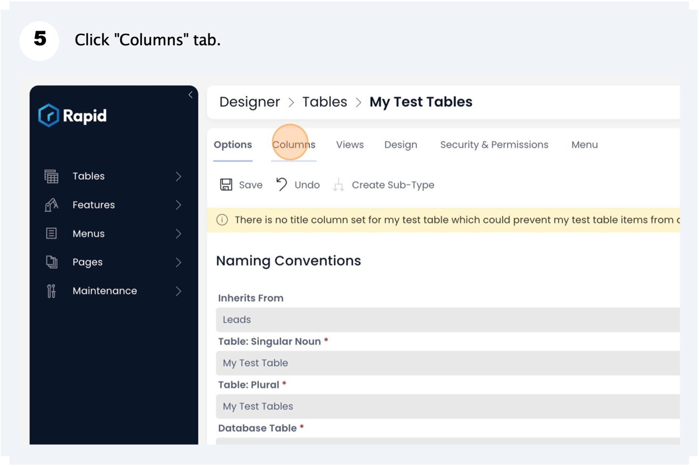
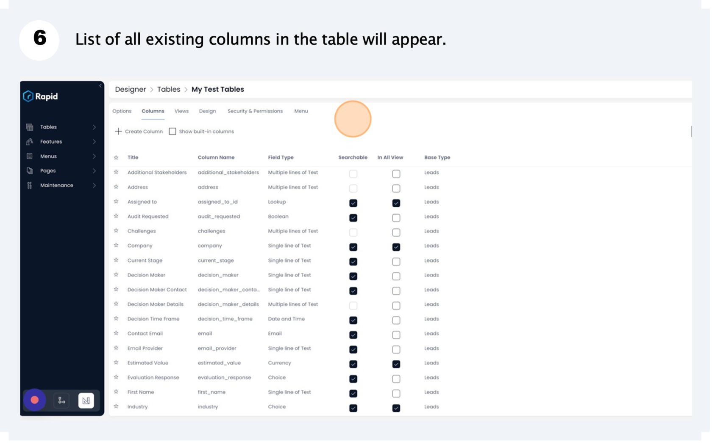
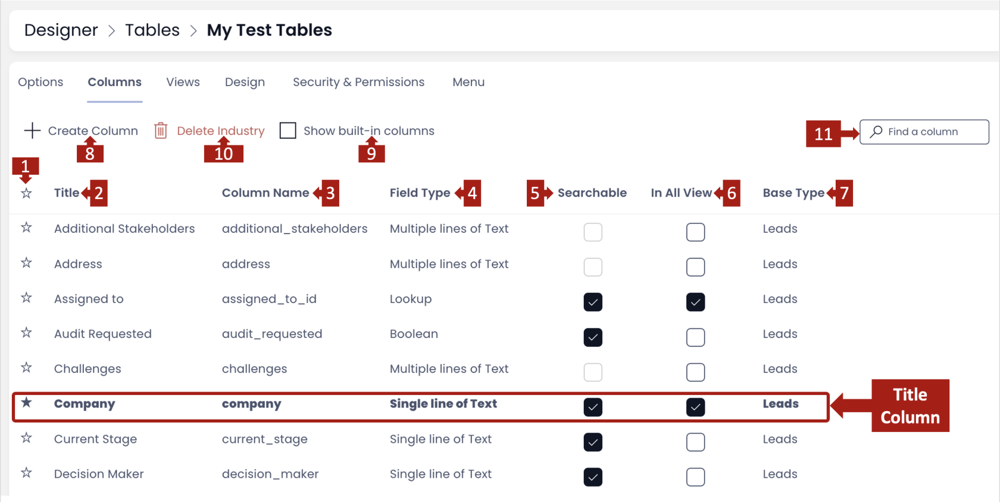
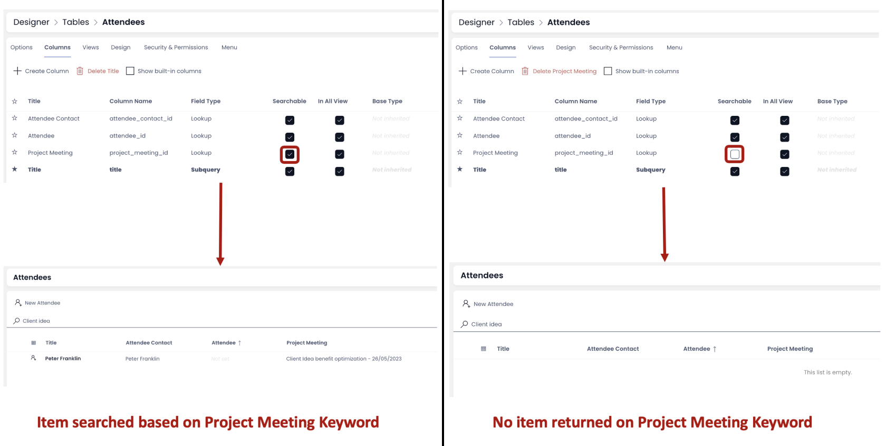
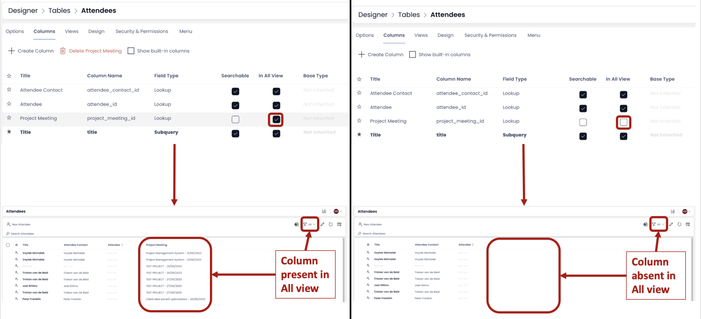
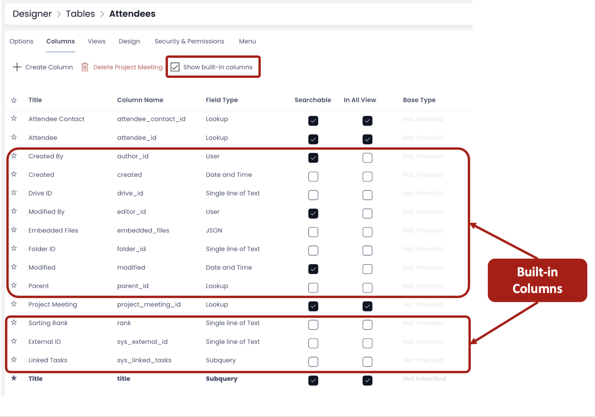

# How to edit / delete a column from a table

There may be scenarios when you need to edit the columns for an existing table.

## How to access Columns Tab of a table in Designer

To access the column's list configured for the table please refer the following points:

Please refer to the below video for illustration.

<iframe allowfullscreen="allowfullscreen" frameborder="0" height="420" src="https://www.youtube.com/embed/UChGDZNSXA8?si=S1zVKzo7g1J5hWyV" title="YouTube video player" width="750"></iframe>

It is advised that you go through "**[How to add columns to a data table?](../how-to-add-columns-to-a-data-table/how-to-add-columns-to-a-data-table.md "How to add columns to a data table?")**" if you have not done it yet. A lot of explanation about the key terms are given there.

## Information and features present on Columns Tab

Please review the below image. It provides a map about the information and features for the columns tab.

**1. Title column** - A filled star at the extreme left indicates that it is the title column of the table. The title column is represented in bold. Please note, there can be only one title column to a table.

**2.** **Title** - This the name given to the column while creating it.

**3. Column Name** - This is system generated column name reference derived from the Title.

**4. Field Type** - This represents the type of the column / nature of the column. For example - Single line of Text, Date and Time

**5. Searchable** - If this option is check, then you will be able to search items in Explorer based on this column. The Explorer window for the table, allows you to search items based on keywords. If "Searchable" is CHECKED OFF, then the items will not be searched based on keywords for the column.

You can easy toggle between making a column Searchable and Non-Searchable by clicking on the box.

<iframe allowfullscreen="allowfullscreen" frameborder="0" height="420" src="https://www.youtube.com/embed/bW4hXNxNBWo?si=-3Ak2ZEUPCJcBoGh" title="YouTube video player" width="750"></iframe>

**6. In All View** - All View is the default Table View. When this option is CHECKED ON, it means that the subject column will be visible in All View. When it is CHECKED OFF, it means the subject column will be absent from the All View.

You can easy toggle between making a column present and absent from All View by clicking on the box.

<iframe allowfullscreen="allowfullscreen" frameborder="0" height="420" src="https://www.youtube.com/embed/U9G1-YVUx68?si=o5baIUE-1HGjHFtS" title="YouTube video player" width="750"></iframe>

**7. Base Type** - A Value in this field indicates that the subject column has been inherited from another table. If your subject table is a [**Sub-Type Of**](/docs/Rapid/3-User%20Manual/glossary/glossary.md#inherit-tables "Inherit Table / Sub-Type Of") another table, then this field provides the name of the parent Table.

**8. Create Column** - This button allows you to create new column(s). The newly created column(s) will be added to the list of existing columns. To learn more about creating new column **[click here](../how-to-add-columns-to-a-data-table/how-to-add-columns-to-a-data-table.md "How to add columns to a data table?")**.

**9. Show built-in columns** - Each table has certain built-in columns which are generated by the system. If you wish to view them, you can check the "Show built-in columns" box.

**10. Delete column** - This button appears only when a column from the list is selected. As you click on this button, the selected column will be deleted.

**Please note** - you cannot delete a Built-in Column.

<iframe allowfullscreen="allowfullscreen" frameborder="0" height="420" src="https://www.youtube.com/embed/QKc2q6NGKlw?si=75gq1eoRQ5YYfSEw" title="YouTube video player" width="750"></iframe>

**11. Find a column** - This is the search field which allows you to search your desired column by typing the keyword from column name.

## How to edit parameters of an existing column

1. Double click on the column name.
2. As the column gets selected, a right panel will open with heading "Edit &lt;column name&gt;".
3. You can edit the title or make changes based on the column type.

**Please note**

- Changing the title now does not change the column\_name.
- The type of the column cannot be changed.
- If you wish to change the column type, the only way is to delete this column and create a new one.

Once you have made all the changes to the column, hit the Save button.

Please refer to the below video for illustration

<iframe allowfullscreen="allowfullscreen" frameborder="0" height="420" src="https://www.youtube.com/embed/tf4OkA8Y5W0?si=HNLz8Ds3-1R8hkF-" title="YouTube video player" width="750"></iframe>

[How to add a new column to a table?](../how-to-add-columns-to-a-data-table/how-to-add-columns-to-a-data-table.md "How to add columns to a data table?")

[How to view / update table options of an existing table in Designer?](../how-to-view-update-table-options-of-an-existing-table-in-designer/how-to-view-update-table-options-of-an-existing-table-in-designer.md "How to view / update table options of an existing table in Designer?")

