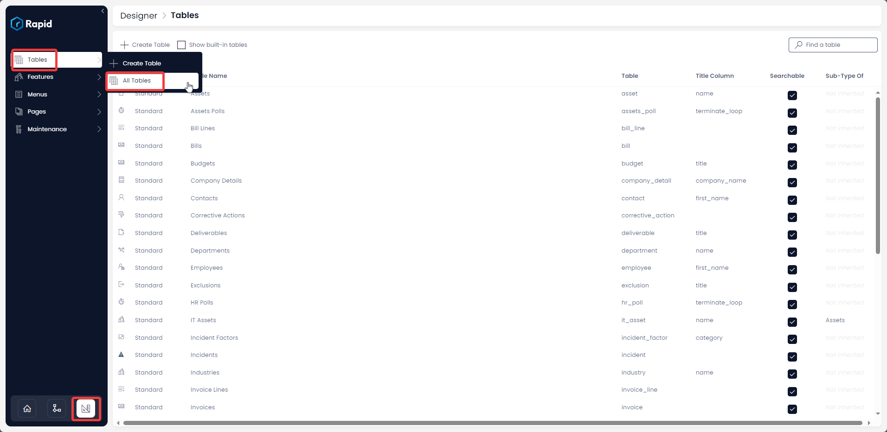
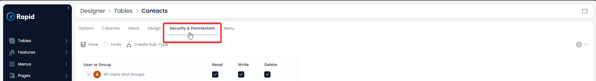
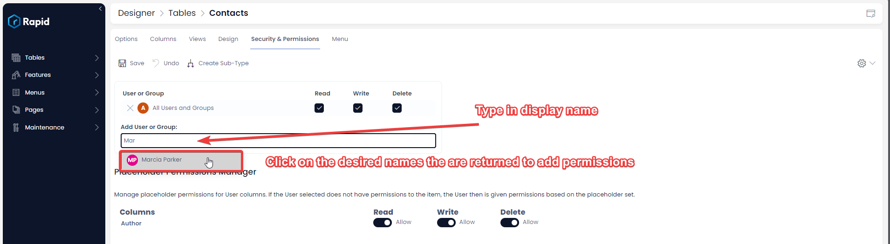
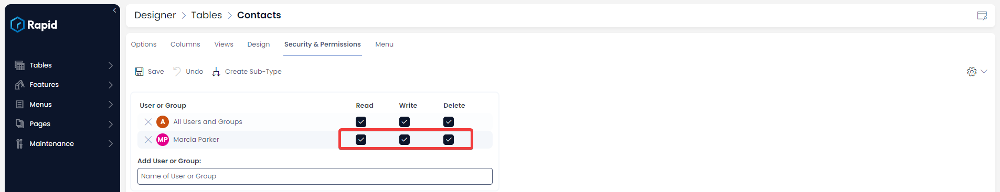
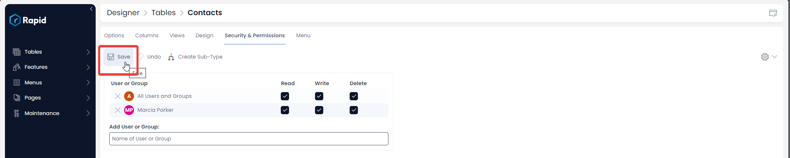
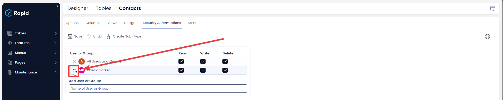
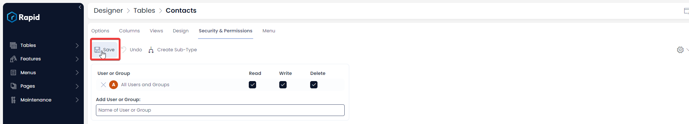
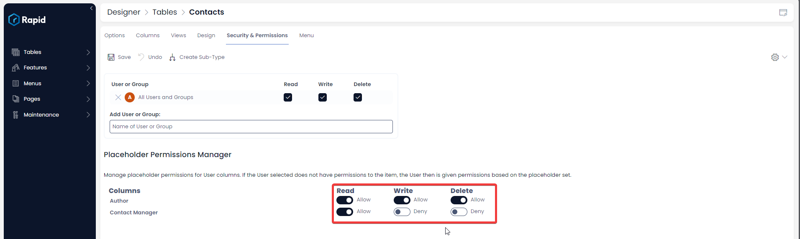

# How to set up security & permissions for a table

Data tables hold sensitive data and many a times, operations on tables should be permissible by authorised people only.

**Note** : The permissions set on a table are the default permissions created items will have. These operations does not retroactively update permissions on existing items.

## Adding User or Group Permissions to a Table

You can easily manage permissions on your subject table.

To achieve so you can follow the below steps:

1. Navigate to Designer &gt; Tables &gt; All Tables  

    

2. Open your desired table. (Find your desired table by using the search bar or scrolling through the list)  

    

3. Select the **Security &amp; Permissions** tab  

    

4. Click on the **Add User or Group** field and begin typing their display name and click on the desired names as they appear 
    1. NOTE: By default the **All Users and Groups** group has Read, Write, and Delete permissions  

        

5. Toggle the relevant privileges by clicking on the relevant checkboxes  

   

6. Click Save   

    

## Removing User or Group Permissions from a Table

1. Navigate to Designer &gt; Tables &gt; All Tables

    

2. Open your desired table. (Find your desired table by using the search bar or scrolling through the list)  

    

3. Select the **Security &amp; Permissions** tab  

    

4. Click on the **Cross** next to the user or group you want to remove permissions of  

   

5. Press Save  

    

Please refer to the below video for illustration:

<iframe allowfullscreen="allowfullscreen" frameborder="0" height="420" src="https://www.youtube.com/embed/HUrlNfeeglU?si=ip6Sj52s3q8WI-lF" title="YouTube video player" width="750"></iframe>

## How to configure Placeholder Permissions Manager

Placeholder permissions specifically relate to a User column. By default, all tables have a system user column, that is the Author column (See the [Adding Columns](../how-to-add-columns-to-a-data-table/how-to-add-columns-to-a-data-table.md) page for more details on how to add a user column). Placeholder permissions allow you as the site manager to determine if the Authors have access to the items they create. In addition to this, if you create a user field such as Project Manager, even if the project manager is not part of the users or groups configured above you can still give them read, write, and delete permissions to this item using placeholder permissions.

To configure placeholder permissions, follow the steps below:

1. Navigate to Designer &gt; Tables &gt; All Tables  

  

2. Open your desired table. (Find your desired table by using the search bar or scrolling through the list)  

     

3. Select the **Security &amp; Permissions** tab  

    

4. Toggle the permissions of the desired user column. (By default, user columns have Read, Write, and Delete Permissions toggled on) 

     

5. Press Save  

    

Please refer to the below video for illustration.

<iframe allowfullscreen="allowfullscreen" frameborder="0" height="420" src="https://www.youtube.com/embed/OAfwwdwb0Es?si=BSzK7rBkQtoiHZ7M" title="YouTube video player" width="750"></iframe>

[How to delete a table in Rapid Platform?](../how-to-edit-delete-a-column-from-a-table/how-to-edit-delete-a-column-from-a-table.md "How to delete a table in Rapid Platform?")

[How to view / update table options of an existing table in Designer?](../how-to-view-update-table-options-of-an-existing-table-in-designer/how-to-view-update-table-options-of-an-existing-table-in-designer.md "How to view / update table options of an existing table in Designer?")

