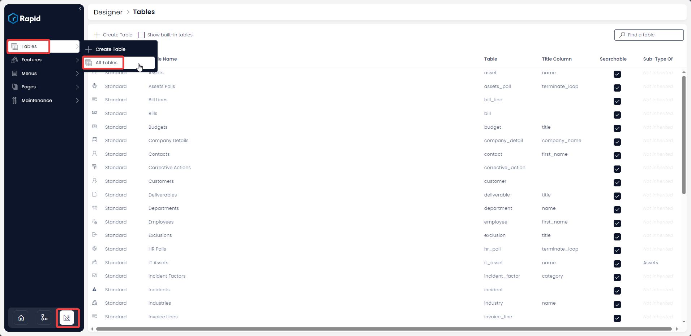
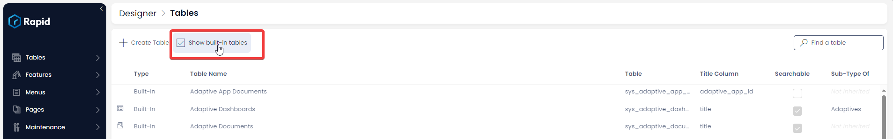

# How to setup Link Inheritance

This resource is also useful to understand - **How to link items from different tables**

## Case Scenario

Imagine you are the Project Manager you have two tables - Projects and Tasks.

You create a Project item and also create Task items that relate to the subject project.

Further, the task items are now assigned to other team-members who interact with the specific task items.

Now while performing the Task, the assignee of the task makes some important notes about it.

As a Project Manager, you access the Projects Table.

It would be beneficial for you to be able to view the notes entered across tasks by other team-members.

This functionality is made possible by Link Inheritance.

## Definition

In simple terms, we can say link inheritance provides the ability to view *actions* performed on a Table item (Table A) in an item of another Table (Table B). For example - view *notes* created on Table A's item in linked Table B's item.

## Setting up Link Inheritance

To setup Link Inheritance the following three steps are needed:

1. Identify the two tables, items of which you need to be linked, say Table A and Table B.

2. Identify which feature you want to view across table items, say *Notes.*

3. Ascertain the flow of information. For example - I want to view Notes created in Table A's item in Table B's item.

Let us try to simulate Link Inheritance with this information.

**Let**

- Table A = Tasks
- Table B = Projects
- Feature to view across tables = Notes

**Objective**

To view Notes created in an item of Tasks in linked item of Project Risks. The Tasks item can be updated by a team-mate assigned to the subject task. Let us assume that the Task item **Notes** are updated with Risks to the Project. These notes should be visible in the corresponding Project Risks Table item. The Project Manager can view the Project Risks Table and hence will take cognisance of the Risks updated in the notes.

1. Navigate to the Notes Table in Designer 
    1. Navigate to Designer &gt; Tables &gt; All Tables 

        

    2. Press **Show built-in tables** (As notes is a system table) 

       

    3. Open the notes table (Find it by scrolling through the list or using the search bar)  

      
      
2. Tick the Checkbox in Link Inheritance against **Project** Table   
      
    **Please note -** Check against the name of the table where you want to view the update. If you want a two way communication, then check against both the table names. This means updates in Table A's item will be visible in Table B's item and vice versa.  
      
    <iframe allowfullscreen="allowfullscreen" frameborder="0" height="420" src="https://www.youtube.com/embed/NOE5KLMeOKU?si=i5UeExoeVHMsoI8A" title="YouTube video player" width="750"></iframe>
3. Go to the item of Project in Explorer.
4. Link it to the relevant item of Task (This can be linked as a universal link as per the GIF below or as a lookup - See the Lookup column type on [Add Columns](../how-to-add-columns-to-a-data-table/how-to-add-columns-to-a-data-table.md) page for more details).  
      
    <iframe allowfullscreen="allowfullscreen" frameborder="0" height="420" src="https://www.youtube.com/embed/DFArKYQ6Qjw?si=rzoIJrMXHSOlAiXy" title="YouTube video player" width="750"></iframe>
5. Go to the task item that is linked to the project
6. Add the Note to the item.
7. If you now navigate to the project item (that the task item is linked to), in the activity feed you will see the note that was added to the task item.

**Result -** Check the subject item in Documentation Test. The note entered in My Test Table item is visible there.  
  
<iframe allowfullscreen="allowfullscreen" frameborder="0" height="420" src="https://www.youtube.com/embed/lc4u9t1_T9I?si=SgWACCr35BnQz81F" title="YouTube video player" width="750"></iframe>

The above simulation has been illustrated for viewing **Notes** created on one item and automatically visible in another linked item of other table. Similarly, you can configure other tables as well like Task Assignation records, Contacts being created etc. Link inheritance is an abstract system that ultimately allows the creation of a new link between the item being created and some third item *linked* to your creation item context.

[How to create items from a linked table?](../creating-items-within-items/creating-items-within-items.md "How to create items from a linked table?")

[How to view / update the options of an existing table?](../how-to-view-update-table-options-of-a-table/how-to-view-update-table-options-of-a-table.md "How to view / update the options of an existing table?")
