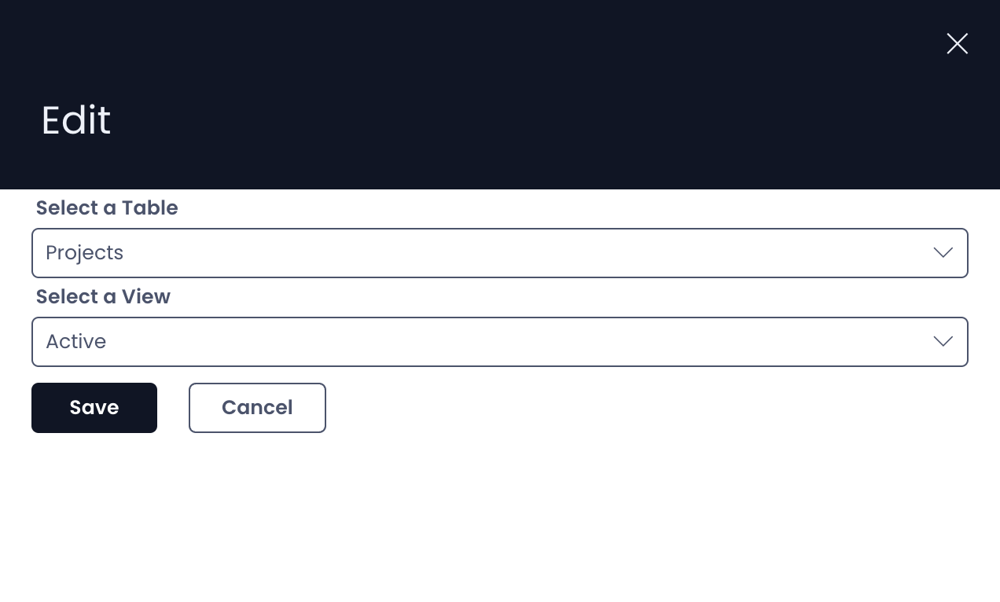

# How to configure / update component properties

## Properties of a component

Each component, based on its nature, allows you to configure properties. These properties define the behaviour of the component in Explorer.

For example :

A Counter component will allow you to define which table you wish to select and the Table View.

Whereas a Gantt Chart component will allow you to select other relevant options (shown below).

The properties for a component can be defined in their respective "Edit" Properties panel.

## How to access "Edit" Properties panel

Every component has a horizontal options panel at the bottom right corner of its boundary. Look for the pencil icon. As you click on this icon, the Edit panel will open for the component on the right side.

Please refer to the below video for illustration.

<iframe allowfullscreen="allowfullscreen" frameborder="0" height="420" src="https://www.youtube.com/embed/Jt8bMFjSEd8?si=EuMNECVgOZA9bjSy" title="YouTube video player" width="750"></iframe>

## Related articles

[How to set a component to be visible / hidden on the 'Item Details' and 'Create' screens?](/docs/Rapid/4-Keyper%20Manual/2-Designer/2-Pages/5-how-to-guides/how-to-hide-components-on-breakpoints/how-to-hide-components-on-breakpoints.md "How to set a component to be visible / hidden on the 'Item Details' and 'Create' screens?")

[How to delete a component from a Layout / Page?](/docs/Rapid/4-Keyper%20Manual/2-Designer/2-Pages/3-Components/2-configuring-components/2-configuring-components.md "How to delete a component from a Layout / Page?")

[How to delete a Layout from a Page?](/docs/Rapid/4-Keyper%20Manual/2-Designer/2-Pages/5-how-to-guides/how-to-delete-a-layout-from-a-page/how-to-delete-a-layout-from-a-page.md "How to delete a Layout from a Page?")
