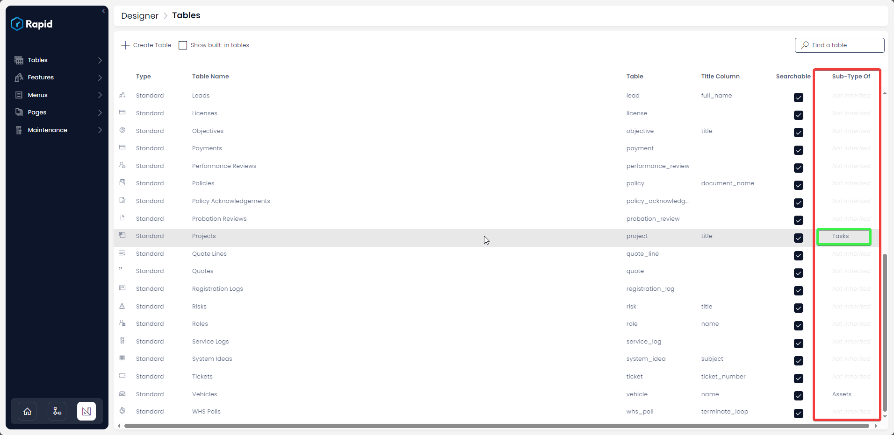
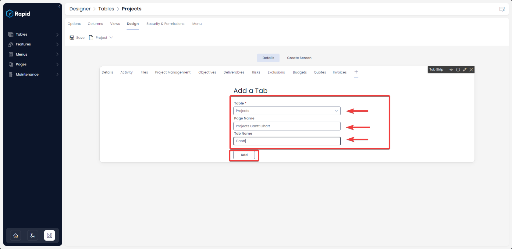
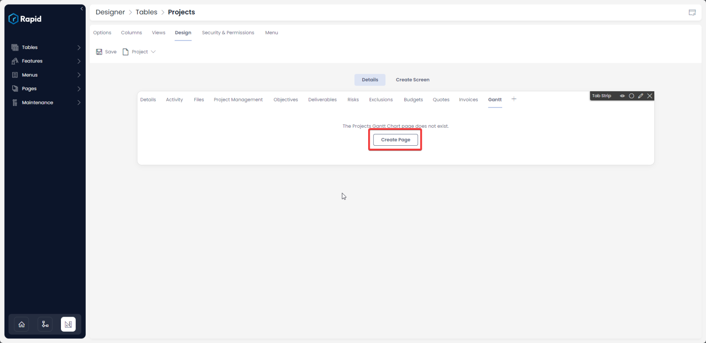
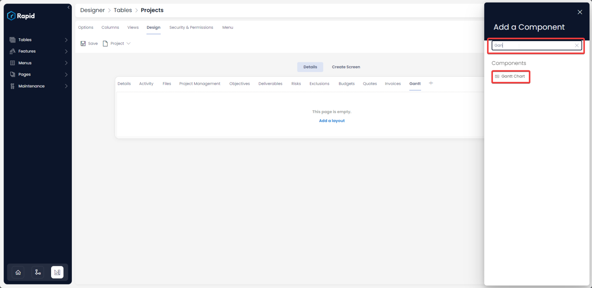
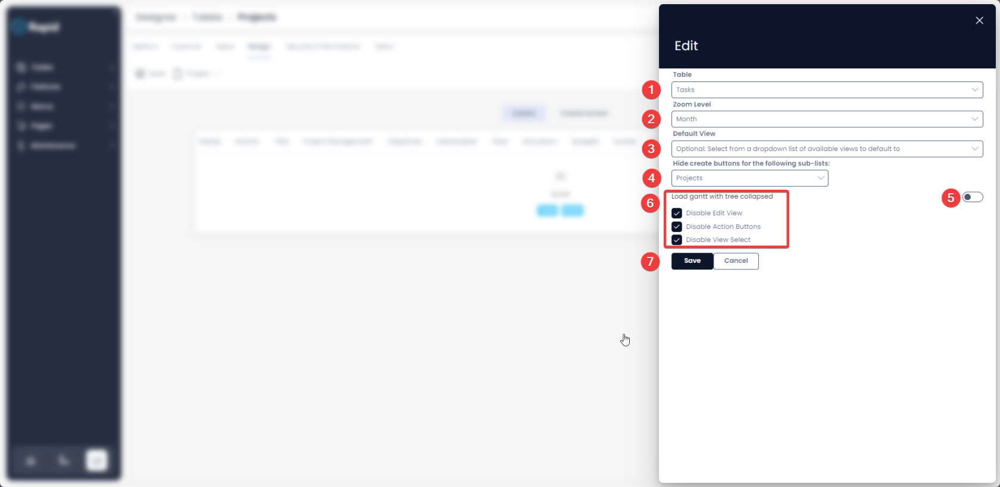
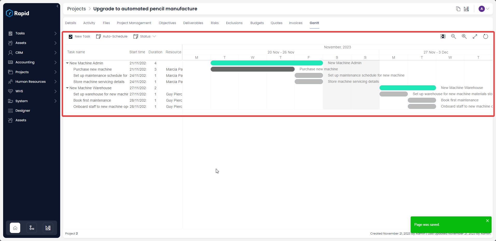

# Gantt Chart

## Overview

Gantt charts are useful project management tools that visually represent the schedule and progress of tasks or activities over time. They offer a clear and structured way to plan, coordinate, and track various elements of a project. Rapid has the ability to configure Gantt charts based on the Tasks and Sub-Types of Tasks in your system

### Creating a Gantt Chart for your Table

**Important note: Gantt charts can only be configured for the "Tasks" table or a table that is a subtype of the "Tasks" table.**

A table is a subtype of the Tasks table if while creating the table, it has inherited the Tasks.

To learn more about how to create sub-type tables read our documentation on [Table Creation Options](/docs/Rapid/4-Keyper%20Manual/2-Designer/1-Tables/3-creating-tables/3-creating-tables.md "Creating a new Table - Table Options").

### Check if your Table qualifies for Gantt Chart

**To check whether your desired table is a subtype of Tasks or not, please follow the below points:**

1. Navigate to Designer &gt; Tables &gt; All Tables
2. Check the "Subtype Of" column for your desired table
3. If it is a subtype of the "Tasks" table then you can make a Gantt from this.

For example, a Gantt chart **CAN** be constructed from the Projects table as it is a subtype of Tasks.

### Configuring the Gantt Chart Page Component

**Please consider the following steps for configuring a Gantt Chart for your Table.**

1. Navigate to Designer &gt; Tables &gt; All Tables

    
2. Open the Table you wish to configure a Gantt Chart on. (You can scroll through the list or use the search bar to find the table)

    
3. Click the Design Tab  
    
    1. If not on the Singular page. Change to this using the dropdown.  

        
4. Add a new Tab to the page (For the purpose of this illustration we are placing the Gantt chart on a new tab, but it can also be placed on an already existing tab.)  

    
5. Configure the Tab 
    1. Select the Table (The name of the Tasks table or Subtype table you are on)
    2. Provide an Appropriate Page name. Page names must be unique.
    3. Provide a Tab Name. This will be what displays on the Tab strip.
    4. Press OK  

        
6. Press Create Page (If the page does not already exist) 

    
7. Press Add a Layout  

    
8. Select the "Gantt Chart" Component. Use the search bar or scroll through the list to find it.  

    
9. Select the Edit Gantt Button
    
    
10. Configure the Gantt Component 
    1. Select the Table you want the Gantt configured from. In this case a Project is made up of Tasks. So the Tasks lists will be selected.
    2. Select an appropriate default Zoom level
    3. Select a view. Views can be used to filter out particular rows. (See Views documentation for more information on how these work)
    4. If you do not want people to be able to create Subtypes of Tasks from the Gantt Chart Hide this
    5. Determine if you want the tree collapsed or open  
        **The below images depict how a collapsed and expanded tree may appear in the Explorer view.**

        **Collapsed Tree**
        
        **Tree with individual tasks open**
        

    6. Disable features you do not want users to configure
    7. Press Save  

        
11. Navigate to explorer, the project and the Gantt Tab to see the produce Gantt.

    