# Available layouts for Pages

[**Layouts**](https://docs.rapidplatform.com/books/glossary/page/page-layout-and-component "Page, layout and component") are an important part of Page construction.

Rapid Platform provides you a set of five layout options to organise [**components**](https://docs.rapidplatform.com/books/glossary/page/page-layout-and-component "Page, layout and component") across a [**Page**](https://docs.rapidplatform.com/books/glossary/page/page-layout-and-component "Page, layout and component").

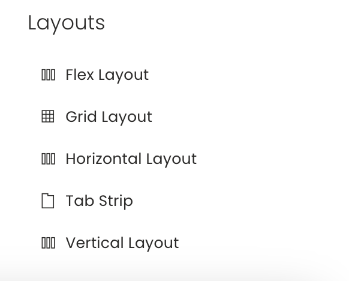

## Horizontal Layout

As the name suggests, in this layout the components are arranged horizontally.

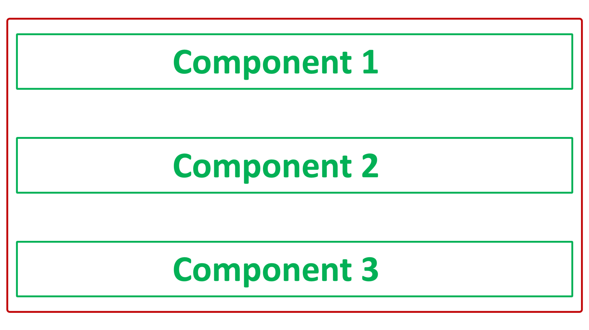

Please note:

- You cannot resize the components
- You cannot move the components across layout
- The components will be arranged top-down order, in the sequence of their addition. Hence, the component added later will be shown below the component added earlier.
- This layout will attempt to fit to the size of the screen viewing it.
- This layout is default when a **[new page is created via a Tab Strip](https://docs.rapidplatform.com/books/experiences/page/how-to-create-a-page-in-designer "How to create a Page in Designer?")**, without changing the default Page name. The system provides a default Page name as the Table name using which the page is being created.

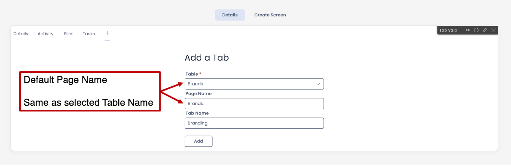

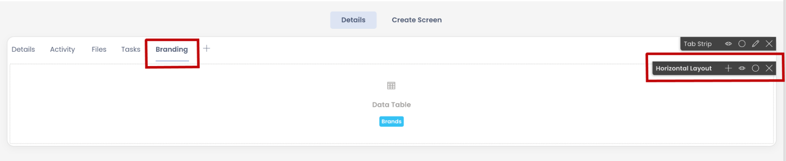

## Vertical Layout

In this layout the components are arranged vertically.

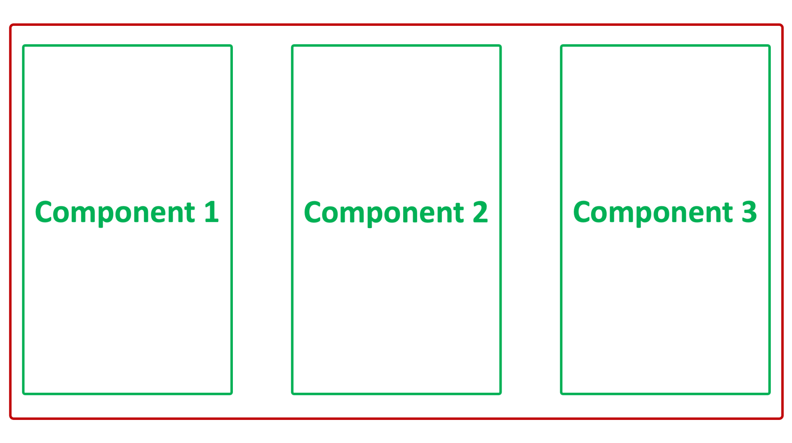

Please note:

- You cannot resize the components
- You cannot move the components across layout
- This layout is not a default layout for any condition
- This layout will attempt to fit to the size of the screen viewing it.

## Flex Layout

Sometimes, if you are not sure, whether the components will arrange better in a Vertical Layout or a Horizontal Layout, you can go for the Flex Layout.

The Flex Layout allows you to choose whether you want to the subject layout to behave as a vertical layout or horizontal layout.

As you click on the Edit icon (*Pencil)*, the Edit panel will open on the right side of the screen.

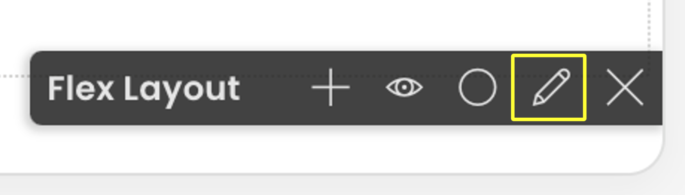

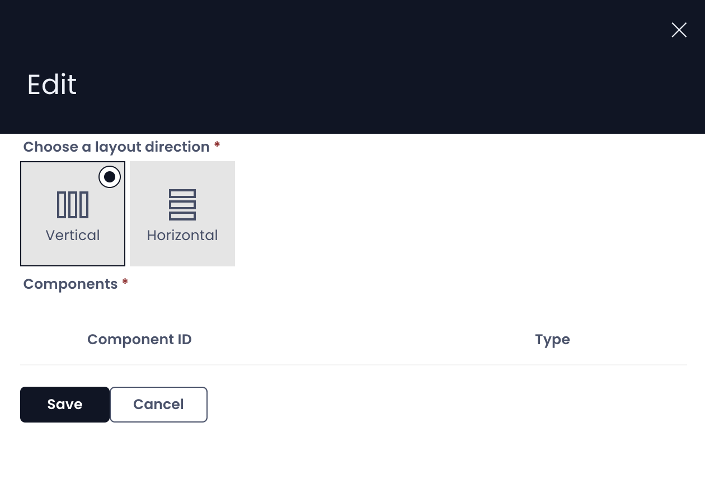

You can select the direction of the layout either Vertical or Horizontal. The layout will behave as defined.

Therefore, you can easily switch between Vertical and Horizontal Layout arrangements for your components on Page.

**Please note:**

This layout will attempt to fit to the size of the screen viewing it.

## Grid Layout

In a Grid Layout, you can arrange the components as per your need.

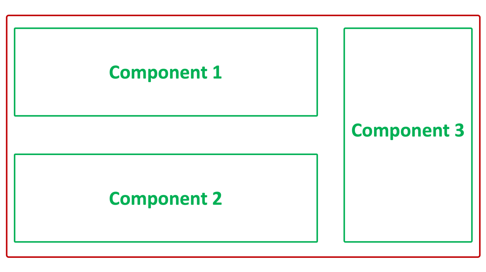

**Please note:**

- [**You can resize and arrange the components on the Grid Layout.**](https://docs.rapidplatform.com/books/experiences/page/how-to-arrange-a-component-on-grid-layout "How to arrange a component on Grid layout?") This is not possible with any other layout.
- Grid Layouts will not attempt to scale to the size of the screen vertically and can be scrolled. They will still attempt to scale horizontally.
- This is present by default on the Details Tab of a Table in Designer.

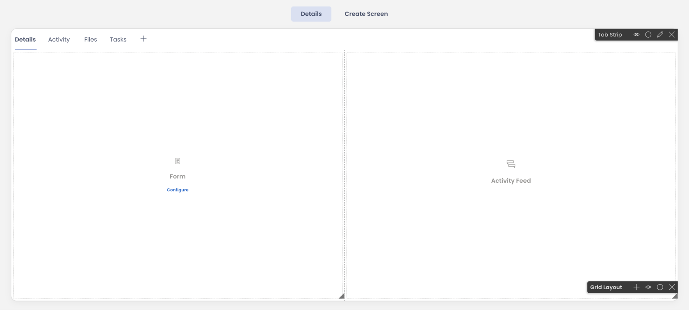

## Tab Strip

Tab Strip is a special type of a layout which is used to add / organise other pages within a layout / Page.

**Please note:**

- [**Using a Tab Strip you can create new tabs and new Pages.**](https://docs.rapidplatform.com/books/experiences/page/how-to-create-a-page-in-designer "How to create a Page in Designer?")
- You can edit Tab Strip preferences by clicking on the Edit icon (*Pencil*)

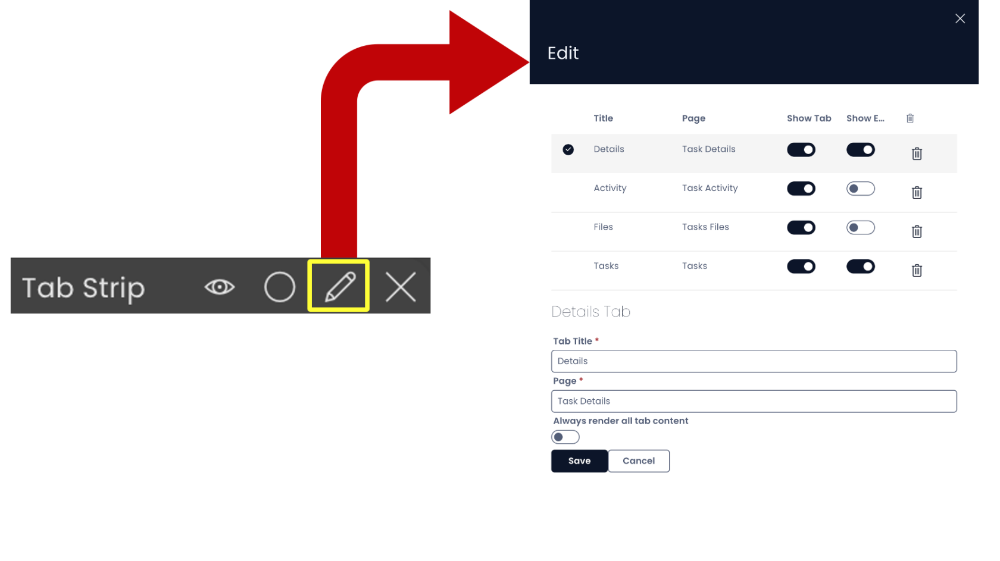

  
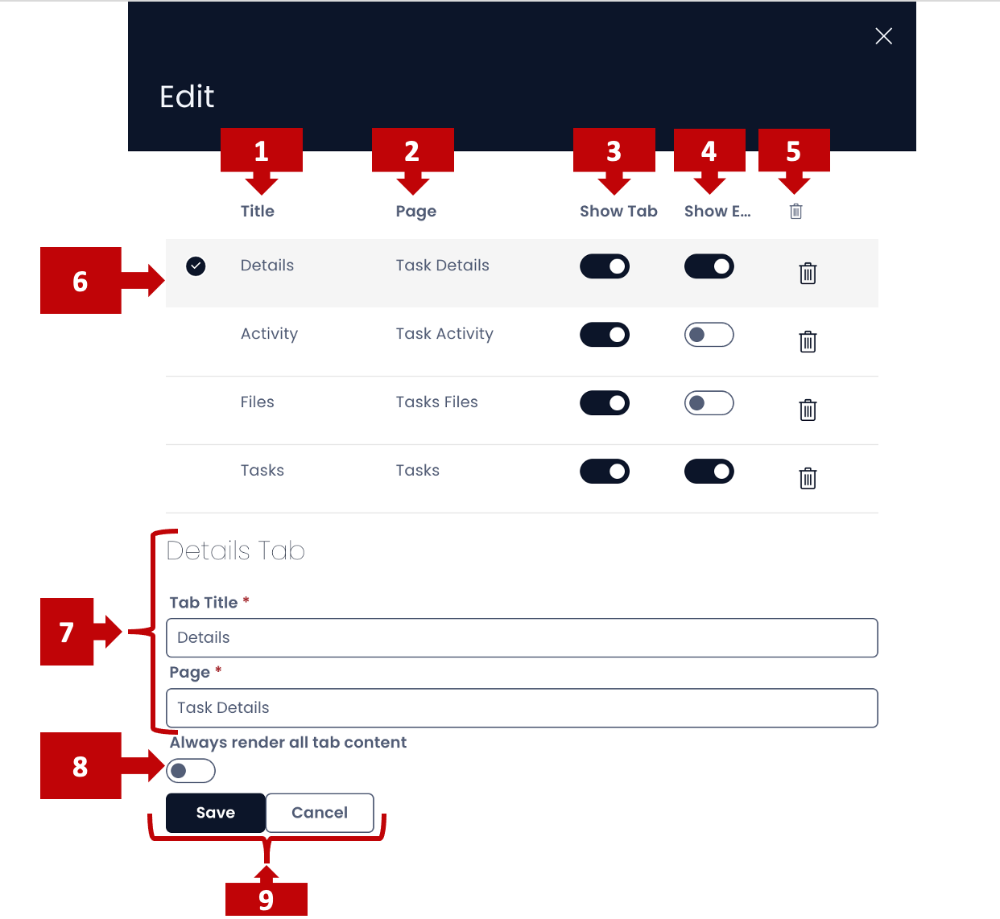

**In this panel you can:**

1. View the Tab Title (the name with which it appears in the Tab Strip)
2. View the Page Title (the name of the page in the system)
3. Toggle whether the Tab should be visible on Tab Strip or not 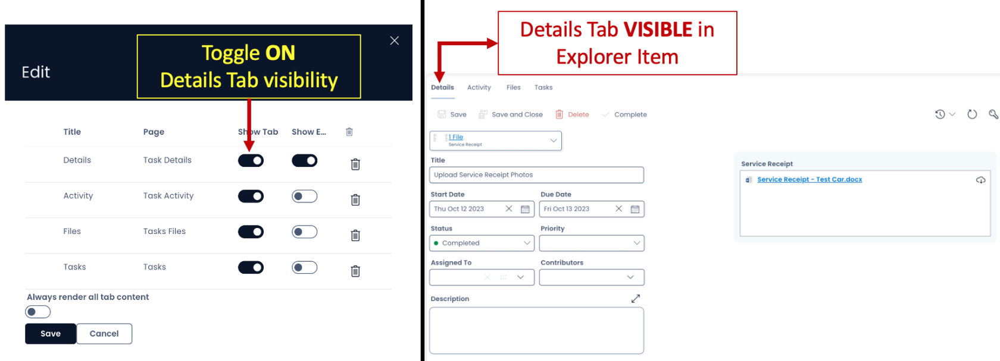](./downloaded_image_1705286273468.png)
4. Toggle whether the Embedded File Bar should be visible on the page or not. 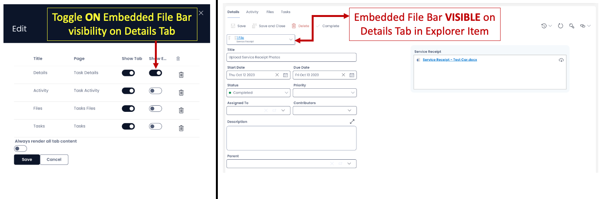]
5. Remove a Tab from the Tab Strip (by pressing the bin icon in the far right of the subject Tab row) &lt;&lt;
6. Select a Tab by clicking on the Tab row. A tick mark indicates that the subject Tab is selected 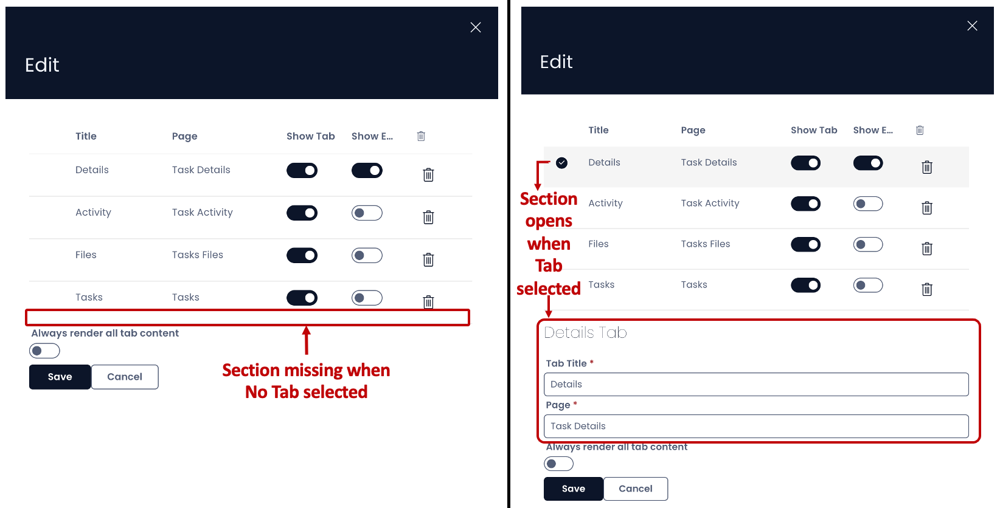
7. As you select a Tab, the Tab particulars open. Here you can : 
    - Edit the Tab Title
    - Edit the Page Title
8. Toggle whether to always render all tab content or not. When this field is in ON position, it means the contents of the Page will refresh each time the Tab is switched active. This is particularly useful with PowerBI Reports that can be set up as a component to a Page. This field is OFF by default, which means the components will pre-load and do not refresh with each switch on the Tab.
9. Save / cancel the changes made.

**Other features in Tab Strip in Designer**

- You can see the existing Tabs on the strip 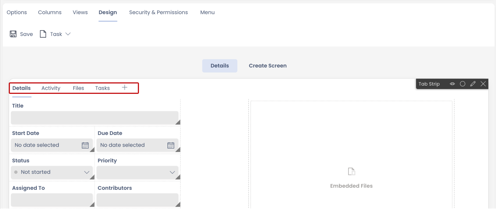
- When a Tab is hidden it still can be seen on the Tab Strip as greyed.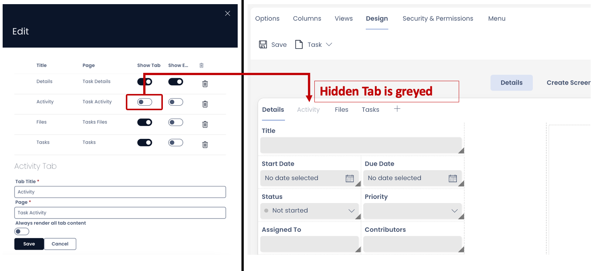
- When you select the hidden tab, it provides an option to enable it. 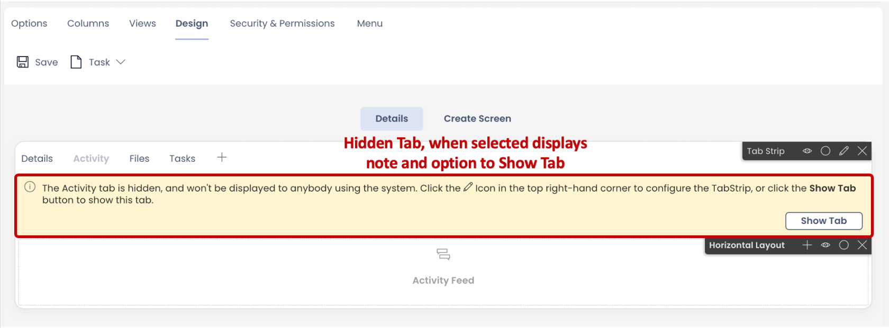
- You can rearrange the order of the tabs on the strip by dragging them in desired position in the Edit panel.

<iframe allowfullscreen="allowfullscreen" frameborder="0" height="420" src="https://www.youtube.com/embed/G1fQj2VaOr0?si=Ie7oOk-l9T0KstFi" title="YouTube video player" width="750"></iframe>

**Important Tip:** Post saving the changes in the Tab Strip Edit Panel, you still need to press the Save button on the Page for the changes to take effect.

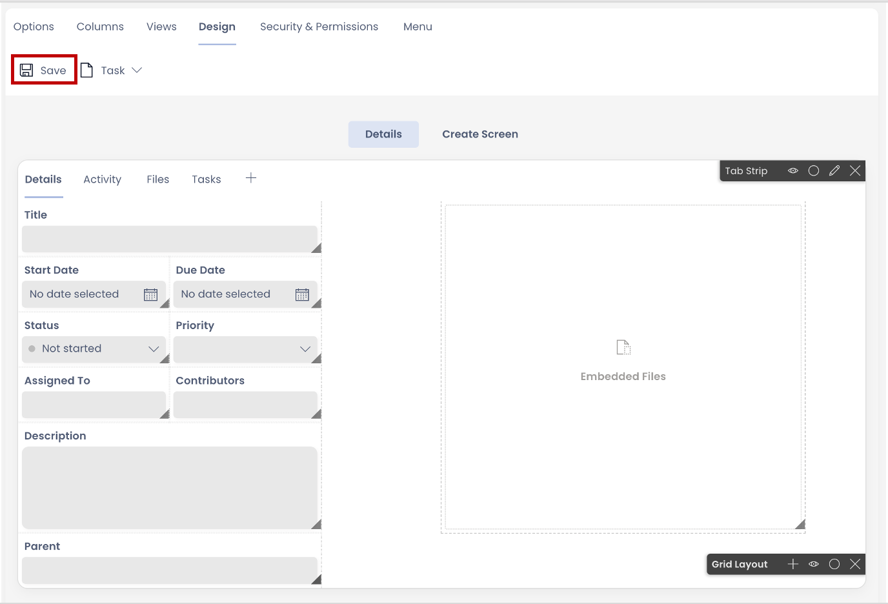

## Related articles

[How to create a Page in Designer?](https://docs.rapidplatform.com/books/experiences/page/how-to-create-a-page "How to create a Page in Designer?")

[How to add a Layout to a Page?](https://docs.rapidplatform.com/books/experiences/page/how-to-add-a-layout-to-a-page "How to add a Layout to a Page?")

[How to add a component to a Layout / Page?](https://docs.rapidplatform.com/books/experiences/page/how-to-add-a-component-to-a-page "How to add a component to a Page?")

[How to configure / update component properties?](https://docs.rapidplatform.com/books/experiences/page/how-to-configure-update-component-properties "How to configure / update component properties?")