# How to configure the Item Details and Item Creation pages

## The defaults on a Design Tab of a new Table

When you [**create a new table**](https://docs.rapidplatform.com/books/experiences/page/how-to-create-a-new-data-table-in-designer "How to create a new data table in Designer?"), the Design Tab will have the following:

- **Singular - Details breakpoint**

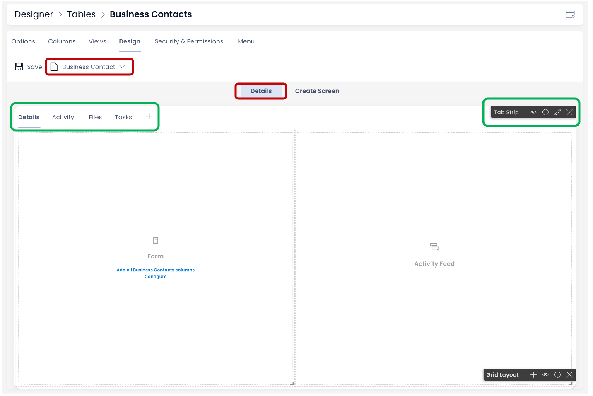

Observe a [**Tab Strip**](https://docs.rapidplatform.com/books/experiences/page/what-are-the-available-layouts-for-pages "What are the available layouts for Pages?") is present by default. It has four tabs:

- **Details Tab** - This is an important tab which has a **[Grid Layout](https://docs.rapidplatform.com/books/experiences/page/what-are-the-available-layouts-for-pages "What are the available layouts for Pages?")** by default. The Grid Layout has two components: 
  - [**Forms Component**](https://docs.rapidplatform.com/books/experiences/page/what-is-a-form-component-on-a-layout-page "What is a Form Component on a Layout / Page?")
  - [**Activity Feed**](https://docs.rapidplatform.com/books/experiences/page/what-is-an-activity-feed-component-on-a-layout-page "What is an Activity Feed component on a Layout / Page?")

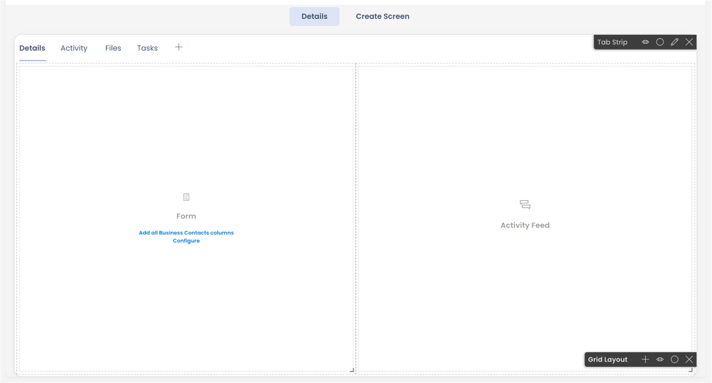

- **Activity Tab** - This tab has the Horizontal Layout by default. There is an Activity Feed Component by default in the layout.
    
- **Files Tab -** This tab has the Horizontal Layout by default. There is a File Browser Component by default in the layout.
    
- **Tasks Tab -** This tab has the Horizontal Layout by default. There is a Data Table Component by default in the layout. The Data Table component is configured for Tasks Table and All Views.
    

- **Singular - Create Screen breakpoint**

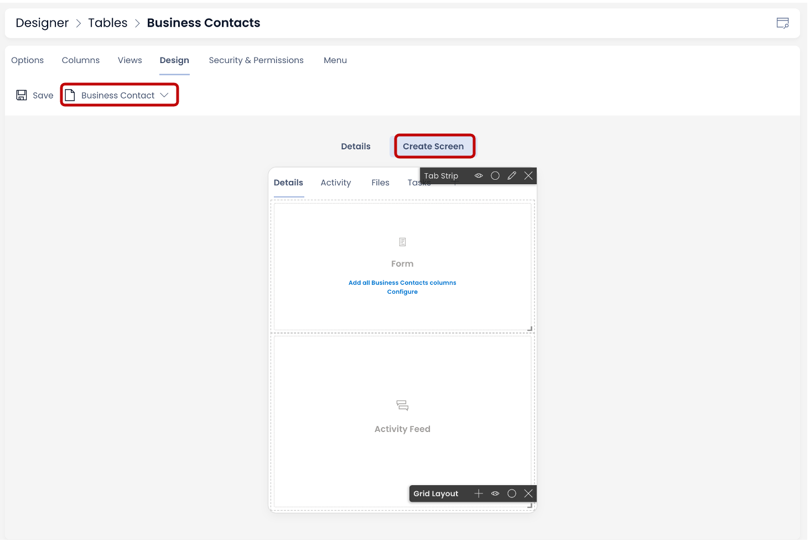

[**The "Create Screen" breakpoint is always in sync with the "Details" breakpoint and vice versa.**](https://docs.rapidplatform.com/books/experiences/page/how-to-set-a-component-to-be-visible-hidden-on-item-details-and-create-breakpoints "How to set a component to be visible / hidden on 'Item Details' and 'Create' breakpoints?") Therefore, we can observe that the "Create Screen" breakpoint is identical to its "Details" breakpoint counterpart. It has Tab Strip with same four Tabs and Details Tab (as seen in the image) has Grid Layout with Form component and Activity Feed component.

- **Plural - Details breakpoint**

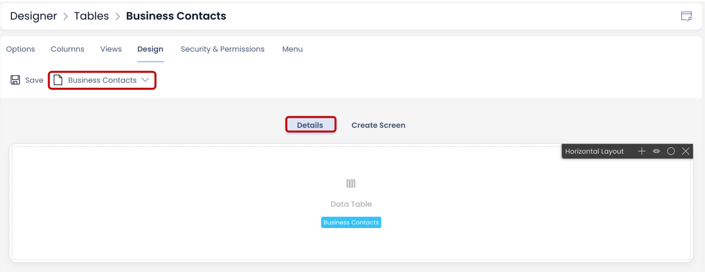

The Plural Details breakpoint has a **[Horizontal Layout](https://docs.rapidplatform.com/books/experiences/page/what-are-the-available-layouts-for-pages "What are the available layouts for Pages?")** by default. There is a [**Data Table Component**](https://docs.rapidplatform.com/books/experiences/page/what-is-a-data-table-component-on-a-layout-page "What is a File Browser component on a Layout / Page?") by default in the layout. The Data Table component is configured for *the subject* Table. This means that this page will show the list of items for the subject table.

## Configuring the Item Details and Item Creation pages

- **Singular - Details breakpoint**

**What this will do? -** As discussed above, there is a Tab Strip present by default on this Page. The Tab Strip contains a set of four Pages.

Whatever is configured on this breakpoint will be visible on the individual Item Details in Explorer ie. this configuration defines what details are shown for each [**Item**](https://docs.rapidplatform.com/books/glossary/page/table-items-and-columns "Table items and columns").

For instance - consider the below image. The Singular Details breakpoint configuration is shown in Image 1 for a Table titled - *Milestones*. Observe that it has four Tabs on the Tab Strip. The Details Tab has a **[Form Component](https://docs.rapidplatform.com/books/experiences/page/what-is-a-form-component-on-a-layout-page "What is a Form Component on a Layout / Page?")** with certain fields and an [**Activity Feed Component**](https://docs.rapidplatform.com/books/experiences/page/what-is-an-activity-feed-component-on-a-layout-page "What is an Activity Feed component on a Layout / Page?").

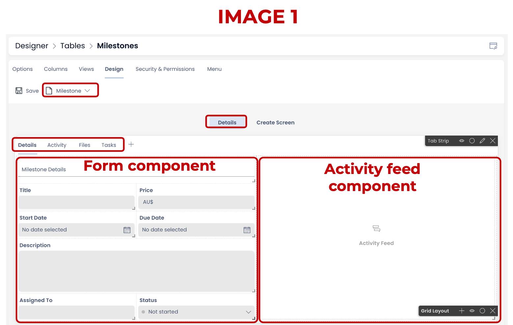

Now observe corresponding Image 2. This is the Item Details for an [**Item**](https://docs.rapidplatform.com/books/glossary/page/table-items-and-columns "Table items and columns") in *Milestones* Table titled - *Project Completed.* Observe that this has same four Tabs as defined. Further, the Details Tab shows the same fields as configured in the Form Component. The fields are now shown with respective Data. Also visible is the Activity Feed Component with relevant Data.

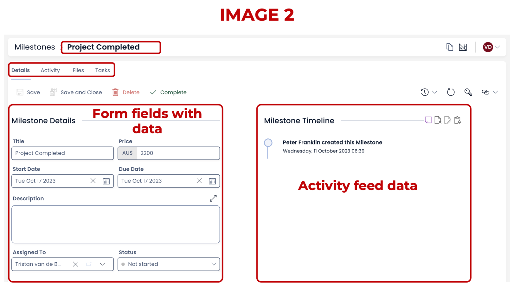

Therefore, whatever we configure in the Singular - Details breakpoint, will be visible in the individual Item Details.

**Imagine if this isn't configured then you wont be able to add / view Item Details in Explorer.**

### How to configure Singular - Item Details

Here you would first want to configure the Forms Component in the Details Tab. This will allow you show the required details about the subject item in Explorer.

**Imagine you have created a new table titled - Business Contacts. The columns of this table have been defined. For example - Full Name, Email, Phone Number are all columns of this table.**

1. Navigate to the Design Tab of Business Contacts table in Designer. Observe that you can see the Singular - Details breakpoint. The default tabs are present on the Tab Strip. The first tab of the Tab Strip - Details Tab is active.  
      
    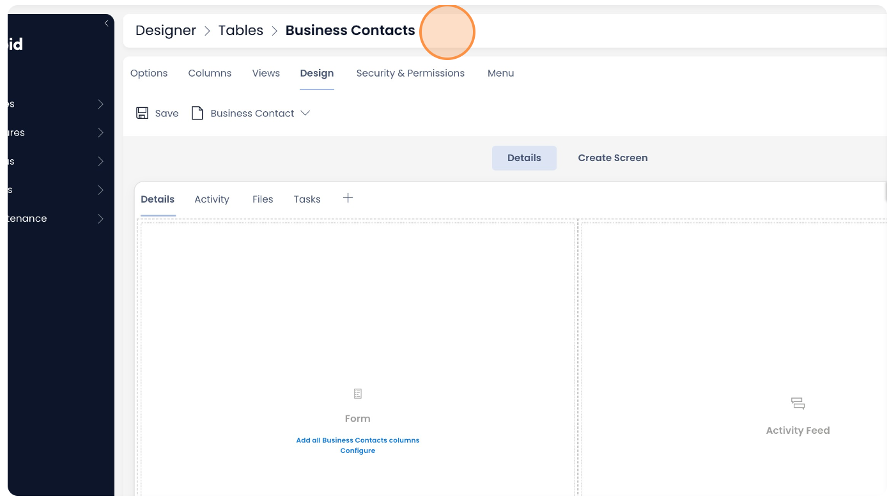  
      
    **Observe on Details Tab you can see two components - Form Component and Activity Feed Component.**
2. Focus on the Form Component. There are two options -  
      
    **1. Add all Business Contacts columns** - If you click on this option, the Form component will include all the existing columns to it. (Please note - the system built-in columns would not be included)  
      
    **2. Configure** - if you click on this option, the Form component will allow you to custom choose the columns you wish to add to the Form from the list of all columns.  
      
    Assume, you click the Configure option.  
      
    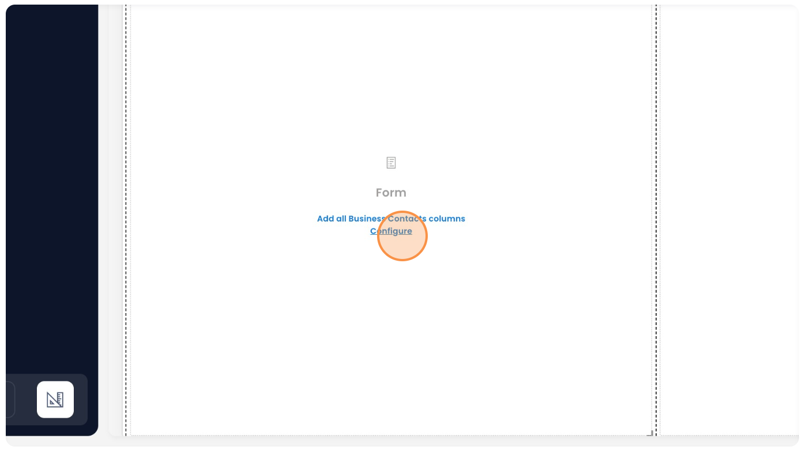
3. A Form Fields panel opens at the right side of the screen. This panel displays the list of all columns in the Table. Observe there is a checkbox to the left of each column name.  
      
    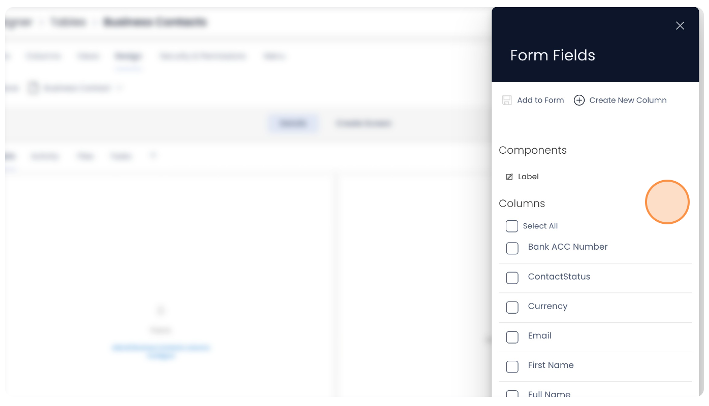
4. Also observe, there is a Label component. This is used to provide a context to the set of Form fields. Click on the Label.  
      
    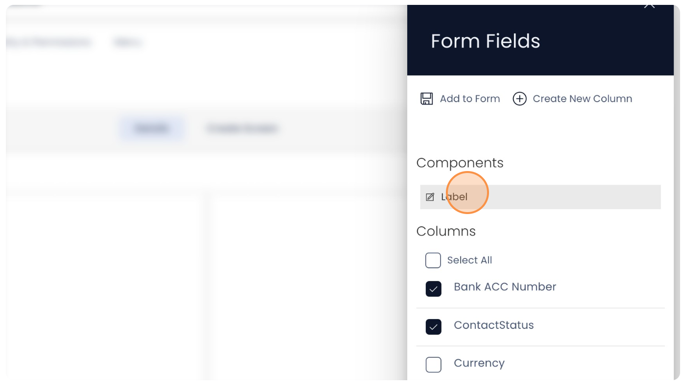
5. As you click on the Label component, it gets added to the Form. Click the "Label text" field.  
      
    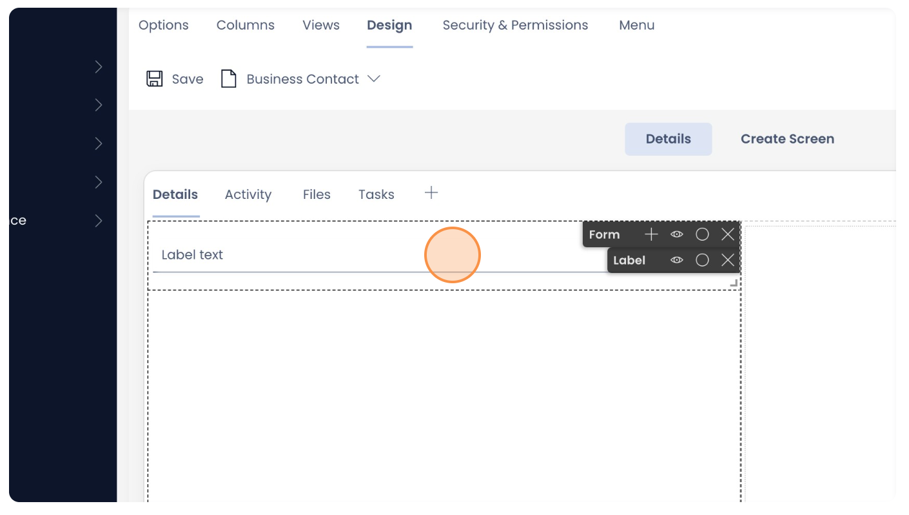
6. Type in your desired Label Text.   
    Then click on the "+" icon in the Form component.  
      
    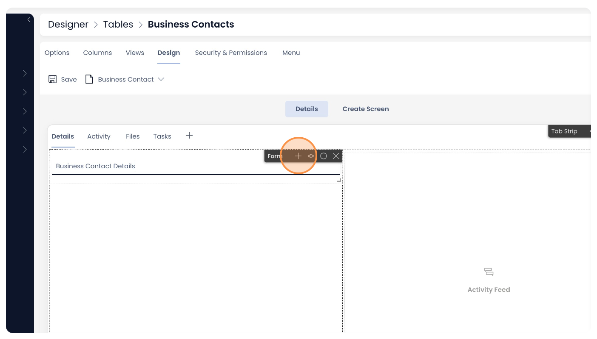
7. Select all the desired column fields.  
      
    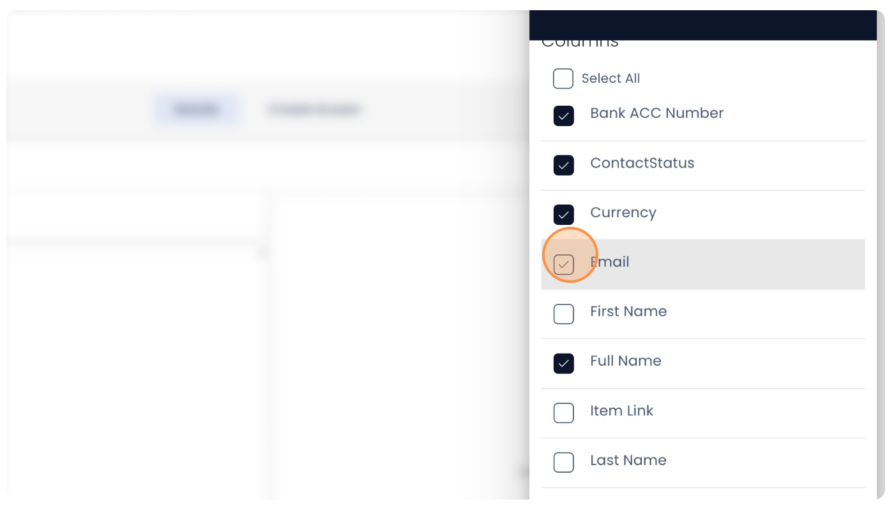
8. Post selecting all the desired fields, click "Add to Form".  
      
    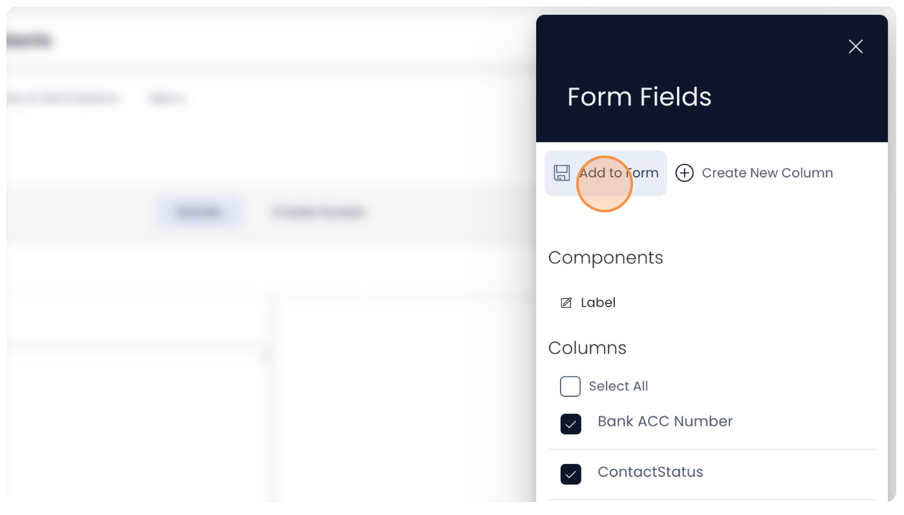
9. Observe the default list of fields appear in the alphabetical order. To re-order the fields in the desired sequence, just go to the respective fields horizontal option bar and drag to its desired position.  
      
    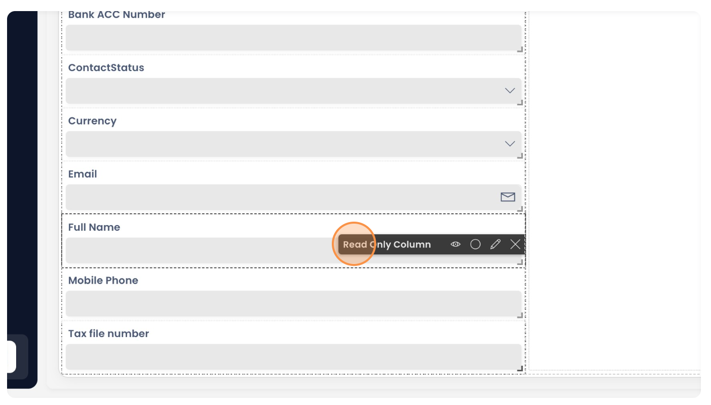
10. Observe that fields "Full Name" and "Email" have been dragged to the top of the list. The system automatically pushes the remaining fields down.  
      
    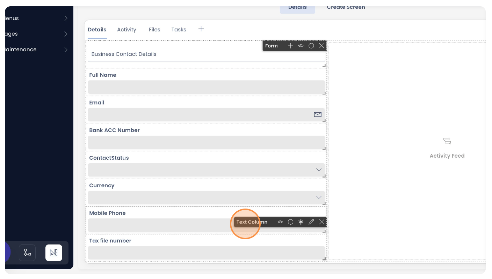
11. Further, you can also resize the fields. Click on the small bottom right part of rectangle. Click and drag the same to resize.  
      
    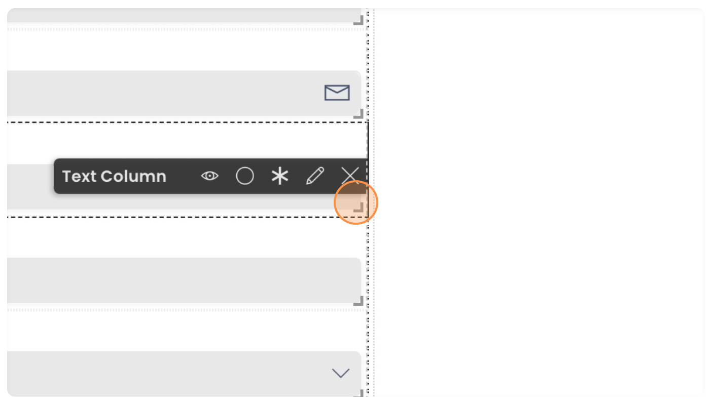
12. You can resize the fields as needed.  
      
    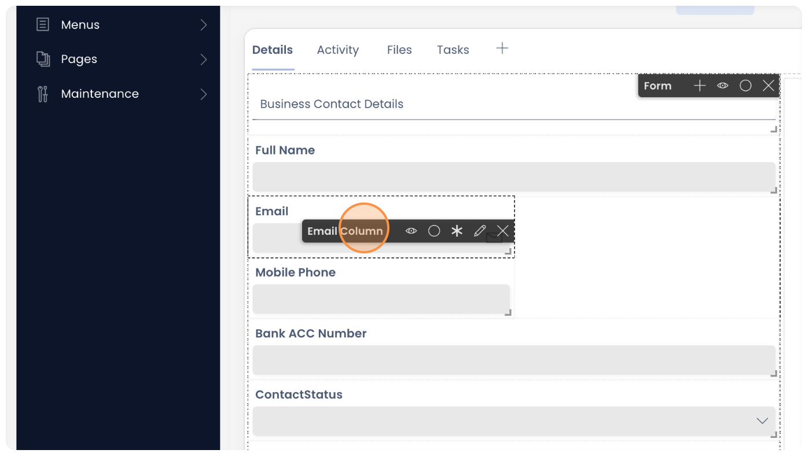
13. You can then arrange the fields as desired. Observe "Mobile Phone" and "Email" fields are arranged parallel to each other instead of horizontal.Also observe, in case you have too many fields and wish to increase the size of the Form canvas, you can click on the bottom right corner of the Form component and drag to the desired length.  
      
    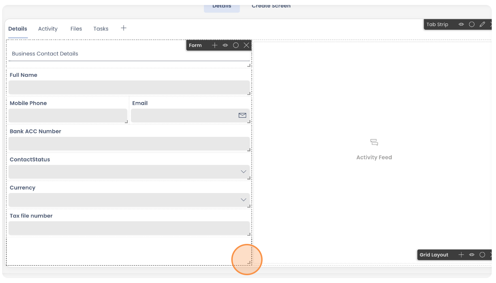
14. Finally, click "Save" for all your configuration to take effect.  
      
    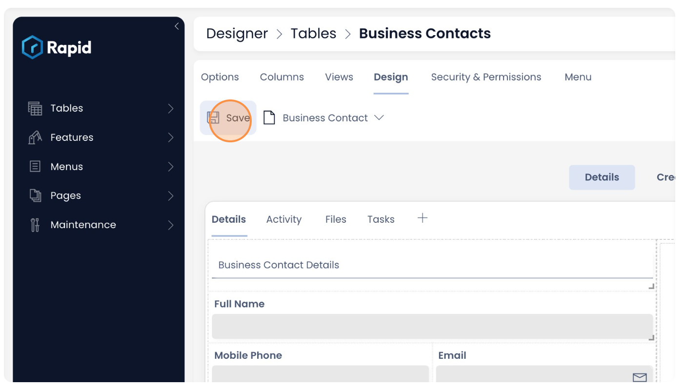

### Singular - Create Screen breakpoint

**What this will do:**

[**The Create Screen breakpoint is always in sync with the Details breakpoint and vice versa.**](https://docs.rapidplatform.com/books/experiences/page/how-to-set-a-component-to-be-visible-hidden-on-item-details-and-create-breakpoints "How to set a component to be visible / hidden on 'Item Details' and 'Create' breakpoints?")

Once you have created the Singular - Details breakpoint, it will automatically reflect in the Create Screen breakpoint. Observe in the image below. The Singular - Create Screen shows exactly how the Forms component was configured above.

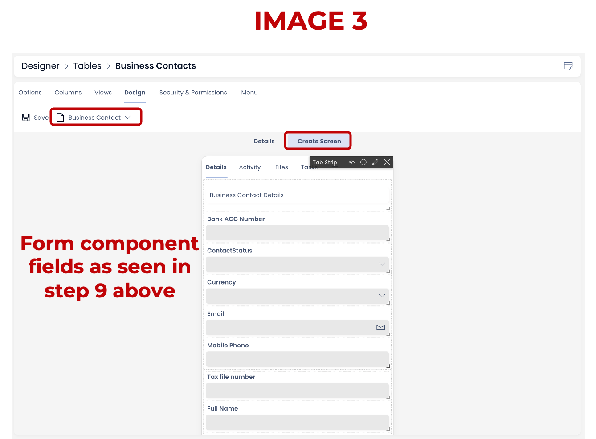

Please note, on the you would need to [**arrange the fields**](https://docs.rapidplatform.com/books/experiences/page/how-to-arrange-a-component-on-grid-layout "How to arrange a component on Grid layout?") in the order you want to see them in the Create Item Form.

:::info[Important]

You can set the fields of the Form Component as [**hidden / visible on the Item Details and Item Creation form**](https://docs.rapidplatform.com/books/experiences/page/how-to-set-a-component-to-be-visible-hidden-on-item-details-and-create-breakpoints "How to set a component to be visible / hidden on 'Item Details' and 'Create' breakpoints?").
::

## Related articles

[How to create a Page in Designer?](https://docs.rapidplatform.com/books/experiences/page/how-to-create-a-page "How to create a Page in Designer?")

[How to add a Layout to a Page?](https://docs.rapidplatform.com/books/experiences/page/how-to-add-a-layout-to-a-page "How to add a Layout to a Page?")

[How to add a component to a Layout / Page?](https://docs.rapidplatform.com/books/experiences/page/how-to-add-a-component-to-a-page "How to add a component to a Page?")

[What are the available components for Pages?](https://docs.rapidplatform.com/books/experiences/page/what-are-the-available-components-for-pages "What are the available components for Pages?")

[How to set a component to be visible / hidden on 'Item Details' and 'Create' breakpoints?](https://docs.rapidplatform.com/books/experiences/page/how-to-set-a-component-to-be-visible-hidden-on-item-details-and-create-breakpoints "How to set a component to be visible / hidden on 'Item Details' and 'Create' breakpoints?")

[***Go back to Pages Main Resource***](https://docs.rapidplatform.com/books/experiences/page/all-about-pages-in-designer "All about Pages in Designer")