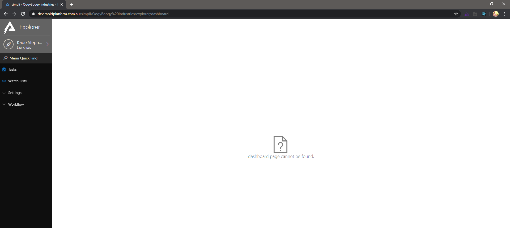
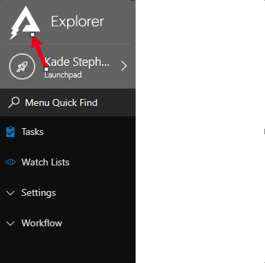
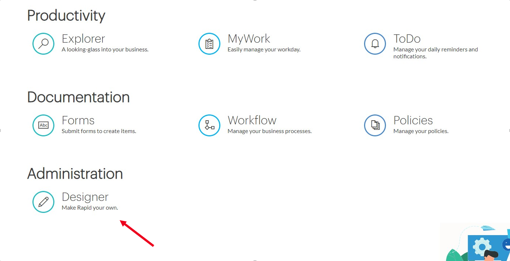
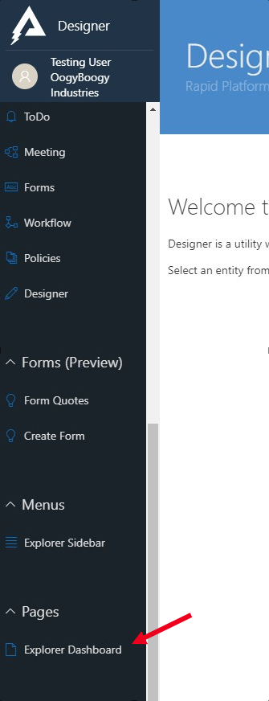
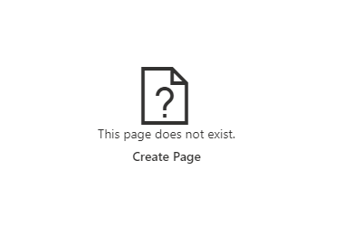
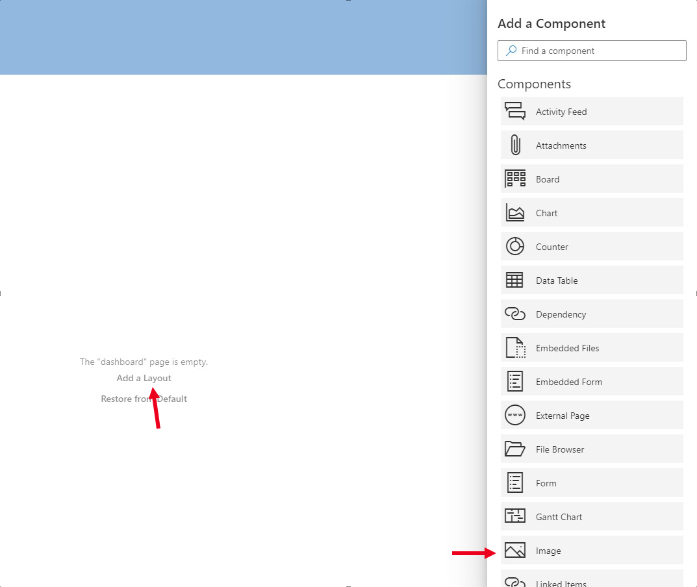
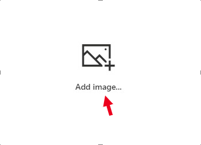
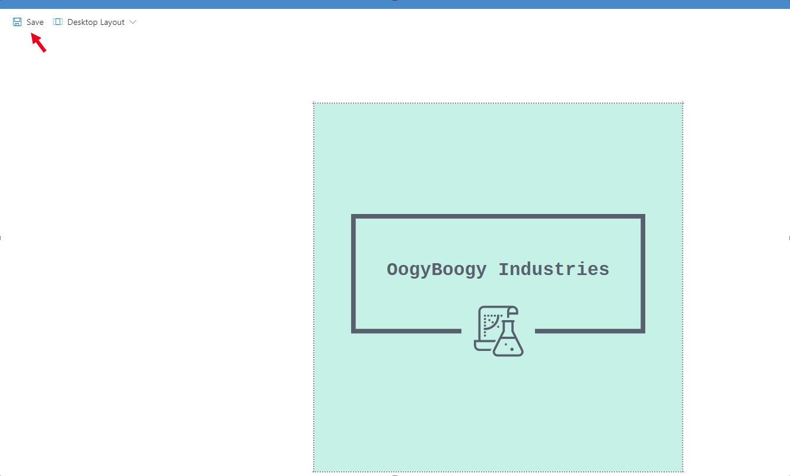
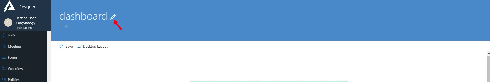
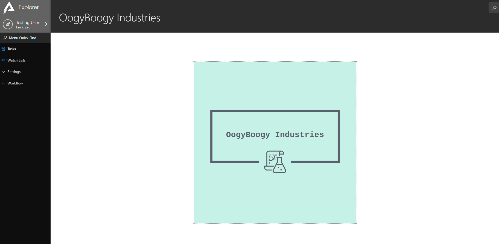

# The Dashboard

Once the site has been created, you will be directed to the Explorer Dashboard. The Dashboard is completely customisable as it utilises Rapid's paging system where a User can add any component and layout to any page.

The below image illustrates the view and state of the Rapid Site immediately after creation. Notice the Dashboard is empty as it has yet to be created

*Empty Dashboard Page in Explorer*

\##Configuring the Explorer dashboard To configure the Explorer dashboard you will need to navigate to the main dashboard and proceed to navigate to the [Designer experience](https://docs.rapidplatform.com/Home/User-Documentation/Designer) which is where the majority of the design and site configuration is done through. To navigate to Designer you will first need to go to the main Dashboard.

💡 At any time you can navigate to the main splash screen by pressing the Rapid Logo in the top left

Once the main dashboard is displayed, navigate to Designer by pressing on the experience

*The Dashboard for the Rapid Site*

After opening Designer, to configure the dashboard scroll down through the left navigation bar until 'Explorer Dashboard' is visible and open it

 *Designer Nav bar*

After opening the Dashboard configuration page you will first need to create a page. Hit the create page button.

*Create Page Interface*

After pressing create page you will now have to select what sort of layout you wish to display on the page. In this example an image will be used. To achieve this, press 'Add a Layout' and choose 'Image' in the nav bar.

*Page Component Configuration*

After pressing the image component, it will immediately be added to the page where you can configure, resize and re-position it.

 *Image Configuration*

Now, add an image to the component. This particular component accepts an image URL. Rapid will stretch the image to fill the size of the image component which is defined by the user if the user defines the image to 'zoom to fill'.

*Page Save*

Unless you save the page after making changes to the page, no changes will be committed. Once the page is saved, you can now set the Title of the Dashboard. Currently the only way to set the title of the Dashboard after creation is to reload the page. After a page reload the title of the dashboard can be edited and saved.

*Title Edit*

Once the Dashboard title has been set you are now able to view the completed page in Explorer, navigate back to the main dashboard by clicking the Rapid Logo and open the Explorer experience.

*Explorer Dashboard*