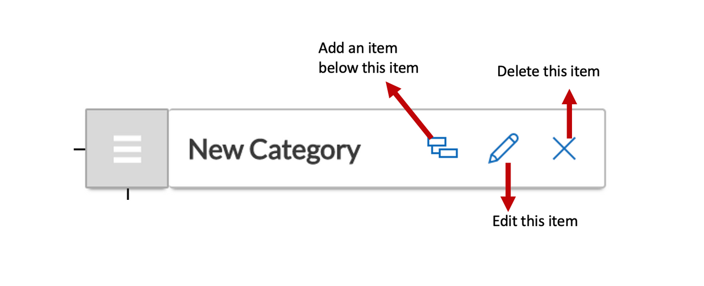

# How to edit / delete / add a menu item below an existing item

Each [***menu item***](https://docs.rapidplatform.com/books/glossary/page/menu-item "Menu item") created in has three options.

## Create a child item below an existing menu item

To create a new item below an existing item, you can click on the nested icon.
 >- As you create a new item below an existing item, you can configure what action should be triggered upon the click of it. For example - you an configure to open a hyperlink in a new window upon click of the item
    

## Edit an existing menu item properties

To edit the properties of a saved item, click on the pencil icon

## Delete an existing menu item 

To delete an item, hit the cross icon.

Click on the save button once all the changes are done.

Your changes will be visible on the related menu.

## Related articles

[How to create a new menu item?](https://docs.rapidplatform.com/books/experiences/page/all-about-menus-in-dezigna "All about Menus in Dezigna")

[All about Menus](https://docs.rapidplatform.com/books/experiences/page/all-about-menus-in-dezigna "All about Menus in Dezigna")