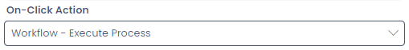

# Execute Workflow Process

This is configurable on both the [Side Bar](</docs/Rapid/3-User Manual/glossary/glossary.md#sidebar>) and [Command Bar](</docs/Rapid/3-User Manual/glossary/glossary.md#command-bar>) menu types.

## Overview

A menu button can be configured to launch a specific **Workflow Process**. 

When a workflow is successfully launched, a confirmation box will appear in the bottom-right corner of the site.

If any **Inputs** are configured on the **Workflow Process**, the desired input fields will appear in a dialogue box before the workflow is activated.

Once the inputs are entered and the user presses **OK**, the **Workflow Process** will be triggered.

## Configuring a Menu Button to Launch a Workflow

1. Navigate to the [menu configuration screen](</docs/Rapid/4-Keyper Manual/2-Designer/3-Menus/3-Menus.md>) of either an **Item** or the **Sidebar**. 

2. Create a new menu item by pressing the **+ New Menu Item** button

![A screenshot demonstrating the appearance and location of the New Menu Item button when editing a menu item. In this example this is editing a Command Strip menu item. At the top of the screenshot is the list of menu tabs for Designer when editing an item. Underneath, to the right of the "Save" button is the "New Menu Item". It has an icon of a + symbol and a downwards chevron indicating that it will open a dropdown menu. The screenshot is annotated with a red box to highlight the button's location.](<New Menu 1.png>)

3. Select **+ New Blank Item**

4. Provide the menu button with its **Display Text** that will appear to the user on the button

5. Optional: Provide a **Description** of what the menu button will accomplish

6. Optional: Select an **Icon** to describe the workflow action

7. Scroll down, and set the **On-Click Action** to *Workflow - Execute Process*

8. Optional: If configuring a **Command Strip** menu button, set the location of the item (Both | Item | Table)

9. Scroll down to the **Workflow - Execute Process** section

10. Select the **Process Diagram ID** to assign to the menu button

11. Set whether the menu button will trigger a save interaction

12. **Save** the menu hierarchy

Now, when the menu button is pressed, it will trigger the configured **Workflow Process**