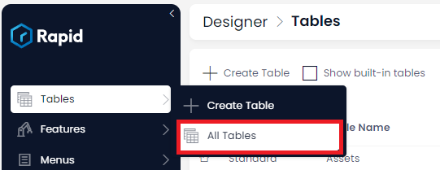
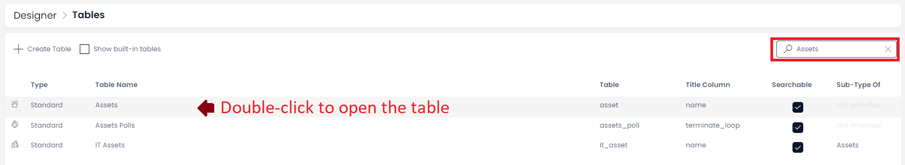
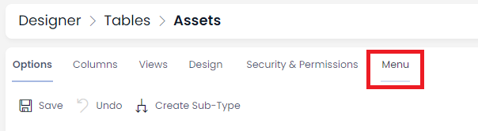
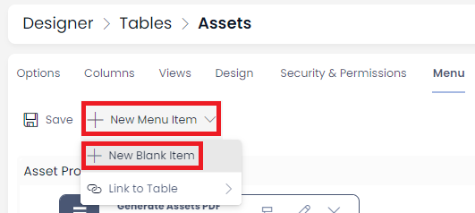
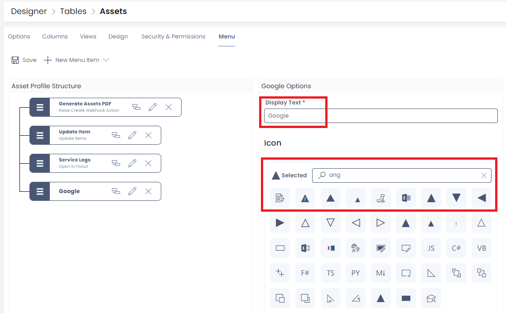
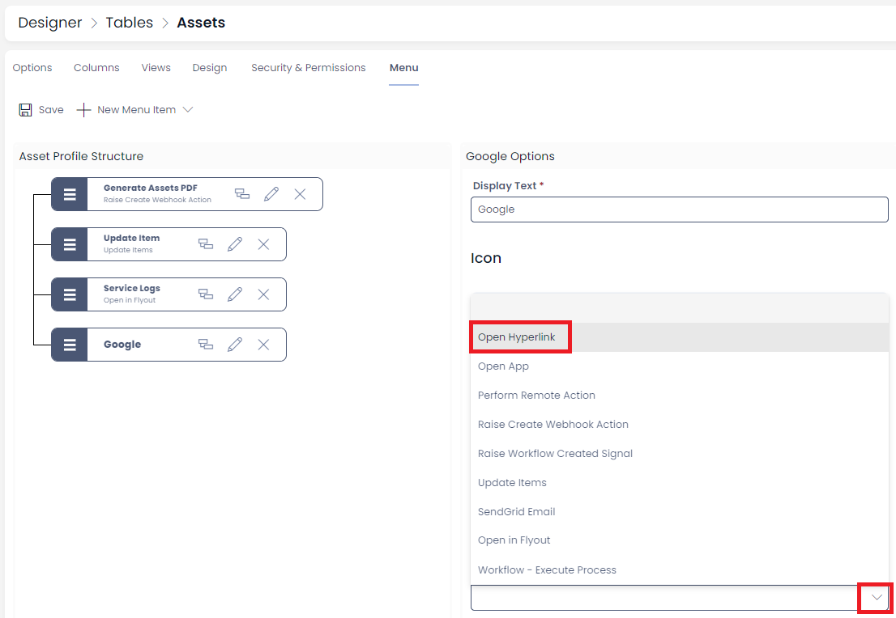
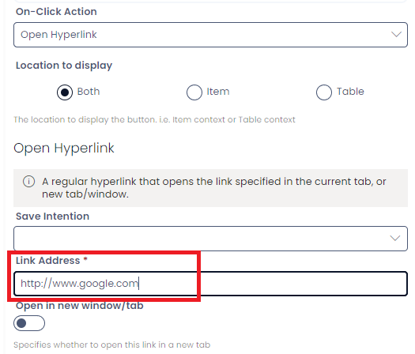
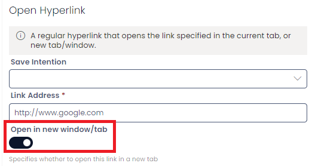
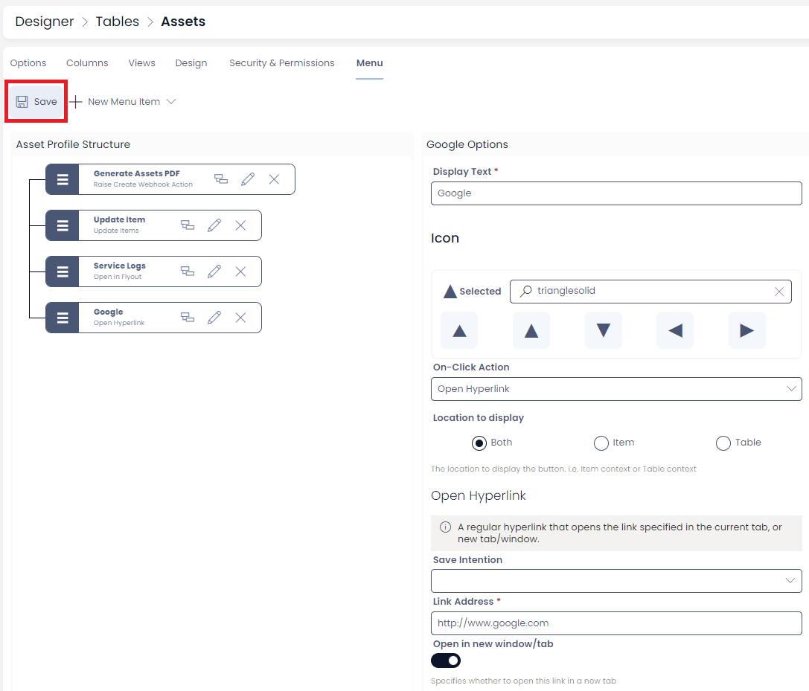

# Open hyperlink

This is configurable on both the ***[Side Bar](https://docs.rapidplatform.com/books/glossary/page/sidebar)*** and ***[Command Bar](https://docs.rapidplatform.com/books/glossary/page/command-bar)*** menu types.

## Overview

Open Hyperlink is among the most used On-Click Actions for a [***Menu button***](https://docs.rapidplatform.com/books/glossary/page/menu "Menu"). As the name suggests, it will configure the subject Menu button so that when a user clicks the same, one will be directed to a defined URL.

The URL can be anything from a Public Form, to even a website address.

## How to configure a "Open Hyperlink" menu button

1. Navigate to Designer &gt; Tables &gt; All Tables  

    
2. Open your desired table. (Find your desired table by using the search bar or scrolling through the list) 

    
3. Click on Menu  

    
4. Click on the **New Blank Item Drop down** then on **New Blank Item** 

    
5. Choose a name and Icon  

    
6. Choose **Open Hyperlink** as the On-Click Action 

    
7. Put the URL into the Link Address Box. Note URLs do require the full protocol (http://)  

    
8. Choose if you want the link to open in a new tab or on the current tab using the toggle  

    
9. Press Save  

    
