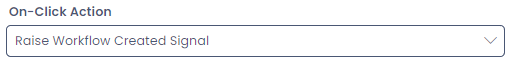

# Raise Workflow Created Signal

This is configurable on both the [Command Bar](</docs/Rapid/3-User Manual/glossary/glossary.md#command-bar>) menu types.

## Overview

A **Signal Start Event** can be triggered manually via a menu button, to activate any **Workflows** with **Signal Start Events** that are listening for when an item is created on a specific table.

This is because it is sometimes desirable to trigger a "created" **Signal Start Event** on an item that has been created previously.

:::note[Example]
When a new invoice item is created, a workflow is triggered that automatically sends the invoice to the customer. However, what is a customer requests the invoice be sent again? This requires the workflow to be triggered on the invoice item again, as though the item had just been created.
:::

When a **Raise Workflow Created Signal** menu button triggers a **Workflow**, a confirmation box will appear in the bottom-right corner of the site.

## Configuring a Menu Button to Launch a Workflow

1. Navigate to the [menu configuration screen](</docs/Rapid/4-Keyper Manual/2-Designer/3-Menus/3-Menus.md>) of either an **Item** or the **Sidebar**. 

2. Create a new menu item by pressing the **+ New Menu Item** button

![A screenshot demonstrating the appearance and location of the New Menu Item button when editing a menu item. In this example this is editing a Command Strip menu item. At the top of the screenshot is the list of menu tabs for Designer when editing an item. Underneath, to the right of the "Save" button is the "New Menu Item". It has an icon of a + symbol and a downwards chevron indicating that it will open a dropdown menu. The screenshot is annotated with a red box to highlight the button's location.](<New Menu 1.png>)

3. Select **+ New Blank Item**

4. Provide the menu button with its **Display Text** that will appear to the user on the button

5. Optional: Provide a **Description** of what the menu button will accomplish

6. Optional: Select an **Icon** to describe the workflow action

7. Scroll down, and set the **On-Click Action** to *Raise Workflow Created Signal*

8. Optional: If configuring a **Command Strip** menu button, set the location of the item (Both | Item | Table)

9. Optional: Conditional logic can also be applied using [OData filter syntax](</docs/Rapid/5-Developer Manual/API Concepts/API Concepts.md#odata-filter-support>) to only trigger a workflow when certain conditions are met. For example, to only trigger a workflow when the **Status** field is set to "Completed" would require the following filter: `status eq "Completed"

10. Scroll down to the **Raise Workflow Created Signal** section

11. Set whether the menu button will trigger a save interaction

13. **Save** the menu

:::note[Outcome]
Now, when the menu button is pressed, it will trigger any **Workflow Processes** that are listening for a created item on the configured.
:::