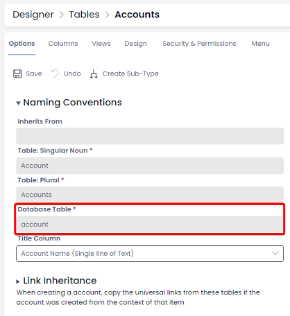

# Error: "Invalid object name"

### Cause:
The table being referenced does not exist, or is misspelled.

### Example:
```sql
SELECT [id]
FROM dbo.[contacts]

-- ERROR --
-- Invalid object name 'dbo.contacts'
```

### Solution:

When referencing Rapid tables using SQL, we must use the **singular** name of the table. To correct this, we simply need to use:

```sql
SELECT [id]
FROM dbo.[contact]
```

You can check the database name of your tables by:

1. Going to **Designer**
2. Clicking **Tables** &gt; **All Tables** in the sidebar
3. Find the table's SQL name in the **Table** column


Note that built-in tables may be turned hidden from this list (e.g. the **Principal** table).

You can reveal these by choosing the "Show Built-in Tables" checkbox at the top of the page.

If a table's database name is too long, it may not display fully in the list. Open the table, and you can find its database name under the **Naming Conventions** header. 

