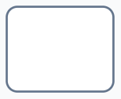

# Activities

**Activities** represent work that needs to be completed. Activitys can generate Activity items for users or for Rapid's system to complete. Below is a list of the different **Activities** and their functionality.

| Element Type | Symbol | Function |
| --- | --- | --- |
| **Abstract Activity** || This type of task cannot be configured or automated. It is useful for documentation purposes only. |
| **Send Activity** || This uses Omnichannel to send messages. At the time of writing, this can only be configured to send emails via SendGrid. For this element to be configured correctly, SendGrid must be configured on your Rapid site. |
| **Receive Activity** || Receives a message from SendGrid or Omnichannel. SendGrid must be configured on your Rapid site.|
| **User Activity** || Generates a a [User Activity](</docs/Rapid/4-Keyper Manual/3-Workflow/8-tasks/user-task/user-task.md>) or project for a user to complete. This activity can be configured with a *Title*, *Adaptive Document*, a static or dynamic *Assignee*, a *Parent Activity*, a *Start Date*, a relative *Due Date*, and a *Description*. The activity can also send an email communication to a relevant user so they are informed about the activity being generated. |
| **Manual Activity** || This is a activity that cannot be configured. Drawing a **Global Link** from this activity downstream to a **Data Store Reference**, will allow you to click the global link and configure the link to update an item or items in the **Data Store Reference**. This is called "modifying a data output association".|
| **Business Rule Activity** || This element cannot be configured. It is a [BPMN 2.0](https://www.bpmn.org/) symbol and useful for documentation only. |
| **Service Activity** || Triggers a [Service Activity](</docs/Rapid/4-Keyper Manual/3-Workflow/8-tasks/service-task/service-task.md>). The type of service activity can be configured. |
| **Script Activity** | | This element cannot be configured. It is a [BPMN 2.0](https://www.bpmn.org/) symbol and useful for documentation only. |
| **Call Activity** || Launches another **Workflow Process Diagram**. The specific **Start Event** that will be triggered can be configured from this activity. |

Note that a **activity** can also be configured into a **sub-process**.