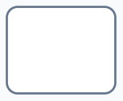

# Element Types

The **Workflow Toolbar** only contains the "base" types of diagram element. For example, using the **Toolbar** you can place a **Task**, but not a **User Task**. In order to configure an element and change its type, we must use the **Configuration Panel** once the element is placed on the **Canvas**.

## Configuring an Element's Type

To configure the type of element:

1. Select an element by clicking on it

2. Press the **Change Type** button on the **Configuration Panel**. The **Change Type** button has an icon of a wrench.

3. From the menu that appears, select a type of element

![A screenshot demonstrating the appearance of the "Change Type" menu that appears after clicking on the "Change Type" button in the "Configuration Panel". In this example, the user is configuring a Start Event. The options that appear are as follows (from top to bottom): "Intermediate Throw Event", "End Event", "Message Start Event", "Timer Start Event", "Conditional Start Event", and the mouse cursor is hovering over the final option, which is the "Signal Start Event"; this event has an icon of a circle with a triangle inside it. ](<Workflow Change Type Button Menu.png>)

4. The element will now be configured to that type, and its appearance will change to reflect this new type

Below is a summary of all element types, and the base type that they are configured from.

## Start Event Types

To access any of the **Start Event Types** below, place a [Start Event](</docs/Rapid/4-Keyper Manual/3-Workflow/5-start-events/5-start-events.md>) on the **Canvas** and change its type using the [Configuration Panel](</docs/Rapid/4-Keyper Manual/3-Workflow/4-element-types/4-element-types.md#configuring-an-elements-type>).

| Element Type | Symbol | Function |
| --- | --- | --- |
| **Start Event** || The default **Start Event**. This event will start when manually triggered with the **Launch** button in the **Workflow** experience, and cannot be configured. |
| **Message Start Event** | | Automated **Message Events** are not implemented at the time of writing. This event cannot be configured, and is only useful for documentation purposes. |
| **Timer Start Event** | | Triggers the start of a workflow and produces a token as set by a timer. For example, can be configured to run at *specific dates of the year* or at specific *times of day*. |
| **Conditional Start Event** | | Conditional events are not implemented at the time of writing. This event cannot be configured. |
| **Signal Start Event** | | Triggers the start of a workflow and produces a token when certain conditions on a table are met. The trigger is configured using an [OData query](</docs/Rapid/3-User Manual/2-Explorer/4-Views/3-Views-Creating/3-Views-Creating.md#extra-filters>). |

- You can also [read more about **Start Events**](</docs/Rapid/4-Keyper Manual/3-Workflow/5-start-events/5-start-events.md>).

## Intermediate Event Types

To access any of the **Intermediate Event Types** below, place an [Intermediate Event](</docs/Rapid/4-Keyper Manual/3-Workflow/6-intermediate-events/6-intermediate-events.md>) on the **Canvas** and change its type using the [Configuration Panel](</docs/Rapid/4-Keyper Manual/3-Workflow/4-element-types/4-element-types.md#configuring-an-elements-type>).

| Element Type | Symbol | Function |
| --- | --- | --- |
| **Intermediate Event** |  | The default **Intermediate Event**. This event cannot be configured, and should be changed to a different intermediate type. |
| **Message Intermediate Catch Event** |  | |
| **Message Intermediate Throw Event** |  | |
| **Timer Intermediate Catch Event** |  | Pauses the process token for a duration that is specified using a Lodash expression, or for a fixed length of time. |
| **Escalation Intermediate Throw Event** |  |  |
| **Conditional Intermediate Catch Event** |  |  |
| **Link Intermediate Catch Event** |  ||
| **Link Intermediate Throw Event** |  ||
| **Compensation Intermediate Throw Event** |  ||
| **Signal Intermediate Catch Event** |  | Creates a new token when the conditions for a table are met. Also discards all other active tokens. These conditions are specified using an OData query.|
| **Signal Intermediate Throw Event** |  ||

## Intermediate Boundary Event Types

Boundary events are created by placing an **Intermediate Event** on top of a **Task**. The result is an element that combines both task and intermediate event.

These events can then have their type configured using the [Configuration Panel](</docs/Rapid/4-Keyper Manual/3-Workflow/4-element-types/4-element-types.md#configuring-an-elements-type>). You can [read more about **Intermediate Boundary Events**](</docs/Rapid/4-Keyper Manual/3-Workflow/6-intermediate-events/boundary-events/boundary-events.md>).

| Element Type | Symbol | Function |
| --- | --- | --- |
| **Boundary Event** || The default boundary event. This element cannot be configured, and should be changed to another element type.|
| **Message Boundary Event** |||
| **Timer Boundary Event** || Generates a new token from a task, once the specified *Duration* has elapsed. Discards all other active tokens. |
| **Escalation Boundary Event** || |
| **Conditional Boundary Event** || |
| **Error Boundary Event** || When the associated element throws an error, the **Error Boundary Event** creates a token. The previous token that arrived on the element is discarded. |
| **Cancel Boundary Event** |||
| **Signal Boundary Event** |||
| **Compensation Boundary Event** ||   |
| **Message Boundary Event (non-interrupting)** ||  |
| **Timer Boundary Event (non-interrupting)** || This event generates a new token upon the configured *Duration* elapsing. However, it does not delete all other active tokens.|
| **Escalation Boundary Event (non-interrupting)** || |
| **Conditional Boundary Event (non-interrupting)** || |
| **Signal Boundary Event (non-interrupting)** |||

## End Event Types

To access any of the **End Events** below, place an [End Event](</docs/Rapid/4-Keyper Manual/3-Workflow/7-end-events/7-end-events.md>) on the **Canvas** and change its type using the [Configuration Panel](</docs/Rapid/4-Keyper Manual/3-Workflow/4-element-types/4-element-types.md#configuring-an-elements-type>).

| Element Type | Symbol | Function |
| --- | --- | --- |
| **End Event** || Discards any token that arrives on it.|
| **Message End Event** |||
| **Escalation End Event** |||
| **Error End Event** |||
| **Compensation End Event** |||
| **Signal End Event** |||
| **Terminate End Event** |||

## Task Types

To access any of the **Tasks** below, place a [Task](</docs/Rapid/4-Keyper Manual/3-Workflow/8-tasks/8-tasks.md>) on the **Canvas** and change its type using the [Configuration Panel](</docs/Rapid/4-Keyper Manual/3-Workflow/4-element-types/4-element-types.md#configuring-an-elements-type>).

| Element Type | Symbol | Function |
| --- | --- | --- |
| **Abstract Task** || This type of task cannot be configured or automated. It is useful for documentation purposes only. |
| **Send Task** || This uses Omnichannel to send messages. At the time of writing, this can only be configured to send emails via SendGrid. For this element to be configured correctly, SendGrid must be configured on your Rapid site. |
| **Receive Task** || Receives a message from SendGrid or Omnichannel. SendGrid must be configured on your Rapid site.|
| **User Task** || Generates a task or project for a user to complete. This task can be configured with a *Title*, *Adaptive Document*, a static or dynamic *Assignee*, a *Parent Task*, a *Start Date*, a relative *Due Date*, and a *Description*. The task can also send an email communication to a relevant user so they are informed about the task being generated. |
| **Manual Task** || This is a task that cannot be configured. Drawing a **Global Link** from this task downstream to a **Data Store Reference**, will allow you to click the global link and configure the link to update an item or items in the **Data Store Reference**. This is called "modifying a data output association".|
| **Business Rule Task** || This element cannot be configured. It is a [BPMN 2.0](https://www.bpmn.org/) symbol and useful for documentation only. |
| **Service Task** || Triggers a [Service Task](</docs/Rapid/4-Keyper Manual/3-Workflow/8-tasks/service-task/service-task.md>). The type of service task can be configured. |
| **Script Task** | | This element cannot be configured. It is a [BPMN 2.0](https://www.bpmn.org/) symbol and useful for documentation only. |
| **Call Activity** || Launches another **Workflow Process Diagram**. The specific **Start Event** that will be triggered can be configured from this task. |

Note that a **task** can also be configured into a **sub-process**.

## Data Store Reference Types

To access any of the **Data Store References** below, place a [Data Store Reference](</docs/Rapid/4-Keyper Manual/3-Workflow/9-data-store-reference/9-data-store-reference.md>) on the **Canvas** and change its type using the [Properties Panel](</docs/Rapid/4-Keyper Manual/3-Workflow/3-drawing-diagrams/3-drawing-diagrams.md>).

| Element Type | Symbol | Function |
| --- | --- | --- |
| **Get Item** |  |  Fetches a single item from a Rapid Table using an item *id*. |
| **Get Items** |  | Fetches multiple items from a Rapid Table using: a selected table view, a [lodash array expression for *selection*](</docs/Rapid/4-Keyper Manual/3-Workflow/formatting-arrays-with-lodash/formatting-arrays-with-lodash.md>) and a [lodash expression for *filtering*](</docs/Rapid/4-Keyper Manual/3-Workflow/filtering-values-with-lodash/filtering-values-with-lodash.md>). |