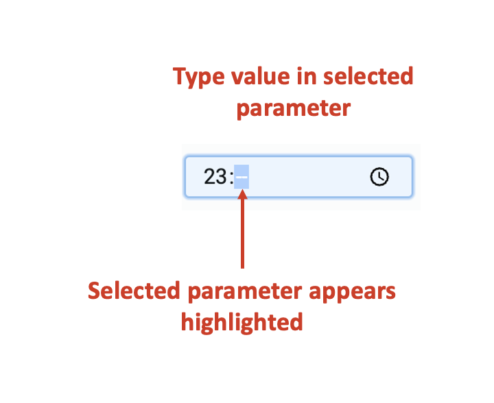
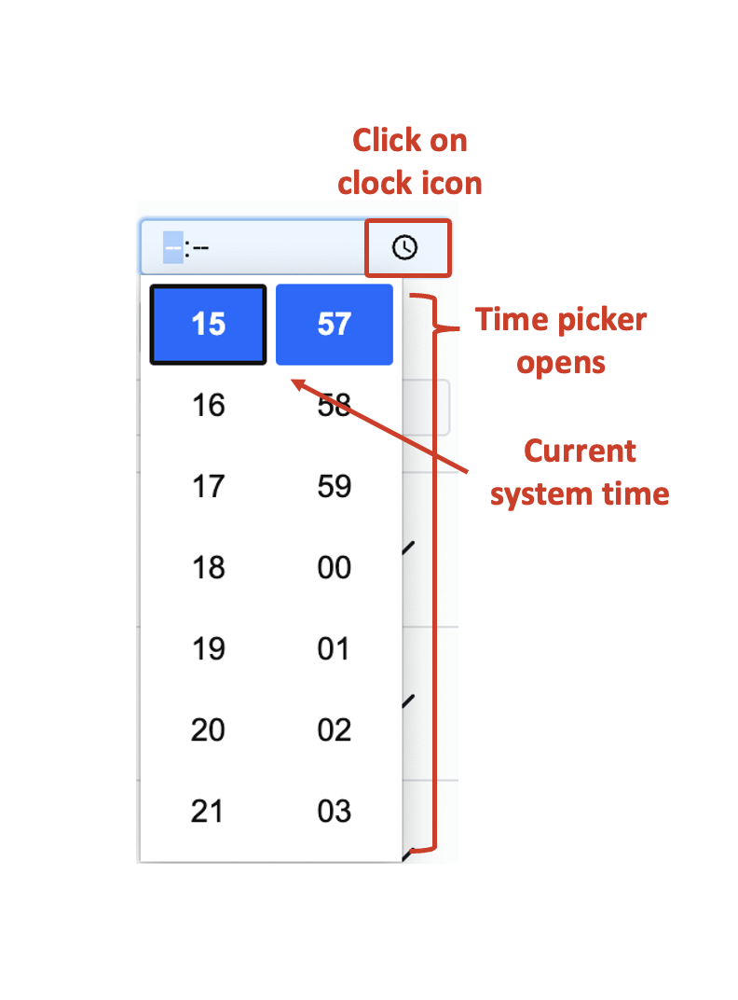

# Time

## What is a Time input control?

A Time control, in its most fundamental form, allows the user to input a timestamp in hh:mm (24 hr) format. This is useful when only time input is required (not combined with the date).

For example: Imagine a scheduler application. Using this application, the users can set up daily stand-up calls for the team. OR Imagine the HR manager defining the shift timings for the staff. In such scenarios, you would want to include a Time type input control.

## What are the attributes for Date-Time input?

Consider the following image and corresponding list sequentially explaining the fields of the attributes section for Date-Time control.

   **a. Label** - This field allows you to type the label to the Time control. The label shall appear above the element in the Adaptive Document and is used to provide context for the user.

   **b. Asterisk (*) sign** - If you click ON this field, then an asterisk sign will appear next to the label. This is used to indicate a special message to the users of the document. For example - conditions apply, the element is mandatory etc.  

   :::info[Please note]  
   It is important to note that the Asterisk sign is only a visual indicator and does not imply any logical condition on the control. For example - turning the Asterisk sign as ON will not make the Time control a mandatory element for users. All logical behaviour for the control should be configured using conditions and validations.  
   :::

   **c. Default value** - The time entered here is set as the default value for the element. If the user inputs a value to the element, then the default value will be replaced by the user entered value. If the user does not interact with the element, then the default value will be submitted as element value. 

   There are two ways to set the default time value:

   1. By manually typing the time.  
       a. Click on the hh parameter. The parameter will get highlighted.   
       b. Type the hours value between 00 and 24.  
       c. The system will automatically select the mm parameter (highlight mm parameter). Type the minutes value between 00 and 59.  
       
         

   1. By using the Time picker  
      a. Click on the clock icon at the right-end of the field.  
      b. The Time picker window opens. It has the current system time highlighted by default.  
      c. Click and select the  time of your choice.  
      d. Click outside the field to set the default value.  
      
      

   :::tip[Please note]  

   * To clear an already set default value, select the time parameter and delete from keyboard.

   * The default value won't set until both hh and mm are provided to the system.

   * If you enter a number greater than the logical range, then the system will take the highest value. For example - if type 35 in hh, the system will take date value as 23. If you type 65 in mm, the system will record it as 59.
   :::

   
   **d. Force disable** - If this field is clicked ON, then it will supersede all enable conditions and the element will always remain in disabled mode.

   :::tip[Please note]
   This is useful when you want to display a dynamic piece of information to the users. For example - time of Event commencement. In such cases, while the event's time is a useful information, you do not want the users to change the same. Hence the element will display the value, but will remain disabled for user input.  
   :::

   **e. Force hide** - If this field is clicked ON, then it will supersede all show conditions and the element will always remain hidden from the user.

   :::tip[Please note]
   This feature can be used in advanced Adaptive Documents, where you need to pass a certain value, (like the timestamp of form submission) but do not want to show it to the user. The element will remain hidden from the user, and hence the user would not be able to enter any value to the element.  
   :::
   
   **f. Class names** - In this field, you can type the name of the CSS class and the element will be styled as per the CSS class definition.