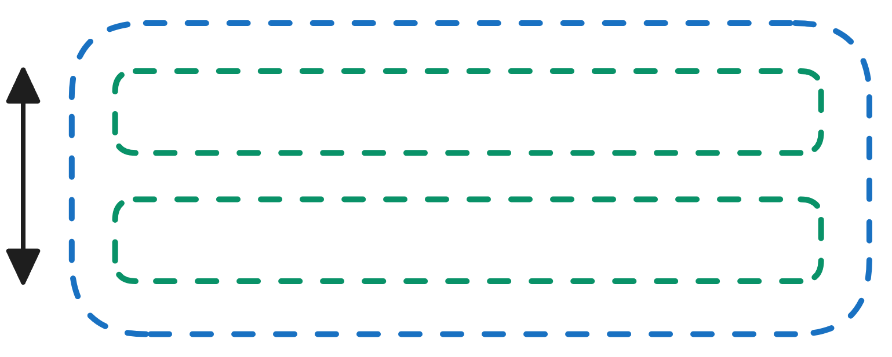

# Configuring the Attributes of Root Section

To configure the Root section properties, please consider the below points:

1.  Click on "Layout.Section root" in the  <a href="https://rapiddocs.z8.web.core.windows.net/docs/Rapid/User%20Manual/glossary/#document-structure-panel--tree-of-elements-adaptive-documents" target="_blank">**Document Structure panel**</a>.

2. Observe the <a href="https://rapiddocs.z8.web.core.windows.net/docs/Rapid/User%20Manual/glossary/#element-configuration-panel-adaptive-documents" target="_blank">**configuration panel**</a> opens. It has "root" written above it.

Also observe there are three categories:
- Attributes
- Conditions
- Connection

Out of these you can only configure Attributes here. Conditions and Connection cannot be configured from this panel for root.

4. Let us describe each of the options for the Attributes category :

    a. **Label** - This the label of the root section. This is a text field. You can type the label in this field.   
    
:::info[Please note]
    The label text will automatically become the name of the root section in the Document Structure Panel.  
  
:::

    b. **Show label** - If you toggle this to "Yes", then the label text will display on the composition area.  
    
:::tip[Please note]
    If this field is set to "No", then it will supersede Divider and Description Show settings (discussed below)  
:::

    c. **Layout direction** - You can select Horizontal or Vertical Layout directions in this field. 
    | Vertical Layout | Horizontal Layout |
    | ------------------- | ---------------------- |
    |   |  |
    | If a vertical layout is selected, new elements will be added one below the other in a vertical manner | If a horizontal layout is selected, new elements will be added rightwards to the previous one in a horizontal manner |

    d. **Heading size** - You can select the size of the heading in which you wish the label text to appear. Options from H1 to H6 are available. These are arranged in descending order of font size, with H1 being the largest.

:::note[Please note - Justify children and Align children]
Justify children and Align children are similar to each other in certain ways, and derive their effect from the Layout direction value (defined above in c.). Therefore, we shall discuss these two parameters together in a table.    
  
It is worth observing that both Justify children and Align children have the same set of seven options.  
   

 We shall discuss the behaviour of Justify and Align for each of these seven options.
:::
   

  |  | e. **Justify children** | f. **Align children** | 
  |---- | -------- | ------ |
  | **Definition** | This will justify the children **along** the line of the axis of the layout direction. Therefore, if the layout direction is selected as vertical, the justify will arrange children top-down, while if layout direction is selected as horizontal, the justify will arrange children left-right. | This will align the children **across** the line of the axis of the layout. Therefore, if the layout direction is selected as vertical, the align will arrange children left-right, while if layout direction is selected as horizontal, the justify will arrange children top-down. |
  | **Layout direction - Vertical** |  |  |
  | **Layout direction - Horizontal** |  |  |

  Next, we will take a look the seven options and see how the system behaves for Vertical / Horizontal - Justify pair. You can then deduce  how the system will arrange children across the layout axis for align. 

   | | Option Definition | Vertical | Horizontal |
  | ------ | ------ | ------ | ------ | 
  | **Start** | Items are packed toward the start of the layout direction. Top for vertical, Left for horizontal |  |  | 
  | **Center** | Items are centered along / across the line |  |  | 
  | **End** | Items are packed toward the end of the layout direction. Bottom for vertical, Right for horizontal |  |  | 
  | **Stretch** | Item fills the container along the layout direction. Height for vertical, Width for horizontal |  |  | 
  | **Around** | Items are evenly distributed along the line with equal space around them. Note that visually the spaces aren’t equal, since all the items have equal space on both sides. The first item will have one unit of space against the container edge, but two units of space between the next item because that next item has its own spacing that applies. |  |  | 
  | **Between** | Items are evenly distributed along the line; first item is on the start line, last item on the end line. |  |  | 
  | **Evenly** | Items are distributed along the line so that the spacing between any two items (and the space to the edges) is equal. |  |  | 

    g. **Show divider** - if this is toggled "Yes", then a divider line appears below the label header.

    h. **Show description** - if this is set to "Yes", then the description text will appear below the label header.

    i. **Fill container** - if this is set to "Yes", the subject element fills up the space of the parent container. **This does not have any effect for the root section, as it has no parent.**

    j. **Description** - this is a text field where you can type the description of the form / header. 

    k. **Css Class Names** - here you can define the existing Css Classes and the design of the root section will pick up the styling based on the Css Class.
