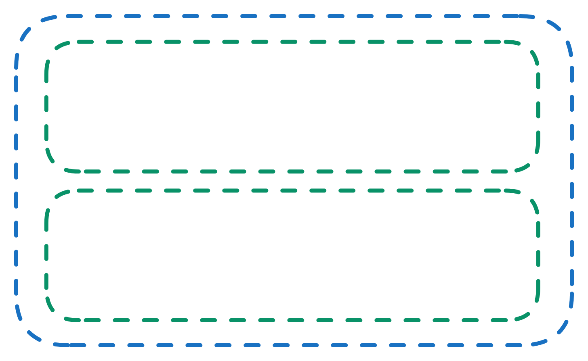
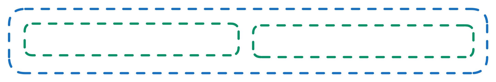
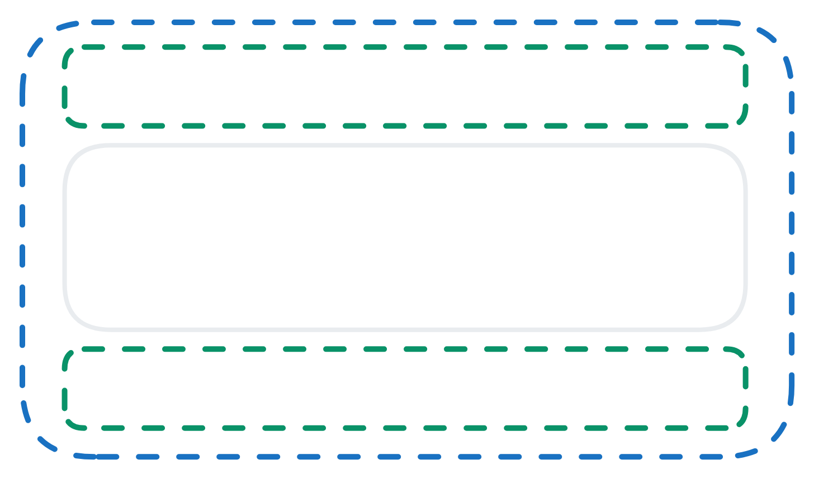

# Configuring the Root Section

To configure the Root section of the form, please consider the below points:

1.  Click on "Layout.Section root" in the  <a href="https://docs.rapidplatform.com/docs/Rapid/User%20Manual/glossary/#document-structure-panel--tree-of-elements" target="_blank">**Element Tree**</a>.

2. Observe the <a href="https://docs.rapidplatform.com/docs/Rapid/User%20Manual/glossary/#element-configuration-panel" target="_blank">**configuration panel**</a> opens. It has "root" written above it.

There are three sections that can be configured:
- Attributes
- Conditions
- Connection

Out of these, you can only configure Attributes for the root.

4. The following can be edited in the Attributes section:

    

    a. **Label** provides a title for the entire form. The label will automatically become the name of the root section, in the **element tree**.

    b. **Show label** allows you to toggle whether the label is displayed in the composition area.  
    
    :::note[Please note]
    If this field is set to "No", then it will override Divider and Description Show settings (discussed below)
    :::

    c. **Layout direction** selects **Horizontal** or **Vertical** Layout directions in this field.

    | Vertical Layout | Horizontal Layout |
    | --- | --- |
    |   |  |
    | If a vertical layout is selected, new elements will be added one below the other in a vertical manner | If a horizontal layout is selected, new elements will be added rightwards to the previous one in a horizontal manner |

    d. **Heading size** selects the size of the heading text. Options from H1 to H6 are available. These are arranged in descending order of font size, with H1 being the largest.

    |  | e. **Justify children** | f. **Align children** | 
    |---- | -------- | ------ |
    | **Definition** | This will justify the children **along** the line of the axis of the layout direction. | This will align the children **across** the line of the axis of the layout. |
    | **Vertical** |  Therefore, if the layout direction is selected as **vertical**, the justify will arrange children **top-down** |  Whereas if layout direction is selected as **horizontal**, the justify will arrange children **left-right**. |
    | **Horizontal** |  Therefore, if the layout direction is selected as **vertical**, the alignment will arrange children **left-right**. |  Whereas if layout direction is selected as **horizontal**, the alignment will arrange children **top-down**. |

    Next, we will take a look the seven options and see how the system behaves alignment vs justification.

      

    | | Option Definition | Vertical | Horizontal |
    | ------ | ------ | ------ | ------ | 
    | **Start** | Items are packed toward the start of the layout direction. Top for vertical, Left for horizontal. |  |  | 
    | **Center** | Items are centered along / across the line. |  |  | 
    | **End** | Items are packed toward the end of the layout direction. Bottom for vertical, Right for horizontal |  |  | 
    | **Stretch** | Item fills the container along the layout direction. Height for vertical, Width for horizontal |  |  | 
    | **Around** | Items are evenly distributed along the line with equal space around them. Note that visually the spaces aren’t equal, since all the items have equal space on both sides. The first item will have one unit of space against the container edge, but two units of space between the next item because that next item has its own spacing that applies. |  |  | 
    | **Between** | Items are evenly distributed along the line; first item is on the start line, last item on the end line. |  |  | 
    | **Evenly** | Items are distributed along the line so that the spacing between any two items (and the space to the edges) is equal. |  |  | 

    g. **Show divider** toggling this will show a divider line below the label header.

    h. **Show description** displays the description text below the label header.

    i. **Fill container** causes the subject element to fill the space of the parent container. This does not have any effect for the root section, as it has no parent.

    j. **Description** is a text field where you can type a description of the form.

    k. **CSS Class Names** define the existing CSS Classes, and the design of the root section will use this styling.
