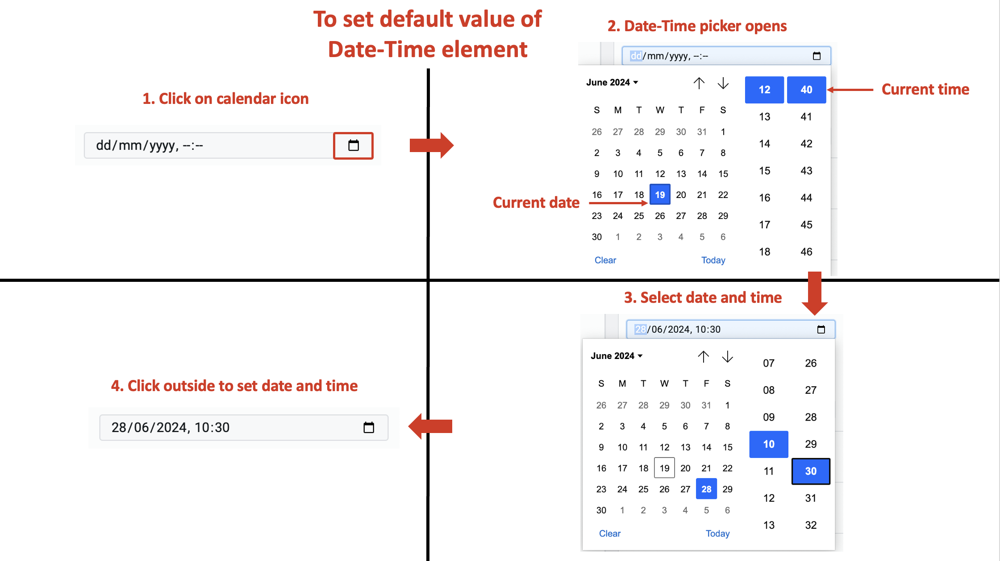
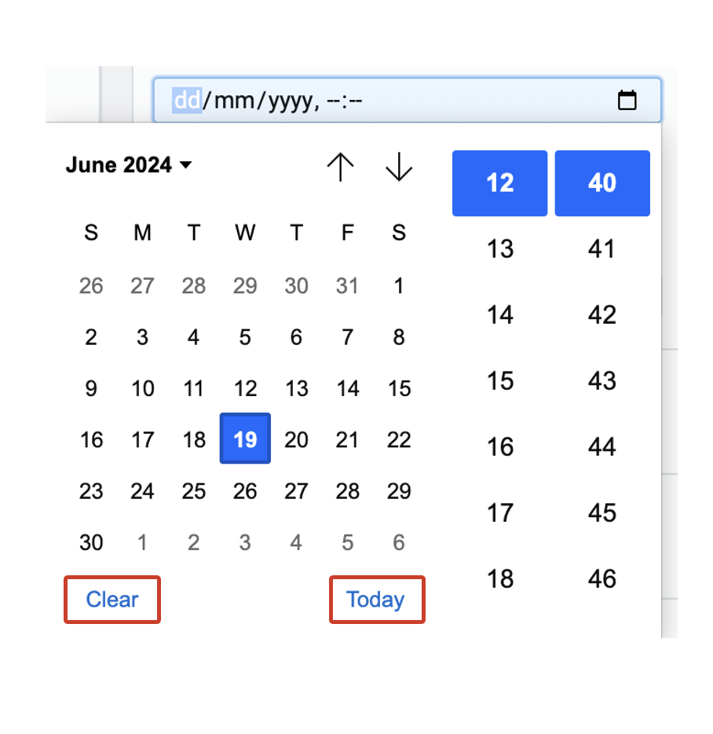
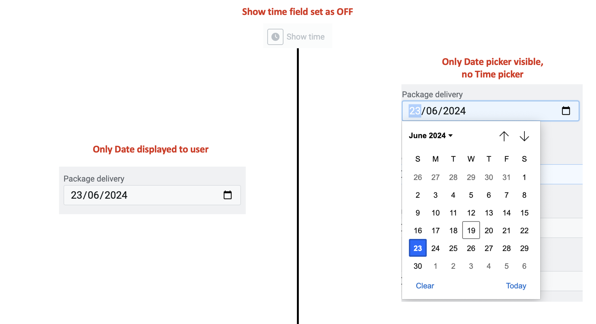
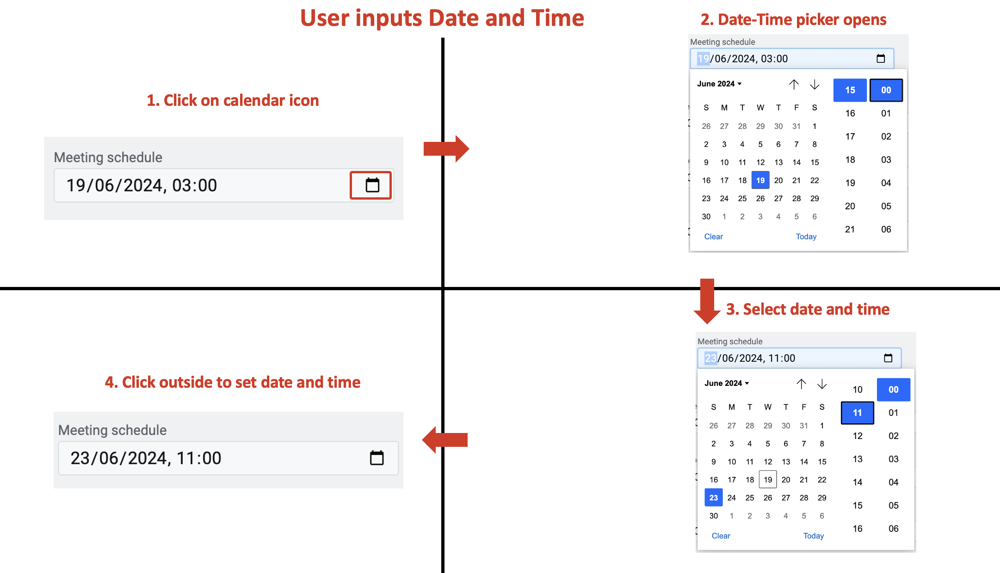
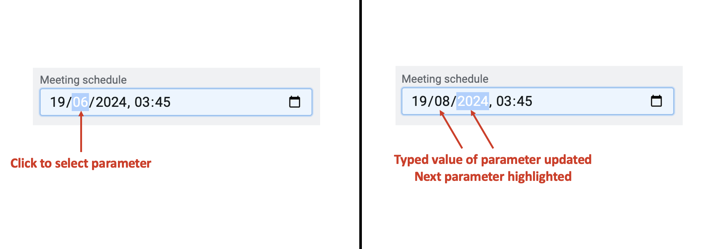

# Date-Time

## What is a Date-Time input control?

A Date-Time control, in its most fundamental form, allows the user to input a timestamp accurate to the minute. The user can input a date, and a time reference in hours and minutes for that date.

For example: Imagine you are creating a scheduler application. Using this application, the users can schedule a meeting with the company representatives. In the application, the user will fill out a form giving out their details and convenient time slot. The users will need to pick a relevant date and time for the meeting. In such scenarios, you would want to include a Date-Time type input control.

## What are the attributes for Date-Time input?

Consider the following image and corresponding list sequentially explaining the fields of the attributes section for Date-Time control.

   **a. Label** - This field allows you to type the label to the Date-Time control. The label shall appear above the element in the Adaptive Document and is used to provide context for the user.

   **b. Asterisk (*) sign** - If you click ON this field, then an asterisk sign will appear next to the label. This is used to indicate a special message to the users of the document. For example - conditions apply, the element is mandatory etc.  

   :::info[Please note]  
   It is important to note that the Asterisk sign is only a visual indicator and does not imply any logical condition on the control. For example - turning the Asterisk sign as ON will not make the Date-Time control a mandatory element for users. All logical behaviour for the control should be configured using conditions and validations.  
   :::

   **c. Default value** - The date and time entered here are set as the default value for the element. If the user inputs a value to the element, then the default value will be replaced by the user entered value. If the user leaves the element blank, then the default value will be submitted as element value. 

   To set the default value:  

   1. Click on the calendar icon at the right-end of the field.
   2. The Date-Time picker window opens. It has the current system date and time highlighted by default. 
   3. Select the date and time of your choice.
   4. Click outside the field to set the default value.

   

   :::tip[Please note]  
   
   

   Click _Today_ to set current system date.  
   Click _Clear_ to clear any default date-time set previously.  
   :::

   **d. Show time**  - If this field is toggled ON, then the date-time field will show the time value, else it will show only the date value to the user. Therefore, if the Show time field is set as OFF, then the user will not be able to input a time value in the element. The date-time picker will show only date picker for the users.

   

   :::tip[When to set Show time field OFF]  
   Imagine a scenario where a courier company is asking the user to schedule the delivery of a received package. The delivery happens post 3 pm everyday. Hence, although the courier company wants the users to select the date for package delivery, they do not want them to select a random time for the same. 

   There can be more applications when Show time field can be Off like selecting when a guardian would pickup kids from school after classes, system maintenance (in non-business hours)  etc.  
   :::

   :::note[Please note]  
   Setting the Show time field to OFF makes the Date-Time control similar to a <a href="https://docs.rapidplatform.com/docs/Rapid/Keyper%20Manual/Adaptive%20Designer/Adaptive%20Controls/inputs-overview/Date/" target="_blank">**Date**</a> control.

   The business scenario drives whether you want to provide the users with the ability to input time, whereas, the connected table's data structure would govern whether you use Date-Time control or Date control.  
   :::

   **e. Force disable** - If this field is clicked ON, then it will supersede all enable conditions and the element will always remain in disabled mode.

   :::tip[Please note]
   This is useful when you want to display a dynamic piece of information to the users. For example - Event date and time etc. In such cases, while the event's date and time is a useful information, you do not want the users to change the same. Hence the element will display the value, but will remain disabled for user input.  
   :::

   **f. Force hide** - If this field is clicked ON, then it will supersede all show conditions and the element will always remain hidden from the user.

   :::tip[Please note]
   This feature can be used in advanced Adaptive Documents, where you need to pass a certain value, (like the timestamp of record creation) but do not want to show it to the user. The element will remain hidden from the user, and hence the user would not be able to enter any value to the element.  
   :::
   
   **i. Class names** - In this field, you can type the name of the CSS class and the element will be styled as per the CSS class definition.

## How the users interact with Date-Time element?

The users of the Adaptive Document can set Date in this element. The users can also set Time, if the _Show time_ field is ON (discussed above in attributes)

### Setting date and time using the Date-Time picker

The users can set the date and time values using the Date-Time picker. The process is similar to setting default value (discussed above)

To set the date and time value, the user has to:  

   1. Click on the calendar icon at the right-end of the field.
   2. The Date-Time picker window opens. It has the current system date and time highlighted (if no default date and time is set) OR it has the default date and time values highlighted (if default date and time set).
   3. Select the date and time of choice.
   4. Click outside the field to set the date-time value.

### Setting date and time by manually typing date and time values

The users can manually enter date and time values. To achieve this the user needs to:

1. Click on the parameter you want to set. For example to set the month click on "mm". The selected parameter will get highlighted.
2. Type the number from keyboard. The parameter will accept the new value and the system will highlight the next parameter on the right.

:::note[Please note]  

If the user enters a number greater than the logical range, then the system will take the highest value. For example - if the user types 50 in dd, the system will take date value as 31. If the user types 23 in mm, the system will record it as 12.

:::

:::warning[Please note]  
If the Show time field has been turned OFF in attributes, then the user will not be able to set the time (discussed above in Show time field).  Please ensure that you set this field as intended.  
:::