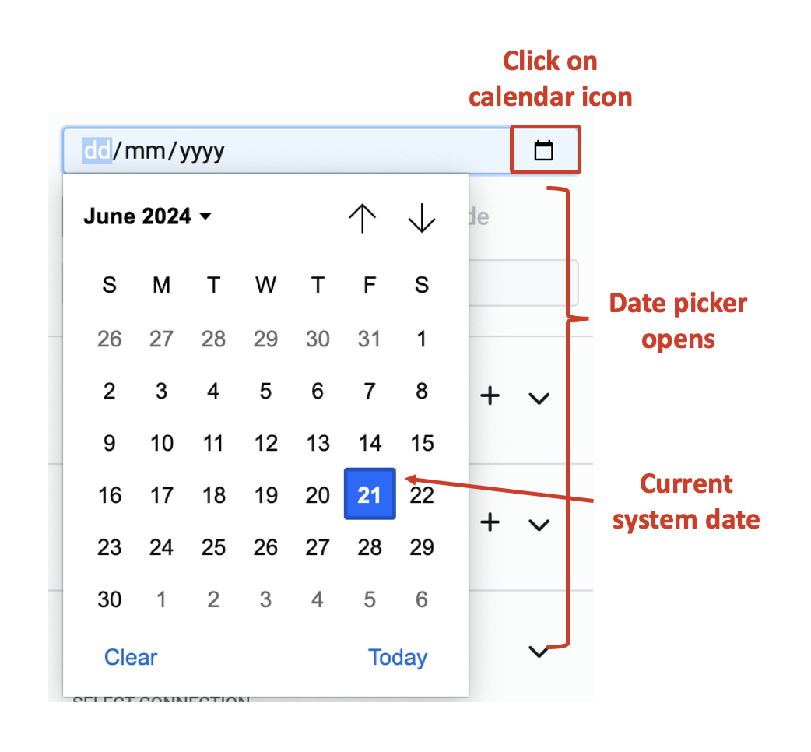
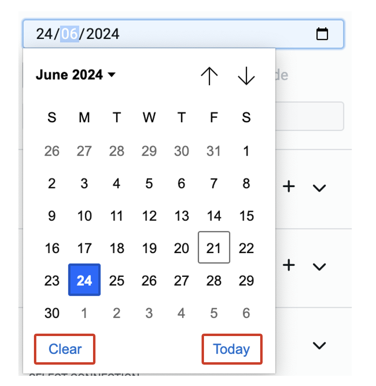

# Date

## What is a Date input control?

A Date control, in its most fundamental form, allows the user to input a date value in dd/mm/yyyy format. 

For example: Imagine you are creating a Task management application for a project manager. The project manager would want to create tasks and respective due dates. Similarly, applications like leave requests, hotel booking etc. would require users to enter specific dates. In such scenarios, you would want to include a Date type input control.

## What are the attributes for Date input control?

Consider the following image and corresponding list sequentially explaining the fields of the attributes section for Date control.

   **a. Label** - This field allows you to type the label to the Date control. The label shall appear above the element in the Adaptive Document and is used to provide context for the user.

   **b. Asterisk (*) sign** - If you click ON this field, then an asterisk sign will appear next to the label. This is used to indicate a special message to the users of the document. For example - conditions apply, the element is mandatory etc.  

   :::info[Please note]  
   It is important to note that the Asterisk sign is only a visual indicator and does not imply any logical condition on the control. For example - turning the Asterisk sign as ON will not make the Date control a mandatory element for users. All logical behaviour for the control should be configured using conditions and validations.  
   :::

   **c. Default value** - The date entered here is set as the default value for the element. If the user inputs a value to the element, then the default value will be replaced by the user entered value. If the user does not interact with the element, then the default value will be submitted as element value.   

   There are two ways to set the default time value:

   1. **By manually typing the time:**  
         a. Click on the dd parameter. The parameter will get highlighted.   
         b. Type the date value between 01 and 31.  
         c. The system will automatically select the mm parameter (highlight mm parameter). Type the month value between 01 and 12.  
         d. The system will then select the yyyy parameter. Type the year value between 0000 to 9999.  
         e. Click outside the field to set the default value.  
      
      :::tip[Please note]  
       You can use the left and right arrow keys of the keyboard to select relevant parameter.    
       :::  

         

   1. **By using the Date picker**  
      a. Click on the calendar icon at the right-end of the field.  
      b. The Date picker window opens. It has the current system date highlighted by default.  
      c. Click and select the date of your choice.  
      d. Click outside the field to set the default value.  
      
      

   :::tip[Please note - for manual entry of default date]  

   * To clear an already set default value using keyboard, select a parameter and press delete from keyboard.

   * The default value won't set until all three parameters - dd, mm and yyyy are provided to the system.

   * If you enter a number greater than the logical range, then the system will take the highest value. For example - if you type 35 in dd, the system will take date value as 31. If you type 15 in mm, the system will record it as 12.
   :::

   :::tip[Please note - for Date Picker]  
   
   

   Click _Today_ to set current system date.  
   Click _Clear_ to clear any default date set previously.  
   :::

   :::note[Please note]  
   The Date control is very similar to <a href="https://docs.rapidplatform.com/docs/Rapid/Keyper%20Manual/Adaptive%20Designer/Adaptive%20Controls/inputs-overview/Date-Time/" target="_blank">**Date-Time**</a>  control with Show time field set as OFF. 

   The business scenario drives whether you want to provide the users with the ability to input only date or both date and time, whereas, the connected table's data structure would govern whether you use Date-Time control or Date control.  
   :::

   **d. Force disable** - If this field is clicked ON, then it will supersede all enable conditions and the element will always remain in disabled mode.

   :::tip[Please note]
   This is useful when you want to display a dynamic piece of information to the users. For example - Event commencement date etc. In such cases, while the event's date is a useful information, you do not want the users to change the same. Hence, the element will display the value, but will remain disabled for user input.  
   :::

   **e. Force hide** - If this field is clicked ON, then it will supersede all show conditions and the element will always remain hidden from the user.

   :::tip[Please note]  
   This feature can be used in advanced Adaptive Documents, where you need to pass a certain value, (like the date user submitted the form) but do not want to show it to the user. The element will remain hidden from the user, and hence, the user would not be able to enter any value to the element.  
   :::
   
   **f. Class names** - In this field, you can type the name of the CSS class and the element will be styled as per the CSS class definition.