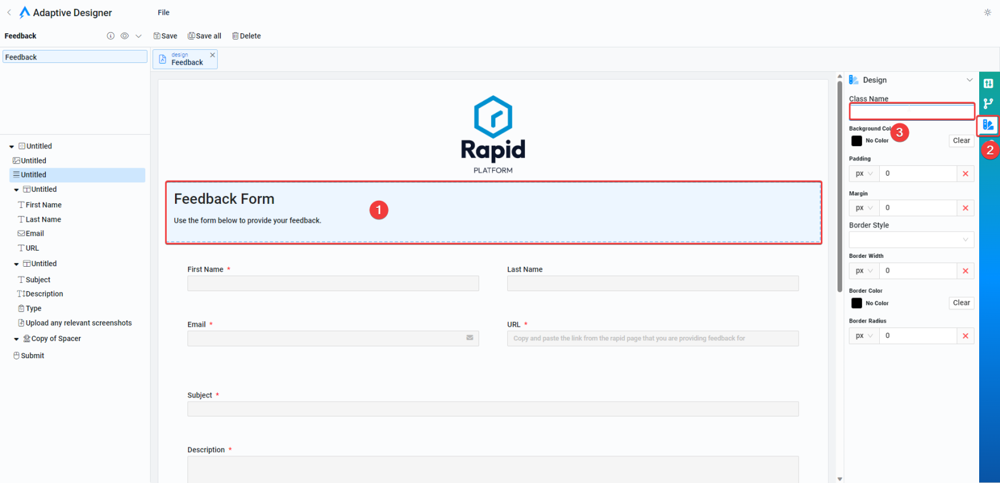

# Component Classes

## How to apply classes to adaptive components

The purpose of this page is to provide a succinct list of useful classes that can be applied to components in adaptive designer. To apply a class.

To apply a class simply:

1. Select the component in adaptive designer
2. Select the styling tab on the right of the screen
3. Enter your class name in the Class field

### Useful Classes

|\**Class**|\**Component type**|\**Description**|
|:----|:----|:----|
|rp-text-right|Most components that include text - Single Line fields, Multi line, Static Text etc.|Aligns the text within these components to the right.|
|rp-text-center|Most components that include text - Single Line fields, Multi line, Static Text etc.|Centers the text within these components|
|rp-margin-top|Most components|Adds margin to the top of the component|
|rp-margin-bottom|Most components|Adds margin to the bottom of the component|
|rp-margin-left|Most components|Adds margin to the left of the component|
|rp-margin-right|Most components|Adds margin to the right of the component|
|rp-input-heading-h1-6|Single Line of Text Fields|Makes the text look like and input field.|
