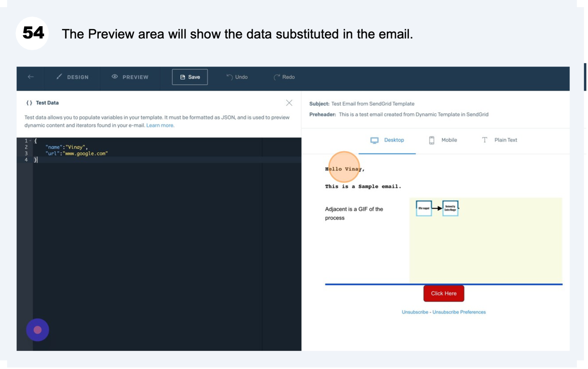

# Basic Substitution

## Substitution
Let us now begin with Dynamic elements configuration - 

:::info
Tip! - You can learn more about Substitution and its applications like :

- **Deep Object Replacement,**
- **Object Failure,**
- **Date Format,**
- **Insert etc.**

**From - [https://docs.sendgrid.com/for-developers/sending-email/using-handlebars#substitution](https://docs.sendgrid.com/for-developers/sending-email/using-handlebars#substitution)**  
:::