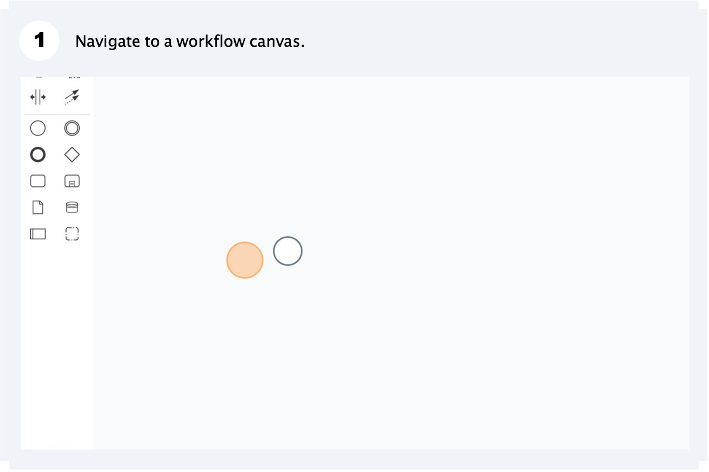
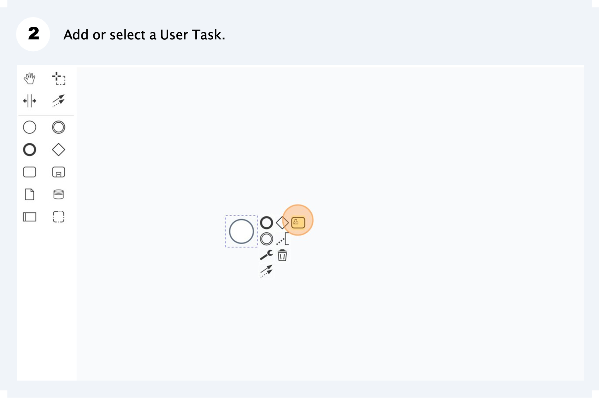
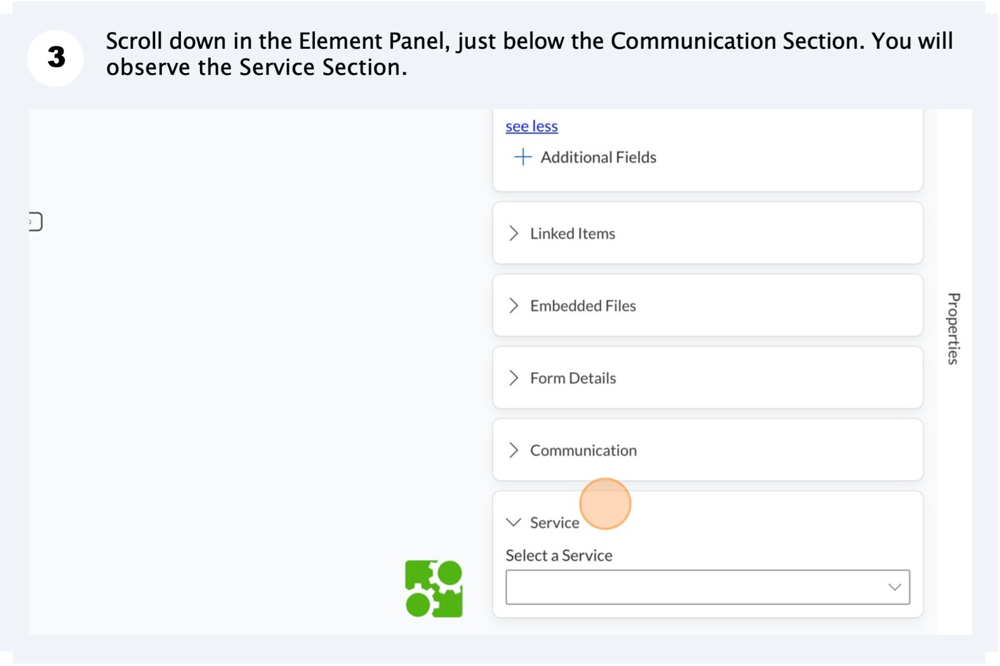
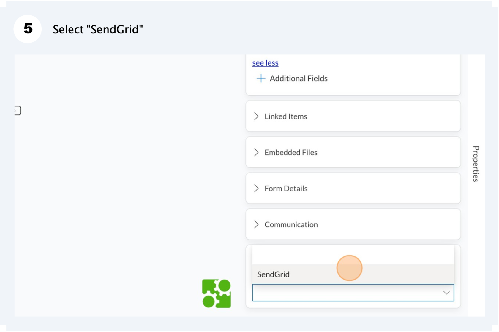
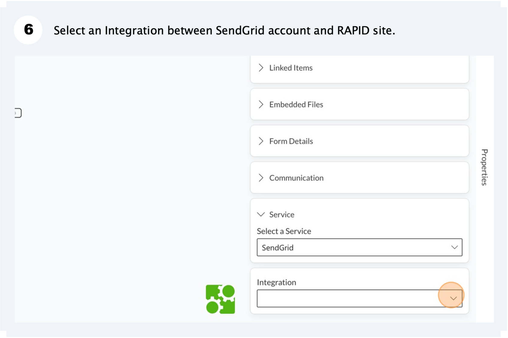
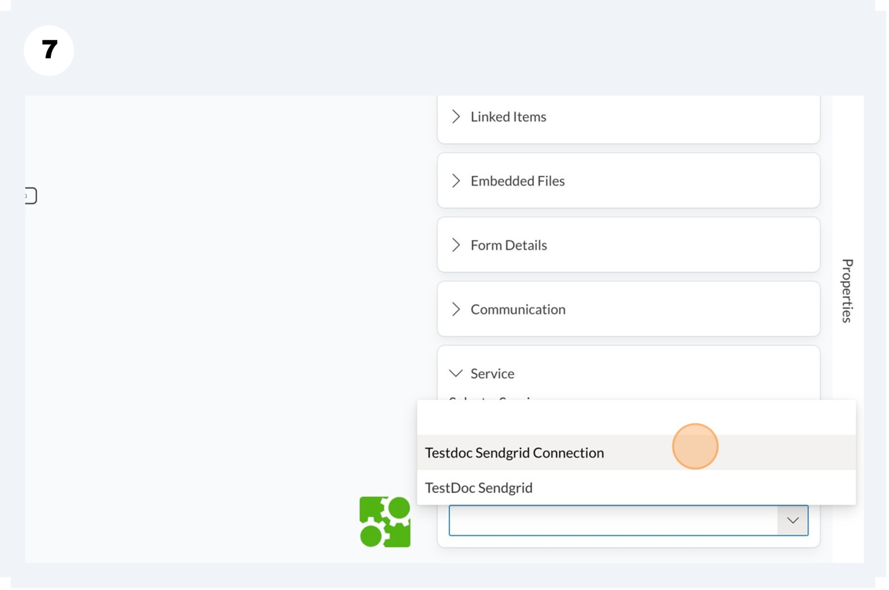
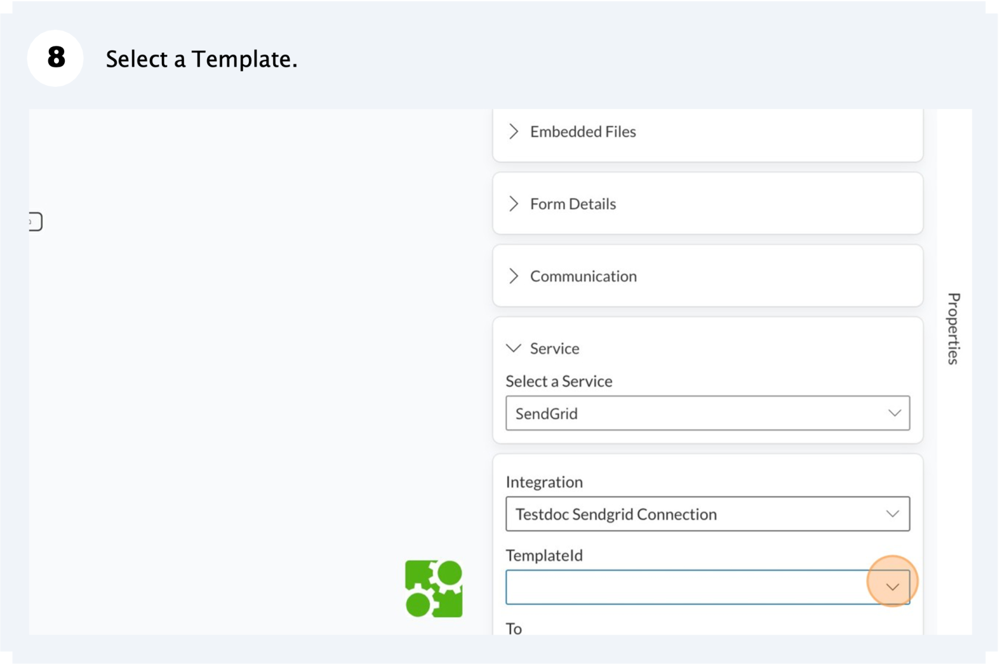
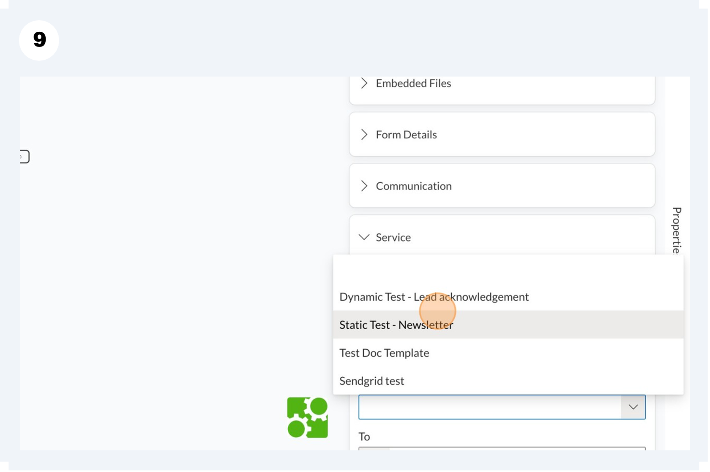
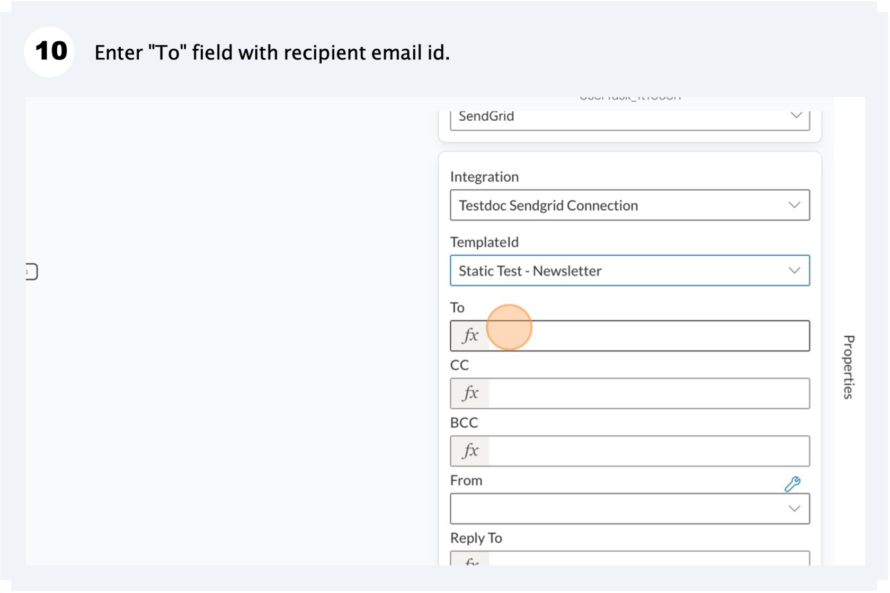
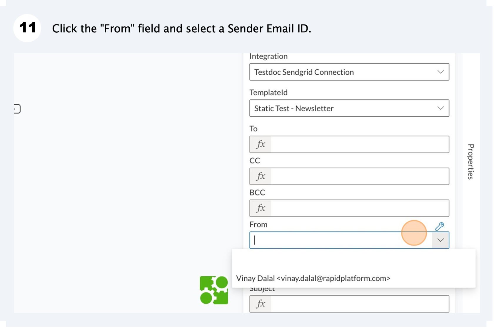

# Sending an email from a Workflow User Task
In this tutorial, we will learn how to configure SendGrid options from a User Task.

Please consider the below steps:

**Rest we have discussed all the options earlier.**

****

****

****

****

****

****

**That's it! When the USER TASK is executed from the Workflow, SendGrid will be triggered to send the desired email as configured.**