# Iteration

Let us now look at Iterations and how to display an array of values in email.

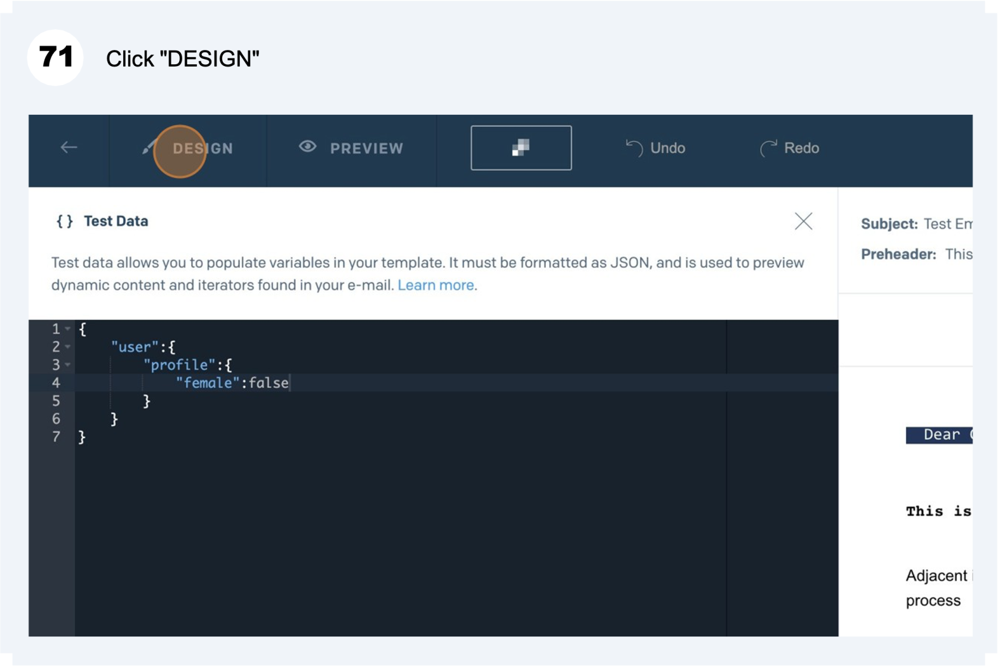

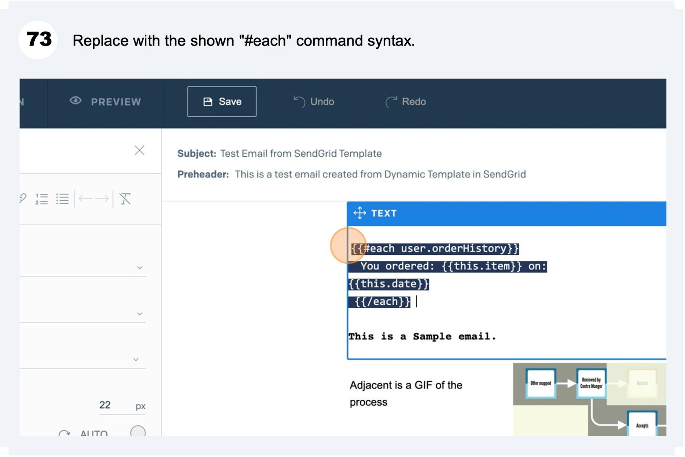

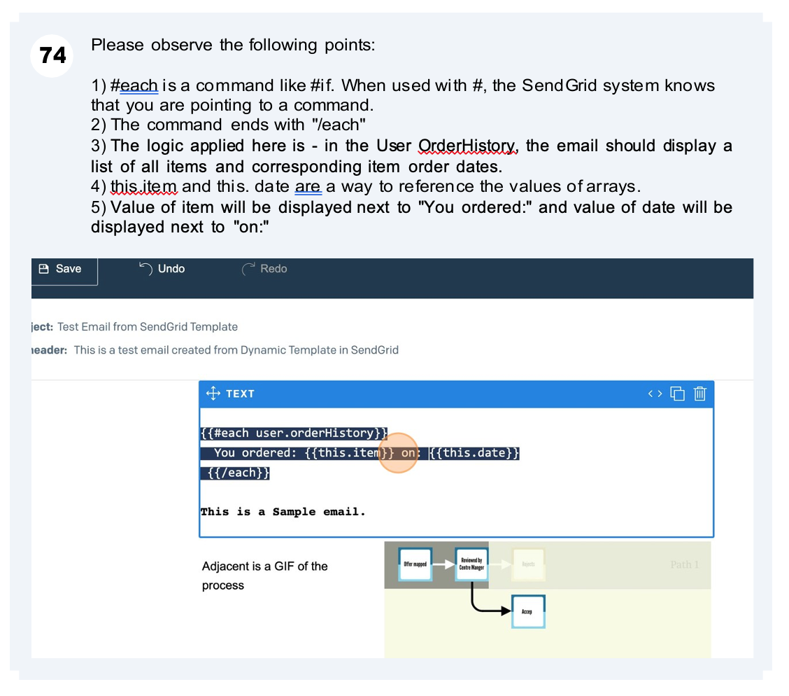

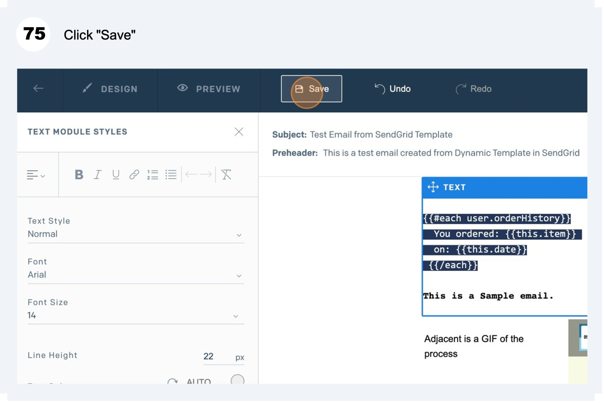

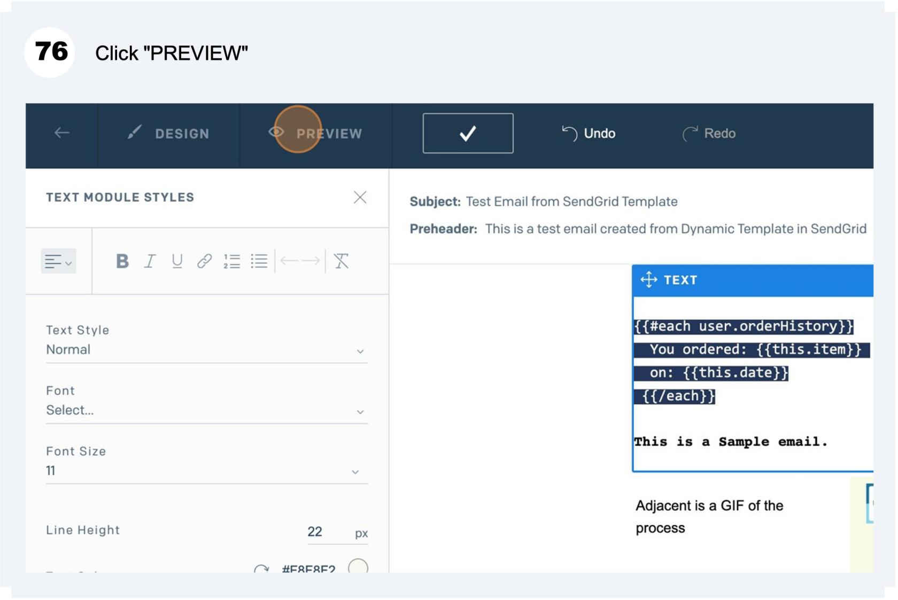

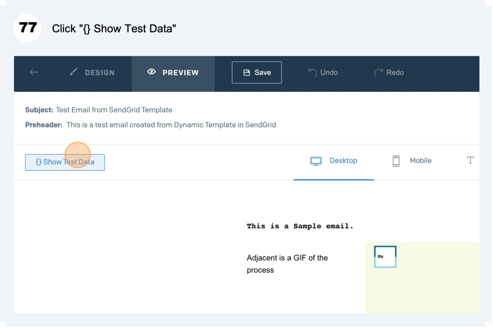

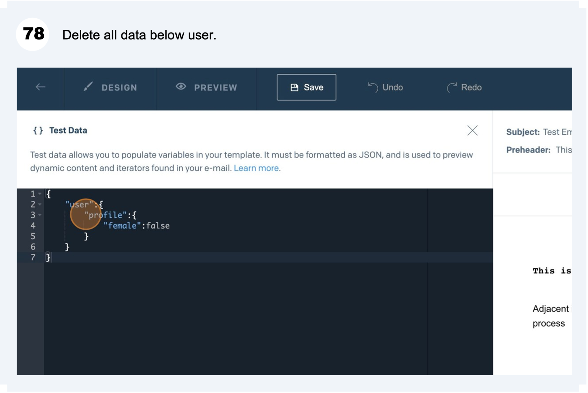

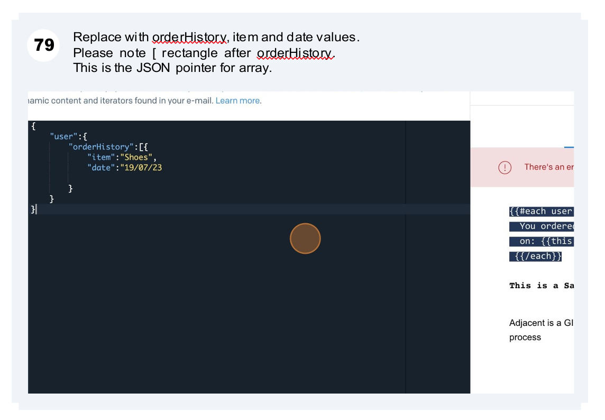

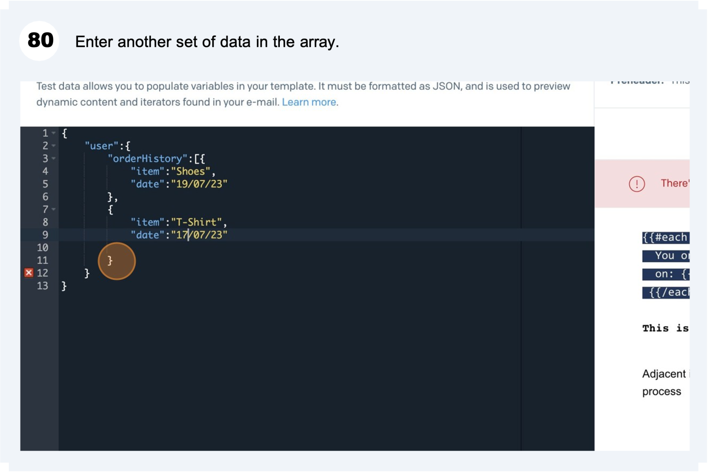

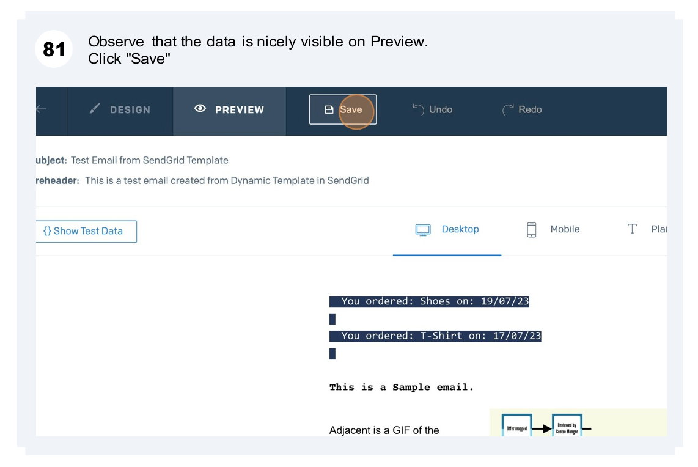

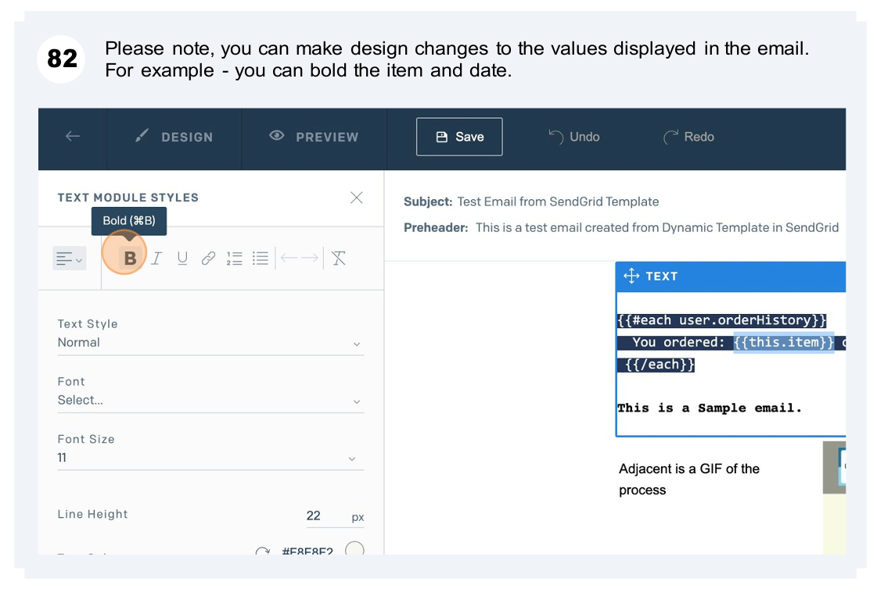

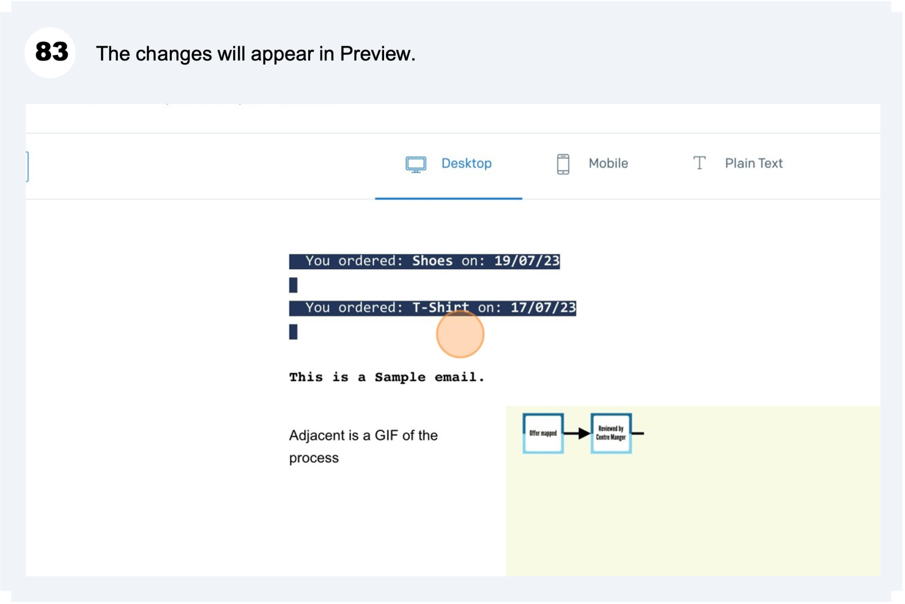

:::info
Tip! - You can learn more about Iterations and some combined examples at this link - [https://docs.sendgrid.com/for-developers/sending-email/using-handlebars#iterations](https://docs.sendgrid.com/for-developers/sending-email/using-handlebars#iterations)
:::

**CONGRATULATIONS!** You have now completed this learning material on Dynamic Templates in SendGrid.