# How to view / update table options of an existing table in Designer?

You can view and update table options for an existing table.

### **How to reach Table Options tab?**

1. Navigate to Designer &gt; Tables &gt; All Tables  
    
2. Open your desired table. (Find your desired table by using the search bar or scrolling through the list)  
    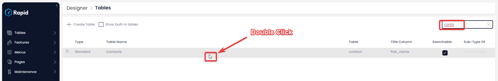
3. Select the Options Tab  
   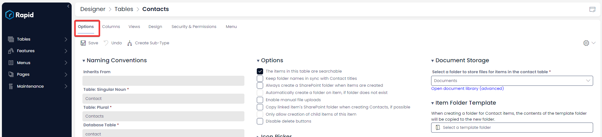

More details can be found at **Point no. 12 of [*All about Tables in* Designer.](https://docs.rapidplatform.com/books/experiences/page/all-about-tables-in-designer "All about Tables in Designer")**

### **What does a Table Options tab contain?**

The Options tab for a table displays the most fundamental information about it. The below image depicts the Options tab for an existing table in Designer:

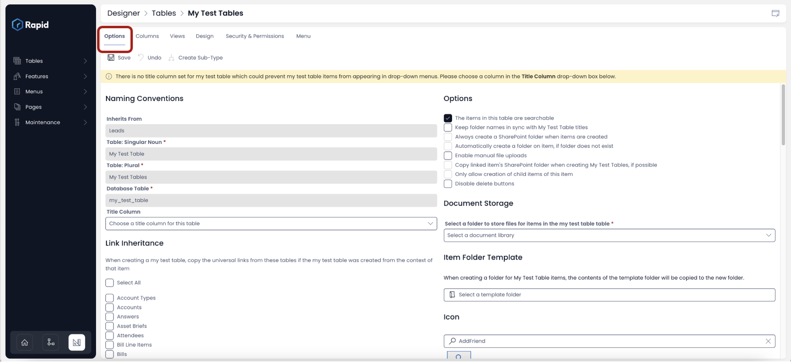

Let us take a look at all the information presented on this page in a segment-wise manner.

The following items will be covered in this page:

1. **Naming Conventions**
2. **Link Inheritance**
3. **Document Storage, Options, and Item Folder Templating**
    1. **Why are some options ghosted (inactive) while some are active?**
    2. **Document Storage**
    3. **Options**
    4. **Item Folder Templating**
4. **Undo Changes**
5. **Create Sub-Type**

### **Naming Conventions (Singular, Plural, Database Table)**

If you are building PowerBI Reports or accessing the backend of your system understanding the various table names is useful. Each of these are explained below.

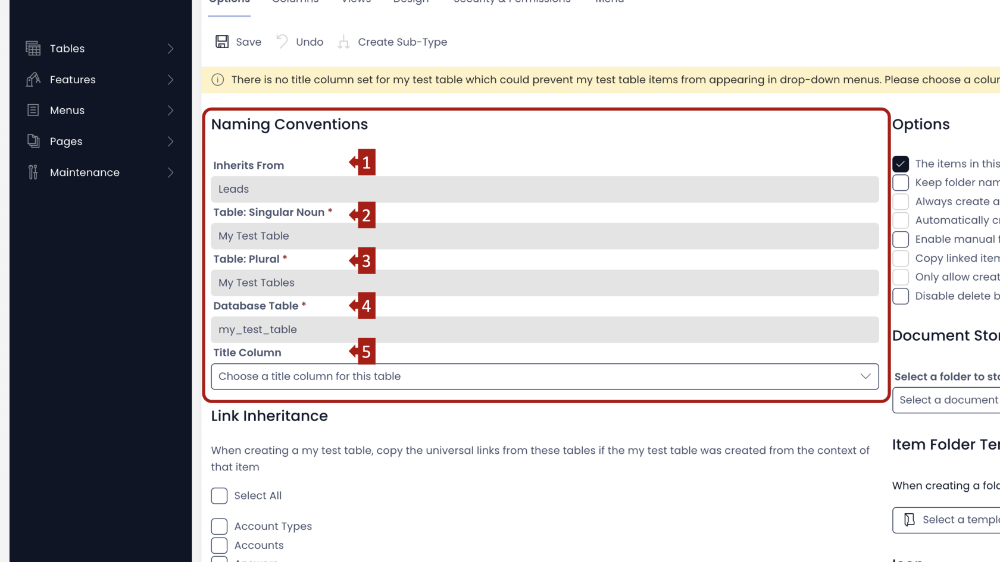

This segment has five fields.

Four out of these five fields are non-editable and derive their value, as provided at the time of [**creating the table in Designer.**](https://docs.rapidplatform.com/books/experiences/page/how-to-create-a-new-data-table-in-designer "How to create a new data table in Designer?")

1. **Inherits From -** This field displays the name of the parent (of which the subject table is a Sub-Type Of). This is defined at the time of creating the table. When your subject table (Table B) inherits from another existing table (Table A), it means this table will inherit the complete column structure of the parent table ie. Table B will have all the columns of Table A. This field, as shown here, is non-editable.
2. **Table: Singular Noun -** While creating the table, it is a best practice to provide the Table Name as a Plural. The system will automatically derive its Singular Noun. For example - if while creating the table, you had provided the Table Name as "My Test Tables", then the system shall automatically derive its singular noun as "My Test Table". This is useful for referring the table's item. For example - A table by the name "Assets" holds information about various assets like vehicle, computer, land etc. Each of these is an item in the table and will be referred as an "Asset" (Singular Noun). You cannot edit this field.
3. **Table: Plural -** This field displays the Table Name as provided at the time of creating the table. It is a good practice to provide the Table Name as a plural. However, in case you provided a singular name to the table, the system will automatically derive the plural name and associate it here. It is used to refer multiple items in the table. This field is non-editable.
4. **Database Table -** This field displays the Table Slug as created by the system at the time of table creation based on the Table Name provided. This field is also non-editable. This is a useful field to know if creating items in rapid through the API or if you are producing PowerBI reports.
5. **Title Column -** It is a good practice to have a title column in the table. In case there is no title column selected for the table, then the system shall prompt you to select one. 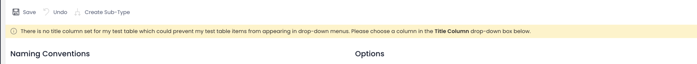
      
    In case you have already selected a Title column, this field will display the column name and the type.
    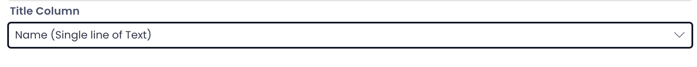
    Please note, this is an editable field. Therefore, you can set / edit the Title Column here.   
    This is a dropdown field. Therefore, as you click on the dropdown, it will display the list of all the columns. You can then easily select the Title Column of your choice.  
   
   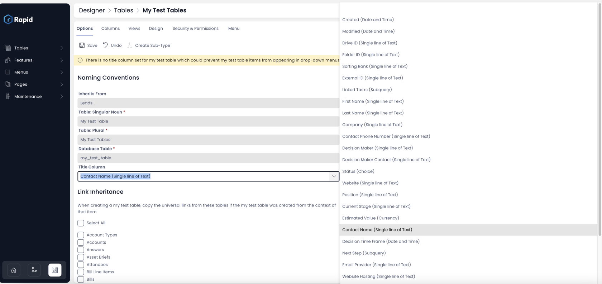

**Next let us look at the Link Inheritance segment**

### **Link Inheritance**

While creating the table, we had discussed the Sub-Type Of / inheritance concept. This Link Inheritance should not be confused with the "Sub-Type of" / table inheritance.

Link inheritance is an item level linkage between two tables, which allows actions to be visible across tables.

This segment has the names of all the tables (custom as well as built-in) in the system. You can click on the checkbox against the name of the relevant table. Intuitively, clicking on "Select All" will check all the boxes, indicating a linkage with all the tables in the system.

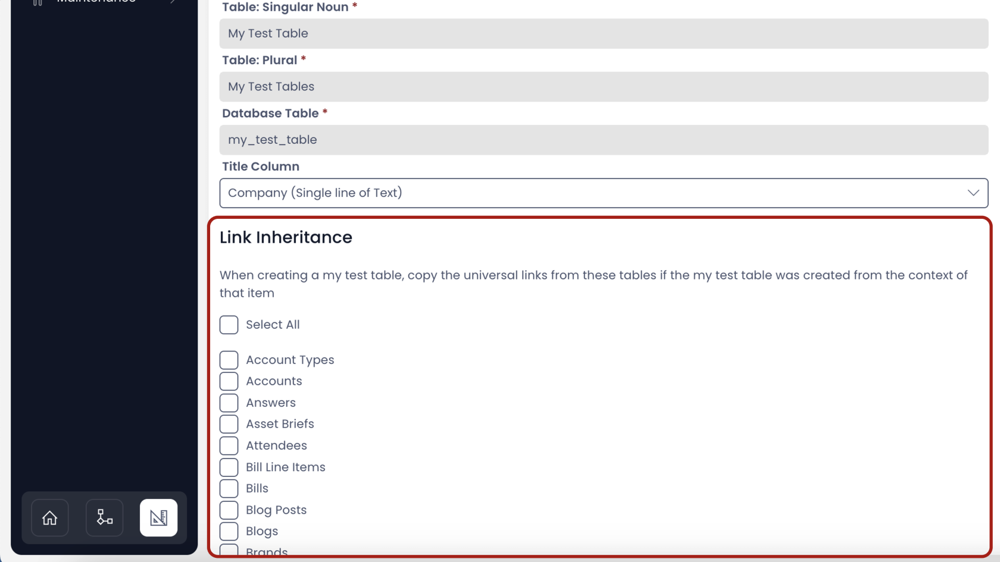

**To learn about Link Inheritance [click here](https://docs.rapidplatform.com/books/experiences/page/how-to-setup-link-inheritance "How to setup Link Inheritance?").**

**Next let us look at the Document Storage and other options segment**

### **Document Storage, Options and Item Folder Template**

This segment provides options to configure how to organise data created in the subject table. The Rapid Platform provides options to upload files against every item created in a table. For example - imagine you have an Invoices table. Each item of the table refers to an invoice generated for a customer. It would be beneficial to upload the actual invoice document against the table item.   
  
The Document Storage and other options relates to storage and organisation of files uploaded with items of a table.

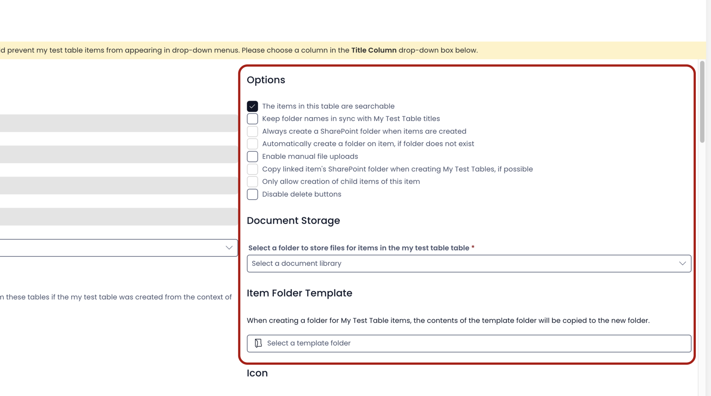

#### **Why are some options ghosted (inactive) while some are active?**

There can be a maximum of four inactive options in the list. The inactive options become active when their activating conditions are met.

For example:   
Option - **Automatically create a folder on item, if folder does not exist** is ghosted at present. \[*the fourth box from top*\]  
This option shall become active when   
Parent option - **Always create a SharePoint folder when items are created** is selected.  
  
Logically, it makes sense as you can enable automatic creation of folder for items not having folders presently, only when you have opted for creation of folders for items.

The below table provides a list of ghosted options and their corresponding activation conditions:

|S.No.|Ghosted Option|Activation condition|
|:----|:----|:----|
|1|Always create a SharePoint folder when items are created|Enabled when Document Storage is defined|
|2|Automatically create a folder on item, if folder does not exist|Option - Always create a SharePoint folder when items are created - should be checked|
|3|Copy linked items' SharePoint folder when creating Table item, if possible|Enabled when Document Storage is defined|
|4|Only allow creation of child items of this item|Enabled only if there are Sub-Types defined for subject table|
  
We shall discuss each of these options in more detail; but it is important to note here that options get enabled when their activation conditions are met.

The first requirement for enabling the ghosted options is to define a Document Storage folder. So let us discuss this first.

#####   

#### **Document Storage**

This is a dropdown field and allows you to select the Document Storage in SharePoint where the folder to store files for items created under subject table will be stored.

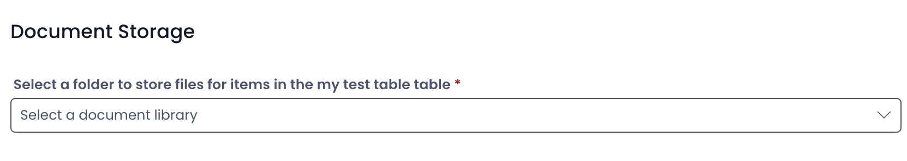

**It is important to note that while [creating the subject table](https://docs.rapidplatform.com/books/experiences/page/how-to-create-a-new-data-table-in-designer "How to create a new data table in Designer?") you received the option to define the Document Storage. If you would have selected a value while creating the table for this field, then it becomes the default value here.**

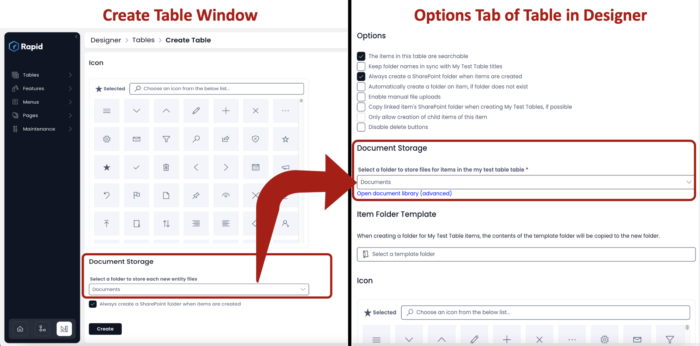

In case, you had not defined the Document Storage at the time of Table Creation, then it appears as blank in the Options Tab for Table in Designer.

Whether it was left blank / defined at the time of table creation, this field provides options to set / update (respectively) Document Storage SharePoint folder.

- To set / update the Document Storage, simple click on the dropdown and select the SharePoint folder of your choice.
- Observe there is a blue link titled "Open document library (advanced)". If you click on this, it will open SharePoint site where library for your subject Table has been created.

Please view the below video for illustration.

<iframe allowfullscreen="allowfullscreen" frameborder="0" height="420" src="https://www.youtube.com/embed/faf9fGJxEKE?si=ty-5amG_h5eFxfbq" title="YouTube video player" width="750"></iframe>

If the Document Storage isn't configured, then the system will not allow you upload a file in Explorer against table item.

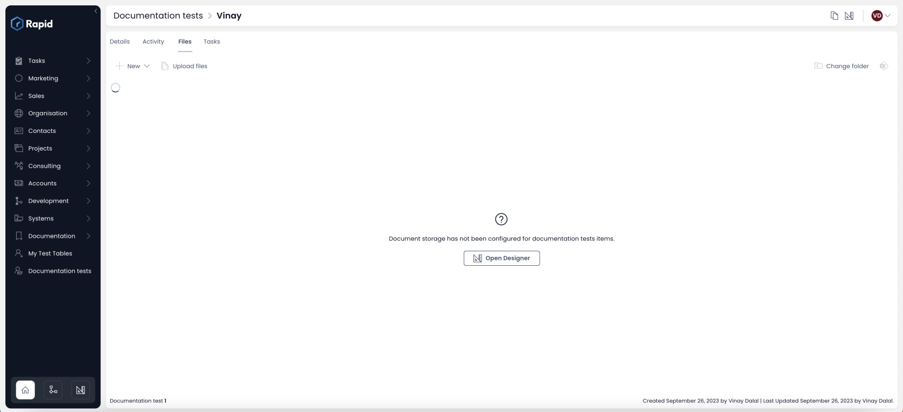

#### **Options**

Let us sequentially look at all the options

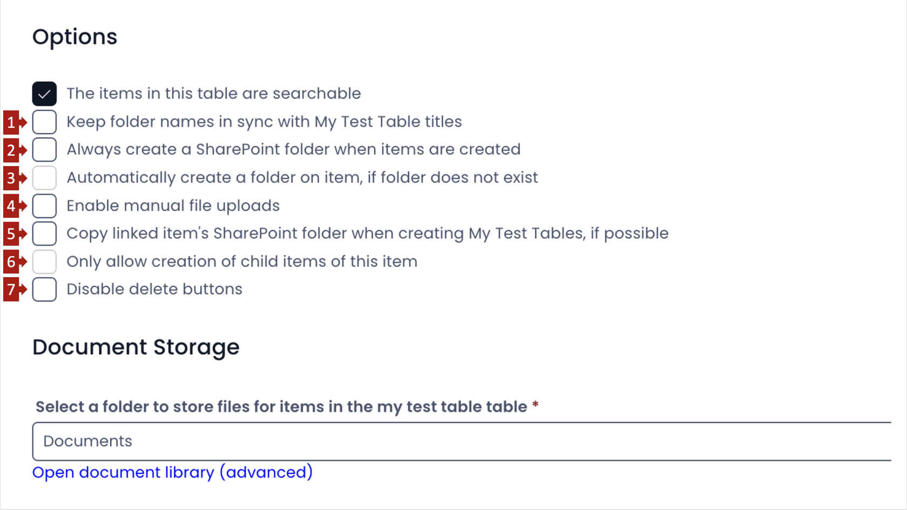

To understand how different options work, let us consider this illustration.

Consider a table named - Company Roles.

It has none of the 7 options ticked and the Document Storage is defined.

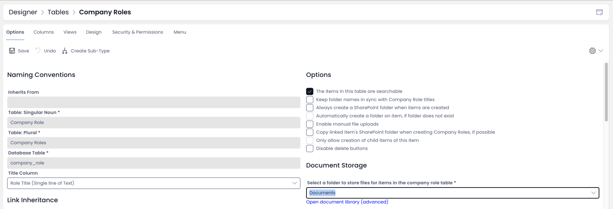

Next, let us try to upload a file to one of the items of this table.

Please refer to below video for illustration.

<iframe allowfullscreen="allowfullscreen" frameborder="0" height="420" src="https://www.youtube.com/embed/XIcptB2rUj4?si=DixYQ_vjuHxQyso5" title="YouTube video player" width="750"></iframe>

You can observe the following points:

1. The file is uploaded after pressing the "Save" button in the files tab for the item.
2. A folder gets created in the SharePoint Document Storage, after the SAVE button is pressed.
3. The name of the folder is aligned to the value of Title column of the item. The value of title column for the item is - "Engineering Manager" and the folder's name is "Engineering Manager Files".
4. The uploaded file is placed within the created folder for the item.

With this background, let us discuss each of the options.

##### **1. Keep folder names in sync with Table item titles:** 

**Relates to:** This option relates to the naming of the Item Folder in SharePoint Document Storage.

You would have observed that the item folder in SharePoint Document Storage derives its name from the Title Column value for the item.   
  
Now imagine, you change the title column value. Should this change the folder name?

This is achieved through "Keep folder names in sync with Table item titles" option.

If this field is CHECKED OFF, then the changes in item title do not reflect in folder name.  
If this field is CHECKED ON, then the folder name is always in sync with changes to the item title.

Refer to the below image for illustration.

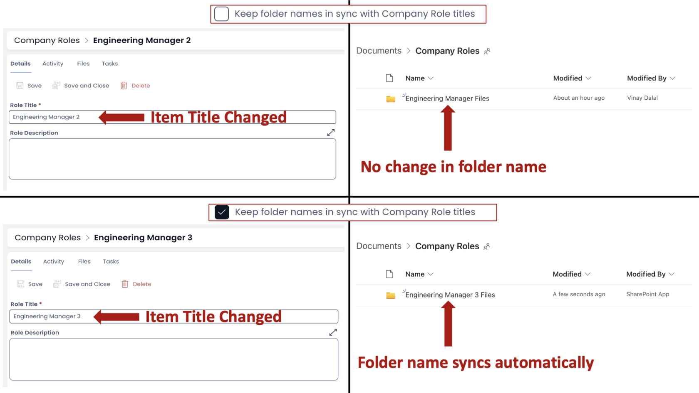

##### **2. Always create a SharePoint folder when items are created**

**Relates to:** This option relates to the timing of creation of Item Folder in SharePoint Document Storage.

You would have seen this field while creating the table. Here, in the Options Tab, it derives its default value from as defined while creating the table.

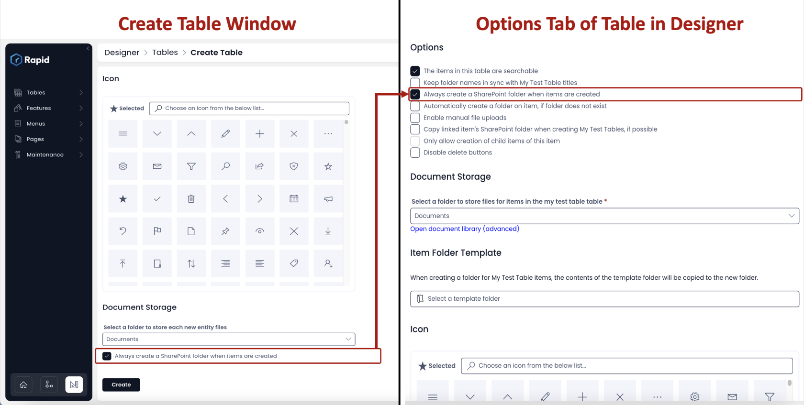

**Please note, this option is enabled only when a Document Storage has been defined.**

**Case:** When option - **Always create a SharePoint folder when items are created** - is **CHECKED OFF**

Recall as seen earlier, a folder in SharePoint is created when a file is dropped in the Files Tab for the item. This is illustrated in below video.

<iframe allowfullscreen="allowfullscreen" frameborder="0" height="420" src="https://www.youtube.com/embed/SvCYLcoN6_E?si=nVWDP1ybHju40mn2" title="YouTube video player" width="750"></iframe>

**Case:** When option - **Always create a SharePoint folder when items are created** - is **CHECKED ON**

When this option is CHECKED ON, the system creates a Folder as soon as an item is created (not when file is uploaded). This is illustrated in video below:

<iframe allowfullscreen="allowfullscreen" frameborder="0" height="420" src="https://www.youtube.com/embed/5vMJPjWZzRc?si=UnJbwG-HGd5JxhJs" title="YouTube video player" width="750"></iframe>

When you want to reduce the clutter and do not want a folder for every item, then you can turn it OFF (uncheck this field).

##### **3. Automatically create a folder on item, if folder does not exist**

**Relates to:** This option relates to the timing of creation of Item Folder in SharePoint Document Storage (for an existing item).

Please note - This option is active only when 2. above is checked.

Imagine that you had created three items before Checking (ON) the option to create one folder per item (option 2 described above). Therefore, the three items would not have a folder dedicated to them.

Now, when this option is checked on, it will create folders for all the items which do not have a folder. A folder will be created automatically for an item when you click on the Files tab of the item.

Please refer to below video for illustration

<iframe allowfullscreen="allowfullscreen" frameborder="0" height="420" src="https://www.youtube.com/embed/vei7DramEG0?si=XI_H3PN3FqEuQtdx" title="YouTube video player" width="750"></iframe>

##### **4. Enable manual file uploads**

When this field is checked, it will open another option to select a user. As you click on "+ Add User", it will open the list of all users and you can check mark the ones that are NOT enabled to upload files manually to the item of the table.

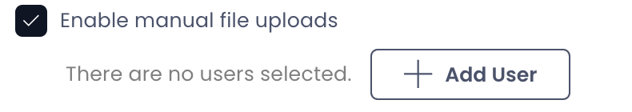

When this option is Checked OFF OR if you are a user not enabled for manual uploads, then you will be asked to "Save" the file folder post upload.

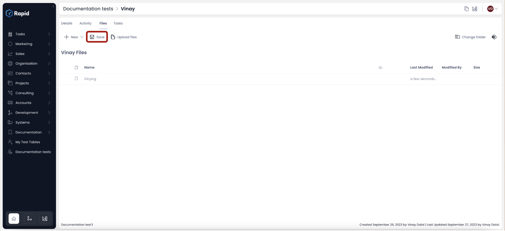

Only once the "Save" button is pressed, the file will be uploaded to the defined SharePoint Document Storage.

When this option is Checked ON, a folder is created and file is uploaded into the same as soon as the file is dragged and dropped in the Files folder. The "Save" button wont appear.

Please review the below video for illustration.

<iframe allowfullscreen="allowfullscreen" frameborder="0" height="420" src="https://www.youtube.com/embed/NDdQ84A_V8c?si=Oqinoklo6kUPlOO7" title="YouTube video player" width="750"></iframe>

##### **5. Copy linked items' SharePoint folder when creating Table item, if possible**

Imagine you have a linked item from some other table (refer [linked items](https://docs.rapidplatform.com/books/experiences/page/how-to-create-items-for-a-table-from-a-linked-table "Link Inheritance") for more clarity) to this table's item. For instance - you can have an Invoices table and a Payments table. You have linked payments against invoice items.

When this option is checked (ON), it would reference the linked item's SharePoint folder in your subject item's folder. In case, the linked item does not have any files or does not have a SharePoint drive defined, then the system would not be able to copy it. Hence the phrase - ***if possible.***

To illustrate the effect of this option, we first need to understand how set up items between linked tables.

**[Please click here to see how to create items from linked tables?](https://docs.rapidplatform.com/books/experiences/page/how-to-create-items-for-a-table-from-a-linked-table "How to create items for a table from a linked table?")**

Please refer to the below steps to understand the impact of this option.

- Ensure that the linked table item (Invoice) has a file uploaded. Here, invoice item - "Test invoice" has two files. 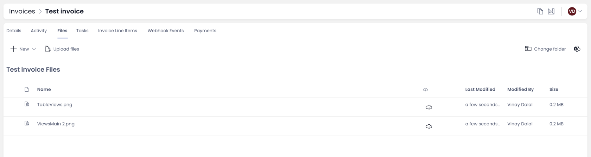

- Now check this option (**Copy linked items' SharePoint folder when creating Table item, if possible)** for the subject table (Payments).  
- Create an item from the linked table (Payment item from Invoice item) as **[discussed here](https://docs.rapidplatform.com/books/experiences/page/how-to-create-items-for-a-table-from-a-linked-table "How to create items for a table from a linked table?")**.
- Go to Files tab of newly created item (Payment's item). You will see the file uploaded in linked Invoice item.

**Please note - Only items created after Checking On this option will show files from linked item. Previously created linked items would not show the same.**
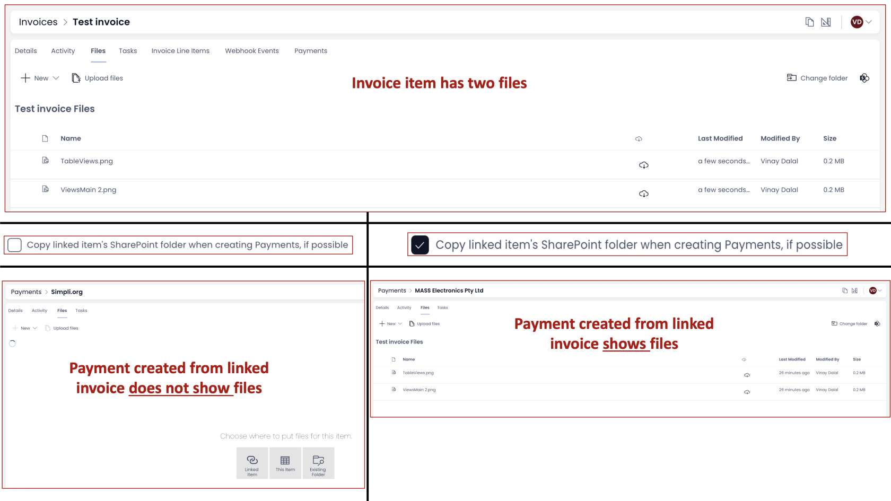

To summarise -

1. If this option is CHECKED ON
2. The invoice item (item of linked table from where subject item needs to be created) has a file uploaded in SharePoint.
3. Payment item is created from within Invoice item (linked table).

Then the invoice files will be visible in Payment item's File tab.

This happens because the Payment item refers to the SharePoint folder of the linked item from Invoices.

##### **6. Only allow creation of child items of this item**

**Please note -** This option is enabled only for table that have a "Sub-Type Of" ie. who are a parent and have other tables who have inherited from the subject table.

When this option is checked on - it means - the system will disable creation of parent items and only the inherited tables can created.

When this option is checked off - it means - the system will allow creation of parent items.

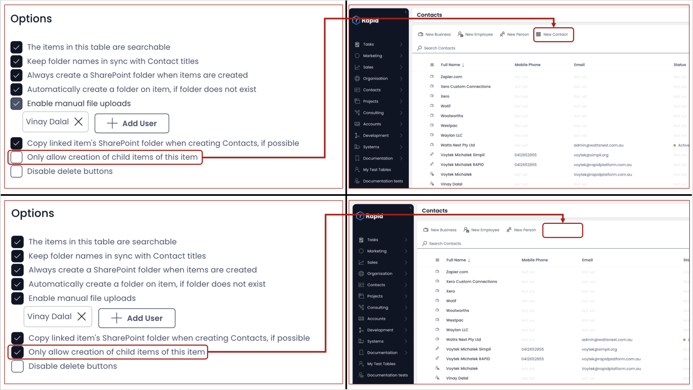

This can be useful when we do not want creation of new parent items as the inherited tables might be covering information in a more comprehensive manner.

##### **7. Disable delete buttons**

When this option is checked on, you cannot delete an item from the subject table. The delete item button is ghosted.

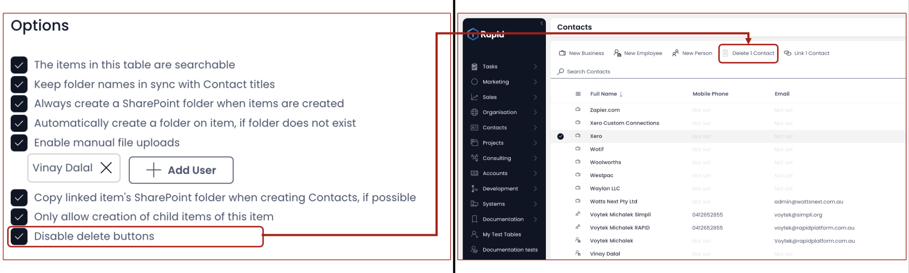

This can be useful when you have an important table, items of which are being referenced for many other important functions. You would not want your users to delete an item of the table by mistake, and hence you can check (ON) this option.

#### **Item Folder Template**

Imagine you have a Projects table. You always create a Project (item) with, say, three sub-folders and two checklists in it. Instead of having to create it with each item (make a folder and put those sub-folders and checklist every-time), you can define an Item Folder Template. This template in SharePoint will be copied every-time an item is created.

As you click on this field, it will open an Item Folder Template Selection window. You can select the arrangement of your choice.

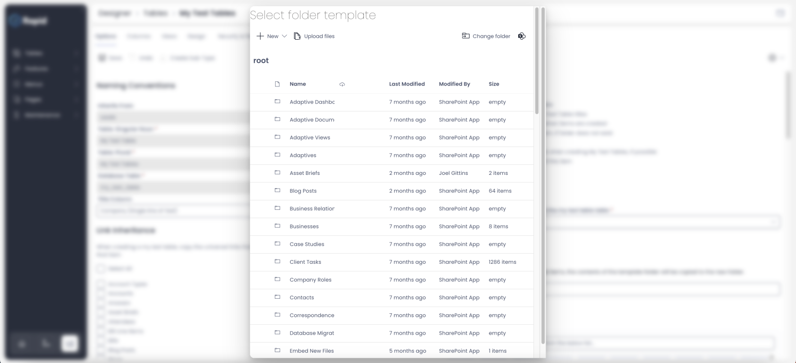

#### **Undo changes**

There may be instances where you make changes to the Options unintentionally or wish to revert changes made. The system provides you with the feature to UNDO (unsaved) changes.

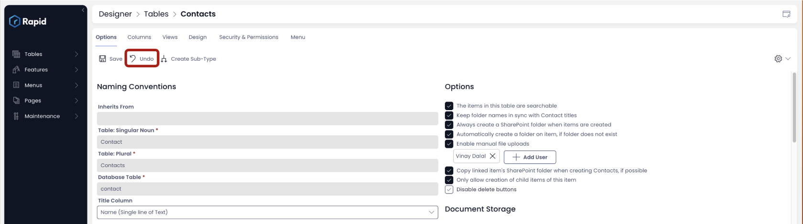

Once the changes are SAVED, the UNDO button will be ghosted.

#####   

#### **Create Sub-Type**

It is easy to create child tables from within the parent table. If you want your subject table to become the parent and wish to derive column structure and other features into a child table, you can use the "Create Sub-Type" button.

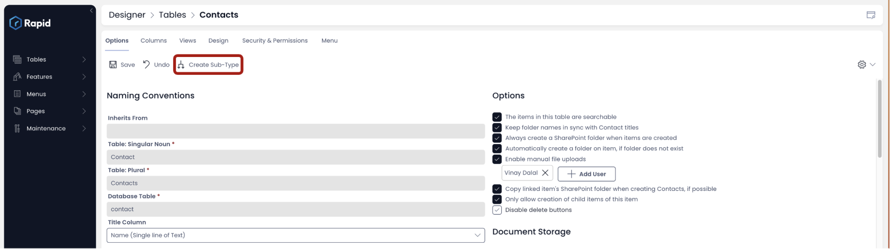

As you click on this button, the create table window will open with pre-filled information -

- "Sub-Type Of" checked
- your subject table selected as parent.

Please note - if your subject table is already a Sub-Type of another table then this option will be ghosted (inactive).

[How to edit / delete Table Views in Designer?](https://docs.rapidplatform.com/books/experiences/page/how-to-edit-delete-table-views-in-designer "How to edit / delete table views in Designer?")

[How to delete a table in Rapid Platform?](https://docs.rapidplatform.com/books/experiences/page/how-to-delete-a-table-in-rapid-platform "How to delete a table in Rapid Platform?")

*[**Go back to Tables in Designer Main Page**](https://docs.rapidplatform.com/books/experiences/page/all-about-tables-in-designer "All about Tables in Designer")*
