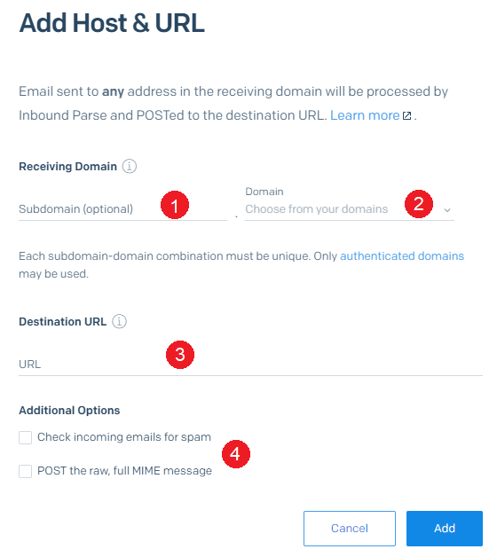

# Setting up SendGrid Email support

Omnichannel integrates with SendGrid to provide Email communication support.

## Creating a SendGrid registration

Before you start you will need

1. A [SendGrid Account](https://sendgrid.com/)
2. At least one [Sending Email Address](https://docs.sendgrid.com/for-developers/parsing-email/setting-up-the-inbound-parse-webhook) set up
3. Your API Key configured with at least

|**Key**|**Access**|
|:----|:----|
|Email Activity|Read|
|Inbound Parse|Full Access|
|Mail Send|Full Access|
|Mail Settings|Full Access|
|Marketing|Full Access|
|Sender Authentication|Full Access|
|Stats|Read|
|Template Engine|Full Access|


This API Key configuration can be modified later if additional keys are required

To create a service registration navigate to Designer in your site, <Add how to use the UI with screenshots>

Once a registration is created you can now use it's generated key to interact with the Omnichannel API.

You can make multiple registrations for different SendGrid registrations to split different 'areas' of communication.

## Setting up Inbound Parse with Omnichannel

In order to process inbound email with SendGrid, the Omnichannel takes advantage of it's Inbound Parse functionality.

First create an integration on the site you want to receive messages. Take special note of the generated Webhook URL as we will need this later.


Next, in SendGrid navigate to the Inbound Parse section (under settings) and add a Host &amp; URL



1. Set the subdomain that is receiving the inbound traffic
2. Set the registered domain
3. Paste the Webhook URL from the RAPID integration into the destination URL
4. Ensure that both Check incoming emails for spam and POST the raw, full MIME message are unchecked

With this set up all email traffic that is sent to <anything>@<subdomain>.<domain> will now

- Create an external contact (if required) in your site
- Add the sent email as a note against the external contact 
    - This will use the inherited links system if you want to see notes in other, related contexts
- Forward the email to <anything>@<domain> so you can see the sent email in your inbox

## Using the Omnichannel API

### Sending an Email

To send an email using your registration

`POST {omnichannel domain}/tenant/site/email/sendgrid?id={registration id}`

This endpoint is secured using the same User bearer token as the rest of the RAPID API.

The post body then should match the Sendgrid API v3. Here is a basic example

```JSON
{
  "to": {
    "email": "{Email address sending to}",
    "name": "{Contacts' display name}"
  },
  "from": "{The registered sender in Sendgrid email adderss}",
  "subject": "Example Subject",
  "html": "Example Content"
}

```

### Configuring a Send Email button

When configuring the form there are special data paths that can be used

Reply To : $.replyTo.email

Reply To Alias : $.replyTo.name

### Receiving an Email  
  


### Configuring an ad-hoc send template

SendGrid have two modes when displaying dynamic content on a template.

Double moustache syntax \{\{}} will be rendered safely. This means any rich text will display html tags in the email itself <p> like so </p>.

Triple moustache syntax \{\{\{}}} will be rendered raw. This will render any html tags in your content directly

like so

### Inbound Parse &amp; Email Forwarding

SendGrid inbound parse enables the detection of inbound email messages. When setting up inbound parse it is recommended to create a subdomain for each 'area' of influence you want to recognize when messages come in. This provides two benefits:

- Having inbound parse configured for a subdomain will allow normal email to be received reducing the amount of false detections
- Having different 'areas' allows different parts of your business interact with the same 3rd party without cross-chatter interfering with their processes.

Additionally, SendGrid uses DNS routing to direct mail traffic to their servers in order to detect them. This means no emails will reach your users inboxes as they will end up in SendGrid instead.

To assist with this, Omnichannel forwards on inbound parsed messages. It assumes that the recipient address exists on the base domain with the registration, For example, a message sent to updates@robot.rapidplatform.com.au will be forwarded to updates@rapidplatform.com.au.

### Direct API Requests

Requests can be made directly to Omnichannel via

http://api.rapidplatform.com/omnichannel/\{tenant}/\{site}