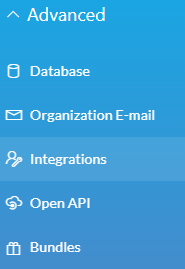
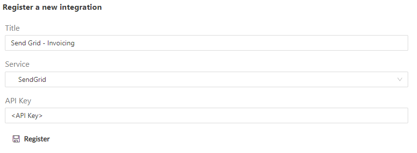
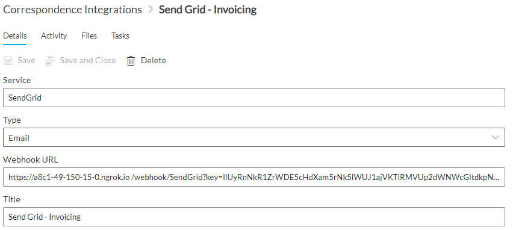

# Omnichannel Overview

The Omnichannel service provides communication integration between RAPID and external services. This service implements each integration as a bolt-on so that future integrations can be easily added.

A site can have multiple integrations active on it at once. For example you could have a Send Grid integration for Sales &amp; Marketing that is managed and handled by that team and another for Invoices that is managed and handled by the Finance team. This allows for different easy control of different 'spheres' of integration and communication to make tracking, control and process easier to manage.

## Supported Integrations

[Send Grid](https://sendgrid.com/) : Bulk email support as well as email templates

~~[Twilio](https://www.twilio.com/) : SMS support using automated phones~~

~~[Outlook Events](https://outlook.com/) : Meeting and event support from the Graph~~

## Registering an Integration

Each integration can require different authentication information. For security these are stored outside of your site in a secure [Azure Key Vault](https://azure.microsoft.com/en-au/services/key-vault/). To register an integration to your site, navigate to Designer and find Integrations under the Advanced tab.

This will show a registration form. After giving your new integration a friendly name, select the service to be integrated. This will then prompt for the authentication information needed for that service. For example, Send Grid requires an API key

Finally, hit Register to create the new integration. This will securely preserve the authentication information in an Azure Key Vault and create a Correspondence Integration item. This item contains a unique webhook URL that can be accessed by the external integration, in this case Send Grid, to identify which integration the message pertains to.

