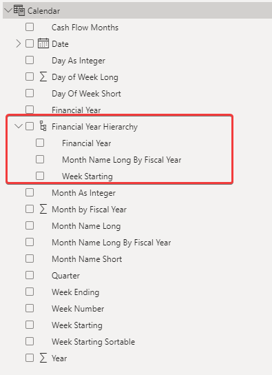

# Creating a Financial / Fiscal Year Calendar Table - Template

The purpose this page is to provide an easy-to-use PowerBi Calendar table with date hierarchy already configured for Australian Financial and Fiscal years. This will ensure that reports that incorporate a date are consistent in the way they are handling them and reduces the work burden of having to recreate from scratch each time.

## The calendar table is created using this DAX Query:

```DAX
Calendar =
ADDCOLUMNS (
    CALENDAR ( DATE ( 2022, 7, 1 ), DATE ( 2025, 6, 30 ) ),
    "Day of Week Long", WEEKDAY ( [Date] ),
    "Day Of Week Short", FORMAT ( [Date], "ddd" ),
    "Day As Integer", FORMAT ( [Date], "DD" ),
    "Week Number", FORMAT ( WEEKNUM ( [Date] ), "DD" ),
    "Week Ending", "Week Ending " & WEEKNUM ( [Date] ),
    "Week Starting", FORMAT( [Date] - WEEKDAY([Date], 2) + 1, "dd/MM/yyyy"),
     "Week Starting Sortable", FORMAT( [Date] - WEEKDAY([Date], 2) + 1, "yyyy/MM/dd"),
    "Month As Integer", FORMAT ( [Date], "MM" ),
    "Month Name Short", FORMAT ( [Date], "mmm" ),
    "Month Name Long", FORMAT ( [Date], "mmmm" ),
    "Cash Flow Months", FORMAT ( [Date], "YYYY/MM" ),
    "Quarter", "Q" & FORMAT ( [Date], "Q" ),
    "Year", YEAR ( [Date] ),
    "Financial Year", "FY" & YEAR ( [Date] ) + IF ( MONTH ( [Date] ) >= 7, 1, 0 ),
      "Month by Fiscal Year",
        IF(
            MONTH([Date]) >= 7,
            MONTH([Date]) - 6,
            MONTH([Date]) + 6
        ),
    "Month Name Long By Fiscal Year", FORMAT ( [Date], "mmmm" )
)
```

## Financial Year Hierarchy:  
Below is a linked PowerBi Report that uses the above Financial Year Calendar Table. It also includes a constructed Financial Year Hierarchy. This heirachy can be added to all visuals / slicers that require sorting by financial year. The 'Week Starting', 'Month Name Long By Fiscal year', and 'Financial Year' have already been sorted so that they appear in the correct order in the visuals.  
  
'Week Starting' is sorted by 'Week Starting Sortable'  
'Month Name Long By Fiscal Year' is sorted by 'Month by Fiscal Year'  
  
[PowerBi Template Report](https://rapidplatform-my.sharepoint.com/:u:/g/personal/tristanvdb_rapidplatform_com_au/EVsIEM_LjrVAowpYX6YqjXYBv7qvIGDLAH8Z-sBaXI2l5Q?e=SKkHtl)


