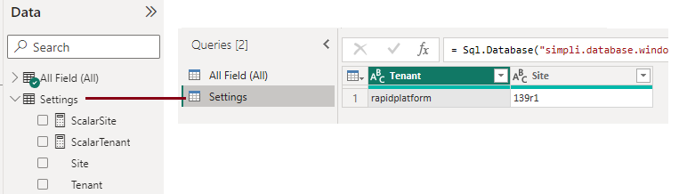

# System Settings Table

The system settings table contains information about your current site. By default this includes the current tenant name, tenant id, site name and site id. 

## Dynamically creating item links in PowerBI

A common scenario when writing reports is being able to reference a site item with a link to its page. You can use the settings table to dynamically populate the site and tenant information so your report will work over multiple sites.

When generating the link you can use the concatenation character Ampersand (&) to join the link parts together like so:

`itemLink = "https://test.rapidplatform.com/" & [ScalarTenant] & "/" & [ScalarSite] & "/explorer/All%20Fields/All%20Field:All%20Fields:" & 'All Field (All)'[id]`

Here `ScalarTenant` and `ScalarSite` are Measures that have been produced from the following custom table

Table : Settings

Query : 
```SQL
SELECT 
(SELECT value FROM dbo.sys_setting WHERE title = 'tenant') as Tenant, 
(SELECT value FROM dbo.sys_setting WHERE title = 'site') as Site
```



`ScalarTenant` DAX : `ScalarTenant = MAXX(Settings, Settings[Tenant])`
`ScalarSite` DAX : `ScalarSite = MAXX(Settings, Settings[Site])`

Here the `MAXX` aggregation function is used to cast the one row table string value to a scalar value for the measure.

